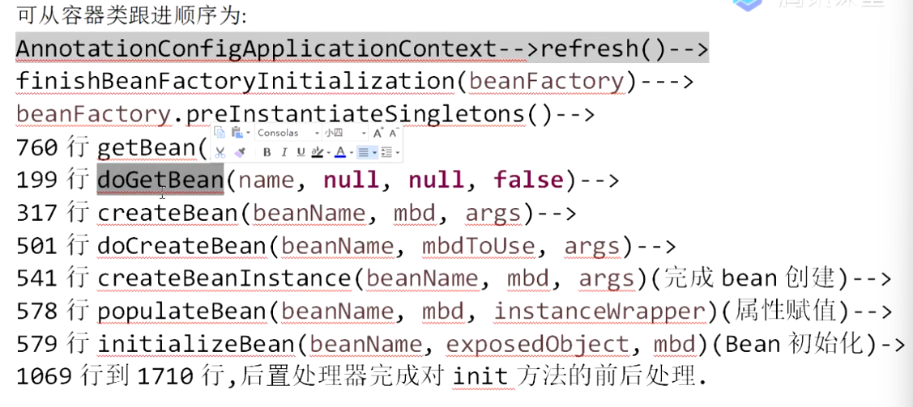
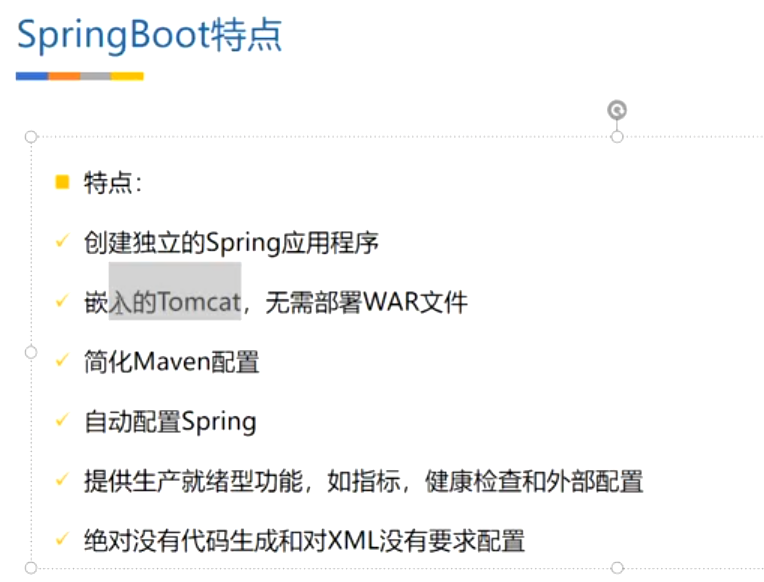
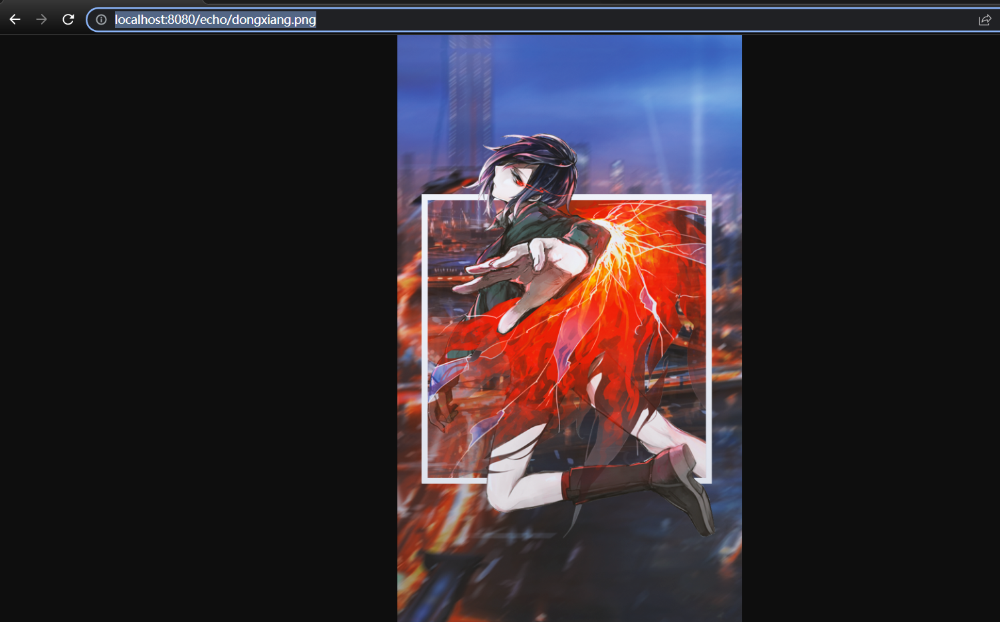

### Spring(一)

#### Spring体系结构


#### XML装配bean

```xml
<bean id="person" class="com.echo.enjoy.chapter1.pojo.Person">
    <property name="name" value="echo"/>
    <property name="age" value="18" />
</bean>
```

#### 配置类装配bean

```java
@Configuration	//告诉Spring这是一个配置类
public class MainConfig {
    //给容器中注册一个bean，类型为返回值类型
    @Bean
    public Person person(){
        return new Person("james",20);
    }
}
```

```java
public static void useAnnotation(){
    ApplicationContext context = new AnnotationConfigApplicationContext(MainConfig.class);
    //用配置文件配置的bean，bean的id使用的是方法的名字，比如说。
    //如果方法名字为person，那么这个bean的id就是person，如果是getPerson
    //那么这个bean的id就是getPerson
    Person person = context.getBean("person", Person.class);
    System.out.println(person);
    //获取bean的名称
    String[] namesForBean = context.getBeanNamesForType(Person.class);
    System.out.println(Arrays.toString(namesForBean));
}
```

```bash
Person{name='james', age=20}
[person]
```

#### 包扫描@ComponentScan

```java
@Configuration
//扫描com.echo.enjoy.chapter1包下的所有被声明为bean的组件
@ComponentScan(value = "com.echo.enjoy.chapter1")
public class MainConfig2 {
    @Bean
    public Person person(){
        return new Person("james",20);
    }
}
```

测试

```java
@Test
public void test01(){
    ApplicationContext context = new AnnotationConfigApplicationContext(MainConfig2.class);
    //获取容器中所有bean的名字
    String[] names = context.getBeanDefinitionNames();
    for (String name: names){
        System.out.println(name);
    }
}
```

```bash
org.springframework.context.annotation.internalConfigurationAnnotationProcessor
org.springframework.context.annotation.internalAutowiredAnnotationProcessor
org.springframework.context.event.internalEventListenerProcessor
org.springframework.context.event.internalEventListenerFactory
mainConfig2
mainConfig
orderController
orderDao
orderService
person
```

概述

```java
@Retention(RetentionPolicy.RUNTIME)
@Target({ElementType.TYPE})
@Documented
@Repeatable(ComponentScans.class)
public @interface ComponentScan {
    /*.....*/
	//定制要扫面的组件
    ComponentScan.Filter[] includeFilters() default {};
	//定制要排除的组件
    ComponentScan.Filter[] excludeFilters() default {};
    
    /*...*/
}
```

自定义扫描规则

```java
@ComponentScan(
    value = "com.echo.enjoy.chapter1", //要扫描的包
    includeFilters = {
        @ComponentScan.Filter(type = FilterType.ANNOTATION,classes = {Controller.class})
	},//声明为按注解过滤，扫描时只扫描被Controller注解标注的bean
	useDefaultFilters = false	//关闭默认的过滤规则
)
```

```bash
org.springframework.context.annotation.internalConfigurationAnnotationProcessor
org.springframework.context.annotation.internalAutowiredAnnotationProcessor
org.springframework.context.event.internalEventListenerProcessor
org.springframework.context.event.internalEventListenerFactory
mainConfig2
orderController
person
```


自定义扫描方式，通过实现TypeFilter接口来进行自定义扫描规则的定制

```java
public class MyTypeFilter implements TypeFilter {
    /**
     *
     * @param metadataReader 读取到当前正在扫描的类信息
     * @param metadataReaderFactory 从该工厂可以获取到其他任何类信息
     * @return 是否过滤
     * @throws IOException
     */
    @Override
    public boolean match(MetadataReader metadataReader, MetadataReaderFactory metadataReaderFactory) throws IOException {
        //获取当前扫描到的注解的元数据
        AnnotationMetadata annotationMetadata = metadataReader.getAnnotationMetadata();
        //获取当前扫描到的类的元数据
        ClassMetadata classMetadata = metadataReader.getClassMetadata();
        //获取当前类的资源(其实就是类的路径)
        Resource resource = metadataReader.getResource();
        //获取当前扫描到的类的名字
        String className = classMetadata.getClassName();
        System.out.println("当前扫描的类是: " + className);
        return false;
    }
}
```

```java
@ComponentScan(
        value = "com.echo.enjoy.chapter1",
        includeFilters = {
                @ComponentScan.Filter(type = FilterType.CUSTOM, classes = {MyTypeFilter.class})
        },
        useDefaultFilters = false
)
```

运行测试

```java
@Test
public void test01(){
    ApplicationContext context = new AnnotationConfigApplicationContext(MainConfig2.class);
    //获取容器中所有bean的名字
    String[] names = context.getBeanDefinitionNames();
    for (String name: names){
        System.out.println(name);
    }
}
```

```bash
当前扫描的类是: com.echo.enjoy.chapter1.Demo1
当前扫描的类是: com.echo.enjoy.chapter1.filter.MyTypeFilter
当前扫描的类是: com.echo.enjoy.chapter1.config.MainConfig
当前扫描的类是: com.echo.enjoy.chapter1.controller.OrderController
当前扫描的类是: com.echo.enjoy.chapter1.dao.OrderDao
当前扫描的类是: com.echo.enjoy.chapter1.pojo.Person
当前扫描的类是: com.echo.enjoy.chapter1.service.OrderService
org.springframework.context.annotation.internalConfigurationAnnotationProcessor
org.springframework.context.annotation.internalAutowiredAnnotationProcessor
org.springframework.context.event.internalEventListenerProcessor
org.springframework.context.event.internalEventListenerFactory
mainConfig2
person
```

可以看到，只有Spring内置的bean，配置文件bean，以及我们在配置文件中手动注入的bean，被装载到了容器中，那些需要进行扫描装载的@Controller、@Service、@Repository都没有被扫描进来，**因为我们的方法返回的是false**

```java
@Override
public boolean match(MetadataReader metadataReader, MetadataReaderFactory metadataReaderFactory) throws IOException {
    //获取当前扫描到的注解的元数据
    AnnotationMetadata annotationMetadata = metadataReader.getAnnotationMetadata();
    //获取当前扫描到的类的元数据
    ClassMetadata classMetadata = metadataReader.getClassMetadata();
    //获取当前类的资源(其实就是类的路径)
    Resource resource = metadataReader.getResource();
    //获取当前扫描到的类的名字
    String className = classMetadata.getClassName();
    System.out.println("当前扫描的类是: " + className);
    //如果类的全限定类名中包含echo,那么扫面进去
    if (className.contains("echo")){
        return true;
    }
    return false;
}
```

```bash
当前扫描的类是: com.echo.enjoy.chapter1.Demo1
当前扫描的类是: com.echo.enjoy.chapter1.config.MainConfig
当前扫描的类是: com.echo.enjoy.chapter1.controller.OrderController
当前扫描的类是: com.echo.enjoy.chapter1.dao.OrderDao
当前扫描的类是: com.echo.enjoy.chapter1.filter.MyTypeFilter
当前扫描的类是: com.echo.enjoy.chapter1.pojo.Person
当前扫描的类是: com.echo.enjoy.chapter1.service.OrderService
org.springframework.context.annotation.internalConfigurationAnnotationProcessor
org.springframework.context.annotation.internalAutowiredAnnotationProcessor
org.springframework.context.event.internalEventListenerProcessor
org.springframework.context.event.internalEventListenerFactory
mainConfig2
demo1
mainConfig
orderController
orderDao
myTypeFilter
person
orderService
```

#### bean的作用域@Scope

Spring中的bean默认是单例的

作用域为Singleton(单例)时：**对象会随着容器的创建而创建**。以后每次获取都是从容器中拿(Map)的同一个bean

```java
@Bean
public Person person() {
    return new Person("james", 20);
}
```

```java
@Test
public void test02(){
    ApplicationContext context = new AnnotationConfigApplicationContext(MainConfig2.class);

    Person person1 = context.getBean("person", Person.class);
    Person person2 = context.getBean("person", Person.class);
    System.out.println(person1 == person2);
}
```

```bash
true
```

作用域为Prototype(多实例)时：**对象是懒加载的**，只有在需要对象时，才会进行对象的创建

```java
@Bean
@Scope(value = "prototype")
public Person person() {
    return new Person("james", 20);
}
```

```java
@Test
public void test02(){
    ApplicationContext context = new AnnotationConfigApplicationContext(MainConfig2.class);

    Person person1 = context.getBean("person", Person.class);
    Person person2 = context.getBean("person", Person.class);
    System.out.println(person1 == person2);
}
```

```bash
false
```

#### @Lazy懒加载

主要针对单实例bean，容器启动时不创建对象。当且仅当第一次获取(bean)的时候才被创建初始化。

```java
@Bean
public Person person() {
    System.out.println("给容器中添加person");
    return new Person("james", 20);
}
```

```java
@Test
public void test02(){
    ApplicationContext context = new AnnotationConfigApplicationContext(MainConfig2.class);
    System.out.println("IOC容器创建完成");
    Person person1 = context.getBean("person", Person.class);
    System.out.println(person1);
}
```

```bash
给容器中添加person
IOC容器创建完成
Person{name='james', age=20}
```

加上懒加载

```java
@Bean
@Lazy
public Person person() {
    System.out.println("给容器中添加person");
    return new Person("james", 20);
}
```

```java
@Test
public void test02(){
    ApplicationContext context = new AnnotationConfigApplicationContext(MainConfig2.class);
    System.out.println("IOC容器创建完成");
    Person person1 = context.getBean("person", Person.class);
    System.out.println(person1);
}
```

```bash
IOC容器创建完成
给容器中添加person
Person{name='james', age=20}
```

### Spring(二)

#### @Conditional条件注入

首先说一下FactoryBean和BeanFactory的区别：

FactoryBean：可以将Java实例Bean通过FactoryBean注入到容器中

BeanFactory: 可以从容器中获取实例化后的bean

**运行时，如果是windows操作系统，让echo注入容器，如果是linux操作系统让jane注入容器**

1.创建配置类

```java
@Configuration
public class MainConfig1 {

    @Bean("echo")
    //加一个bean注入容器时的条件
    @Conditional(WindowsCondition.class)
    public Person getEcho(){
        System.out.println("给容器中添加echo......");
        return new Person("echo",27);
    }

    @Bean("jane")
    //加一个bean注入容器时的条件
    @Conditional(LinuxCondition.class)
    public Person getJane(){
        System.out.println("给容器中添加jane......");
        return new Person("jane",28);
    }

    @Bean("lucky")
    public Person getLucky(){
        System.out.println("给容器中添加lucky......");
        return new Person("lucky",29);
    }
}
```

2.实现Condition接口创建不同的条件

```java
public class WindowsCondition implements Condition {
    /**
     * @param conditionContext 判断条件可以使用的上下文环境
     * @param annotatedTypeMetadata 注解的元数据信息
     * @return 是否符合条件
     */
    @Override
    public boolean matches(ConditionContext conditionContext, AnnotatedTypeMetadata annotatedTypeMetadata) {
        //能获取到IOC容器正在使用的beanFactory
        ConfigurableListableBeanFactory beanFactory = conditionContext.getBeanFactory();
        //获取当前的环境变量，包括操作系统类型
        Environment environment = conditionContext.getEnvironment();
        //获取当前环境的操作系统
        String os = environment.getProperty("os.name");
        if (os.contains("Windows")){
            return true;
        }
        return false;
    }
}
```

```java
public class LinuxCondition implements Condition {
    @Override
    public boolean matches(ConditionContext conditionContext, AnnotatedTypeMetadata annotatedTypeMetadata) {
        //能获取到IOC容器正在使用的beanFactory
        ConfigurableListableBeanFactory beanFactory = conditionContext.getBeanFactory();
        //获取当前的环境变量，包括操作系统类型
        Environment environment = conditionContext.getEnvironment();
        //获取当前环境的操作系统
        String os = environment.getProperty("os.name");
        if (os.contains("linux")){
            return true;
        }
        return false;
    }
}
```

3.测试

```java
@Test
public void test01(){
    ApplicationContext context = new AnnotationConfigApplicationContext(MainConfig1.class);
    //运行时，如果是windows操作系统，让echo注入容器，如果是linux操作系统让jane注入容器
    //
    System.out.println("容器初始化完成");
}
```

```bash
给容器中添加echo......
给容器中添加lucky......
容器初始化完成
```

#### @Import注册bean

```java
/**
     * 给容器中注册组件(Bean)的方式
     * 1.@Bean：适用于导入第三方的类或包的组件，例如Person为第三方的类，需要我们在
     * IOC容器中使用时，需要使用该注解
     * 2.包扫描(@ComponentScan) + 组件的标注注解(@Controller,@Service,@Repository,@Component)
     * 一般是针对我们自己写的类，
     * 3.@Import:能够快速给容器导入一个Bean，
     *    3.1 @Import(value = {Dog.class, Cat.class})value中的值是要注入到容器中的bean的class，bean的ID为类的全限定类名
     *    3.2 ImportSelector:是一个接口，返回需要导入到容器的组件的全类名数组
     *    3.3 ImportBeanDefinitionRegister: 可以手动添加组件到IOC容器，所有Bean的注册可以使用BeanDefinitionRegistry
     */
```

**直接使用@Import注解**

```java
public class Cat {
}
```

```java
public class Dog {
}
```

```java
@Configuration
@Import(value = {Dog.class, Cat.class})
public class MainConfig2 {
}
```

```java
@Test
public void test02(){
    ApplicationContext context = new AnnotationConfigApplicationContext(MainConfig2.class);
    System.out.println("容器初始化完成");
    //看看狗的bean是否注入到了容器中
    String[] names = context.getBeanDefinitionNames();
    for (String name : names){
        System.out.println(name);
    }
}
```

```bash
容器初始化完成
org.springframework.context.annotation.internalConfigurationAnnotationProcessor
org.springframework.context.annotation.internalAutowiredAnnotationProcessor
org.springframework.context.event.internalEventListenerProcessor
org.springframework.context.event.internalEventListenerFactory
mainConfig2
com.echo.enjoy.chapter2.pojo.Dog   //狗
com.echo.enjoy.chapter2.pojo.Cat	//猫
```

**使用ImportSelector**

创建两个新的类

```java
public class Fish {
}
```

```java
public class Cow {
}
```

创建一个ImportSelector并实现selectImports()方法，注意，该方法不可以返回null，否则会报错

```java
public class EchoImportSelector implements ImportSelector {

    @Override
    public String[] selectImports(AnnotationMetadata annotationMetadata) {
        return new String[]{"com.echo.enjoy.chapter2.pojo.Fish","com.echo.enjoy.chapter2.pojo.Cow"};
    }
}
```

```java
@Import(value = {Dog.class, Cat.class,EchoImportSelector.class})
```

测试

```java
@Test
public void test02(){
    ApplicationContext context = new AnnotationConfigApplicationContext(MainConfig2.class);
    System.out.println("容器初始化完成");
    //看看狗的bean是否注入到了容器中
    String[] names = context.getBeanDefinitionNames();
    for (String name : names){
        System.out.println(name);
    }
}
```

```bash
容器初始化完成
org.springframework.context.annotation.internalConfigurationAnnotationProcessor
org.springframework.context.annotation.internalAutowiredAnnotationProcessor
org.springframework.context.event.internalEventListenerProcessor
org.springframework.context.event.internalEventListenerFactory
mainConfig2
com.echo.enjoy.chapter2.pojo.Dog
com.echo.enjoy.chapter2.pojo.Cat
com.echo.enjoy.chapter2.pojo.Fish
com.echo.enjoy.chapter2.pojo.Cow
```

**使用ImportBeanDefinitionRegister**

```java
public class Car {
}
```

```java
public class Robot {
}
```

实现ImportBeanDefinitionRegistrar接口，重写registerBeanDefinitions()方法

```java
public class EchoBeanDefinitionRegister implements ImportBeanDefinitionRegistrar {
    /**
     * 自定义注入bean
     * @param importingClassMetadata 当前类的注解元数据
     * @param registry 把所有需要添加到容器中的bean加入
     */
    @Override
    public void registerBeanDefinitions(AnnotationMetadata importingClassMetadata, BeanDefinitionRegistry registry) {
        //ImportBeanDefinitionRegistrar.super.registerBeanDefinitions(importingClassMetadata, registry);
        //如果容器中包含Fish和Cow那么就注入Robot和Car
        boolean fish = registry.containsBeanDefinition("com.echo.enjoy.chapter2.pojo.Fish");
        boolean cow = registry.containsBeanDefinition("com.echo.enjoy.chapter2.pojo.Cow");
        if (fish && cow){
            //对于我们要注册的bean，要将其进行包装
            RootBeanDefinition car = new RootBeanDefinition(Car.class);
            RootBeanDefinition robot = new RootBeanDefinition(Robot.class);
            registry.registerBeanDefinition("robot",robot);
            registry.registerBeanDefinition("car",car);
        }
    }
}
```

将上面的类加入到Configuration的@Import注解中

```java
@Configuration
@Import(value = {Dog.class, Cat.class,EchoImportSelector.class,EchoBeanDefinitionRegister.class})
public class MainConfig2 {

}
```

测试运行

```java
@Test
public void test02(){
    ApplicationContext context = new AnnotationConfigApplicationContext(MainConfig2.class);
    System.out.println("容器初始化完成");
    //看看狗的bean是否注入到了容器中
    String[] names = context.getBeanDefinitionNames();
    for (String name : names){
        System.out.println(name);
    }
}
```

```bash
容器初始化完成
org.springframework.context.annotation.internalConfigurationAnnotationProcessor
org.springframework.context.annotation.internalAutowiredAnnotationProcessor
org.springframework.context.event.internalEventListenerProcessor
org.springframework.context.event.internalEventListenerFactory
mainConfig2
com.echo.enjoy.chapter2.pojo.Dog
com.echo.enjoy.chapter2.pojo.Cat
com.echo.enjoy.chapter2.pojo.Fish
com.echo.enjoy.chapter2.pojo.Cow
robot		//注入的
car			//注入的
```

#### 使用FacotryBean注入

```java
public class SpiderMan {
}
```

```java
public class EchoFactoryBean implements FactoryBean<SpiderMan> {
    @Override
    public SpiderMan getObject() throws Exception {
        return new SpiderMan();
    }

    @Override
    public Class<?> getObjectType() {
        return SpiderMan.class;
    }

    @Override
    public boolean isSingleton() {
        return FactoryBean.super.isSingleton();
    }
}
```

```java
@Configuration
@Import(value = {Dog.class, Cat.class,EchoImportSelector.class,EchoBeanDefinitionRegister.class})
public class MainConfig2 {

    //将自定义的工厂注入到容器中，然后容器会解析这个FactoryBean中对bean的定义，将FactoryBean中定义的bean注入到容器中
    @Bean
    public EchoFactoryBean echoFactoryBean(){
        return new EchoFactoryBean();
    }
}
```

```java
@Test
public void test03(){
    ApplicationContext context = new AnnotationConfigApplicationContext(MainConfig2.class);
    System.out.println("容器初始化完成");
    Object bean = context.getBean("echoFactoryBean");
    System.out.println(bean);
}
```

接下来会出现一个比较诡异的结果，我们将这个FactoryBean也注入到了容器中，这个FactoryBean会将在其中定义的SpiderMan注入到容器中，但是如果我们以context.getBean("echoFactoryBean")的方式来获取bean的话，获取的并不是这个FactoryBean而是它注入的SpiderMan的bean;这可以通过跟源码来发现。

```bash
com.echo.enjoy.chapter2.pojo.SpiderMan@126253fd
```

但是如果以这样的方式

```java
@Test
public void test03(){
    ApplicationContext context = new AnnotationConfigApplicationContext(MainConfig2.class);
    System.out.println("容器初始化完成");
    //        Object bean = context.getBean("echoFactoryBean");
    Object bean = context.getBean("&echoFactoryBean");	//加一个&
    System.out.println(bean);
}
```

那么就会正常拿到echoBeanFactoryBean

```bash
com.echo.enjoy.chapter2.config.EchoFactoryBean@126253fd
```

### Spring(三) bean的生命周期

先看一个简单的例子

#### 1.最朴素的生命周期(定义了init和destroy方法)


**单实例**

```java
public class Bike {
    public Bike(){
        System.out.println("Bike constructor...");
    }
    public void init(){
        System.out.println("Bike init....");
    }
    public void destroy(){
        System.out.println("Bike destroy....");
    }
}
```

```java
@Bean(initMethod = "init",destroyMethod = "destroy")
public Bike bike(){
    return new Bike();
}
```

```java
@Test
public void test01(){
    AnnotationConfigApplicationContext context = new AnnotationConfigApplicationContext(MainConfig1.class);
    System.out.println("IOC容器创建完成");
    //关掉容器
    context.close();
    System.out.println("IOC容器被关闭");
}
```

```java
Bike constructor...
Bike init....
IOC容器创建完成
Bike destroy....
IOC容器被关闭
```

**对于Singleton的bean**可以正常调用初始化和销毁的方法


*扩展*

*IOC容器关闭，调用close方法时*

```java
// Destroy all cached singletons in the context's BeanFactory.
destroyBeans();

// Close the state of this context itself.
closeBeanFactory();

// Let subclasses do some final clean-up if they wish...
onClose();

```

*调用destroyBeans()*

```java
this.containedBeanMap.clear();		//把装bean的map清空
this.dependentBeanMap.clear();
this.dependenciesForBeanMap.clear();
```

*增强bean的核心代码*

```java
Object wrappedBean = bean;
//BeanPostProcessorsBeforeInitialization
if (mbd == null || !mbd.isSynthetic()) {
    wrappedBean = applyBeanPostProcessorsBeforeInitialization(wrappedBean, beanName);
}
//init
try {
    //@Bean(initMethod="init") 增强的是init方法？
    invokeInitMethods(beanName, wrappedBean, mbd);
}
catch (Throwable ex) {
    throw new BeanCreationException(
        (mbd != null ? mbd.getResourceDescription() : null),
        beanName, "Invocation of init method failed", ex);
}
//BeanPostProcessorsAfterInitialization
if (mbd == null || !mbd.isSynthetic()) {
    wrappedBean = applyBeanPostProcessorsAfterInitialization(wrappedBean, beanName);
}

return wrappedBean;
```

**多实例**

对于多实例的bean，容器只负责初始化，但不会管理bean，容器关闭时不会调用销毁方法.

```java
@Scope("prototype")
@Bean(initMethod = "init",destroyMethod = "destroy")
public Bike bike(){
	return new Bike();
}
```

```bash
IOC容器创建完成
IOC容器被关闭
```

#### InitializingBean接口和DisposableBean接口


```java
public interface InitializingBean {

	/**
	 * Invoked by the containing {@code BeanFactory} after it has set all bean properties
	 * and satisfied {@link BeanFactoryAware}, {@code ApplicationContextAware} etc.
	 * <p>This method allows the bean instance to perform validation of its overall
	 * configuration and final initialization when all bean properties have been set.
	 * @throws Exception in the event of misconfiguration (such as failure to set an
	 * essential property) or if initialization fails for any other reason
	 */
    //bean的属性设值之后调用
	void afterPropertiesSet() throws Exception;

}
```

```java
public interface DisposableBean {

	/**
	 * Invoked by the containing {@code BeanFactory} on destruction of a bean.
	 * @throws Exception in case of shutdown errors. Exceptions will get logged
	 * but not rethrown to allow other beans to release their resources as well.
	 */
    //在bean销毁时，由BeanFactory调用此方法
	void destroy() throws Exception;

}
```

定义一个pojo

```java
@Component
public class Train implements InitializingBean, DisposableBean {
    public Train(){
        System.out.println("Train constructor...");
    }

    @Override
    //在bean销毁时，调用此方法
    public void destroy() throws Exception {
        System.out.println("Train DisposableBean destroy()...");
    }

    @Override
    //bean的属性设值,初始化完成之后调用
    public void afterPropertiesSet() throws Exception {
        System.out.println("Train InitializingBean afterPropertiesSet()...");
    }
}
```

```java
@Test
public void test02(){
    AnnotationConfigApplicationContext context = new AnnotationConfigApplicationContext(MainConfig1.class);
    System.out.println("IOC容器创建完成");
    //关掉容器
    context.close();
    System.out.println("IOC容器被关闭");
}
```

```bash
Train constructor...
Train InitializingBean afterPropertiesSet()...
IOC容器创建完成
Train DisposableBean destroy()...
IOC容器被关闭
```

#### @PostConstruct注解和@PreDestroy注解


```java
@Component
public class Jeep {
    public Jeep(){
        System.out.println("Jeep Constructor ......");
    }
    @PostConstruct
    public void doInit(){
        System.out.println("Jeep doInit() ......");
    }
    @PreDestroy
    public void doDestroy(){
        System.out.println("Jeep doDestroy() ......");
    }
}
```

```java
@Test
public void test02(){
    AnnotationConfigApplicationContext context = new AnnotationConfigApplicationContext(MainConfig1.class);
    System.out.println("IOC容器创建完成");
    //关掉容器
    context.close();
    System.out.println("IOC容器被关闭");
}
```

```bash
Jeep Constructor ......
Jeep doInit() ......
IOC容器创建完成
Jeep doDestroy() ......
IOC容器被关闭
```

#### BeanPostProcessor


```java
@Component
public class EkkoBeanPostProcessor implements BeanPostProcessor {
    @Override
    public Object postProcessBeforeInitialization(Object bean, String beanName) throws BeansException {
        //return BeanPostProcessor.super.postProcessBeforeInitialization(bean, beanName);
        System.out.println("EkkoBeanPostProcessor postProcessBeforeInitialization() 处理了" + beanName);
        return bean;
    }

    @Override
    public Object postProcessAfterInitialization(Object bean, String beanName) throws BeansException {
        //return BeanPostProcessor.super.postProcessAfterInitialization(bean, beanName);
        System.out.println("EkkoBeanPostProcessor postProcessAfterInitialization() 处理了" + beanName);
        return bean;
    }
}
```

```java
@Test
public void test02(){
    AnnotationConfigApplicationContext context = new AnnotationConfigApplicationContext(MainConfig1.class);
    System.out.println("IOC容器创建完成");
    //关掉容器
    context.close();
    System.out.println("IOC容器被关闭");
}
```

```bash
EkkoBeanPostProcessor postProcessBeforeInitialization() 处理了mainConfig1
EkkoBeanPostProcessor postProcessAfterInitialization() 处理了mainConfig1
Jeep Constructor ......
EkkoBeanPostProcessor postProcessBeforeInitialization() 处理了jeep
Jeep doInit() ......
EkkoBeanPostProcessor postProcessAfterInitialization() 处理了jeep
IOC容器创建完成
Jeep doDestroy() ......
IOC容器被关闭
```

#### 一个整体的生命周期流程

```java
public class Loser implements InitializingBean, DisposableBean {
    public static int count = 0;
    private String name;
    public Loser(String name){
        count++;
        System.out.println("这是构造方法: " + " count 的值为: " + count);
        this.name = name;
    }

    public void setName(String name) {
        this.name = name;
    }

    public String getName() {
        return name;
    }

    public void customInit(){
        count++;
        System.out.println("这是我自定义的init方法,在该方法里的name属性值为： " + this.name + " count 的值为: " + count);
    }

    public void customDestroy(){
        count++;
        System.out.println("这是我自定义的destroy方法,在该方法里的name属性值为：  " + this.name + " count 的值为: " + count);

    }

    @Override
    public void destroy() throws Exception {
        count++;
        System.out.println("这是DisposableBean的destroy方法,在该方法里的name属性值为：  " + this.name + " count 的值为: " + count);
    }

    @Override
    public void afterPropertiesSet() throws Exception {
        count++;
        System.out.println("这是InitializingBean的afterPropertiesSet方法,在该方法里的name属性值为： " + this.name  + " count 的值为: " + count);
    }

    @PostConstruct
    public void customPostConstruct(){
        count++;
        System.out.println("这是我自定义的由@PostConstruct标记的方法,在该方法里的name属性值为：  " + this.name  + " count 的值为: " + count);
    }

    @PreDestroy
    public void customPreDestroy(){
        count++;
        System.out.println("这是我自定义的由@PreDestroy标记的方法,在该方法里的name属性值为：  " + this.name  + " count 的值为: " + count);
    }
}

```

```java
@Component
public class EkkoBeanPostProcessor implements BeanPostProcessor {
    @Override
    public Object postProcessBeforeInitialization(Object bean, String beanName) throws BeansException {
        //return BeanPostProcessor.super.postProcessBeforeInitialization(bean, beanName);
        if (beanName.equals("loser")){
            Loser loser = (Loser) bean;
            Loser.count ++;
            System.out.println("EkkoBeanPostProcessor postProcessBeforeInitialization() 处理了 " + beanName  +
                     " name属性值为：" + loser.getName() + " count 的值为: " + Loser.count);
        }
        return bean;
    }

    @Override
    public Object postProcessAfterInitialization(Object bean, String beanName) throws BeansException {
        //return BeanPostProcessor.super.postProcessAfterInitialization(bean, beanName);
        if (beanName.equals("loser")){
            Loser loser = (Loser) bean;
            Loser.count ++;
            System.out.println("EkkoBeanPostProcessor postProcessAfterInitialization() 处理了 " + beanName  +
                    " name属性值为：" + loser.getName() + " count 的值为: " + Loser.count);
        }
        return bean;
    }
}

```

```java
@Configuration
public class MainConfig1 {
    @Bean
    public EkkoBeanPostProcessor ekkoBeanPostProcessor(){
        return new EkkoBeanPostProcessor();
    }

    @Bean(initMethod = "customInit",destroyMethod = "customDestroy")
    public Loser loser(){
        return new Loser("Ekko");
    }
}
```

```java
@Test
public void test02(){
    AnnotationConfigApplicationContext context = new AnnotationConfigApplicationContext(MainConfig1.class);
    System.out.println("IOC容器创建完成");
    //关掉容器
    context.close();
    System.out.println("IOC容器被关闭");
}
```

```bash
这是构造方法:  count 的值为: 1
EkkoBeanPostProcessor postProcessBeforeInitialization() 处理了 loser name属性值为：Ekko count 的值为: 2
这是我自定义的由@PostConstruct标记的方法,在该方法里的name属性值为：  Ekko count 的值为: 3
这是InitializingBean的afterPropertiesSet方法,在该方法里的name属性值为： Ekko count 的值为: 4
这是我自定义的init方法,在该方法里的name属性值为： Ekko count 的值为: 5
EkkoBeanPostProcessor postProcessAfterInitialization() 处理了 loser name属性值为：Ekko count 的值为: 6
IOC容器创建完成
这是我自定义的由@PreDestroy标记的方法,在该方法里的name属性值为：  Ekko count 的值为: 7
这是DisposableBean的destroy方法,在该方法里的name属性值为：  Ekko count 的值为: 8
这是我自定义的destroy方法,在该方法里的name属性值为：  Ekko count 的值为: 9
IOC容器被关闭
```

与经典流程图一样


### Spring(四) BeanPostProcessor

#### 引子

@Autowired注解的实现其实就是一个BeanPostProcessor.

```java
public class AutowiredAnnotationBeanPostProcessor extends InstantiationAwareBeanPostProcessorAdapter
		implements MergedBeanDefinitionPostProcessor, PriorityOrdered, BeanFactoryAware {
}
```


其实这些BeanPostProcessor也是一种注入到容器中的bean，只不过它们用来管理和控制我们创建的业务bean。


将bean交给processor处理的核心方法其实是：**applyBeanPostProcessorsBeforeInitialization()**

```java
wrappedBean = applyBeanPostProcessorsBeforeInitialization(wrappedBean, beanName);
```

Spring在该方法中的逻辑是在完成bean的创建和属性赋值之后，依次遍历所有的BeanPostProcessor然后进行相应的逻辑处理

```java
@Override
public Object applyBeanPostProcessorsBeforeInitialization(Object existingBean, String beanName)
    throws BeansException {
	//将当前的bean赋值给result
    Object result = existingBean;
    //遍历所有的Spring内置的和我们自定义的BeanPostProcessor
    for (BeanPostProcessor processor : getBeanPostProcessors()) {
        //如果bean需要当前的processor处理，那么使用当前processor对该bean进行处理。
        //例如，如果当前bean有@Autowire注解，在AutowiredAnnotationBeanPostProcessor被遍历到的时候，使用AutowiredAnnotationBeanPostProcessor进行处理。
        Object current = processor.postProcessBeforeInitialization(result, beanName);
        if (current == null) {
            return result;
        }
        result = current;
    }
    return result;
}
```

#### 一个@Async的例子

```java
@Async	//这个注解并不是SpringBoot中的注解，而是Spring的原生注解!!
public void methodA() throws Exception {
    System.out.println("methodA()...");
}
```

使用该注解之后，该方法会被AsyncAnnotationBeanPostProcessor进行拦截，然后开线程对方法进行执行。

```java
public class AsyncAnnotationBeanPostProcessor extends AbstractBeanFactoryAwareAdvisingPostProcessor {

	/**
	 * The default name of the {@link TaskExecutor} bean to pick up: "taskExecutor".
	 * <p>Note that the initial lookup happens by type; this is just the fallback
	 * in case of multiple executor beans found in the context.
	 * @since 4.2
	 * @see AnnotationAsyncExecutionInterceptor#DEFAULT_TASK_EXECUTOR_BEAN_NAME
	 */
	public static final String DEFAULT_TASK_EXECUTOR_BEAN_NAME =
			AnnotationAsyncExecutionInterceptor.DEFAULT_TASK_EXECUTOR_BEAN_NAME;


	protected final Log logger = LogFactory.getLog(getClass());

	@Nullable
	private Supplier<Executor> executor;

	@Nullable
	private Supplier<AsyncUncaughtExceptionHandler> exceptionHandler;

	@Nullable
	private Class<? extends Annotation> asyncAnnotationType;


	public AsyncAnnotationBeanPostProcessor() {
		setBeforeExistingAdvisors(true);
	}


	/**
	 * Configure this post-processor with the given executor and exception handler suppliers,
	 * applying the corresponding default if a supplier is not resolvable.
	 * @since 5.1
	 */
	public void configure(
			@Nullable Supplier<Executor> executor, @Nullable Supplier<AsyncUncaughtExceptionHandler> exceptionHandler) {

		this.executor = executor;
		this.exceptionHandler = exceptionHandler;
	}

	/**
	 * Set the {@link Executor} to use when invoking methods asynchronously.
	 * <p>If not specified, default executor resolution will apply: searching for a
	 * unique {@link TaskExecutor} bean in the context, or for an {@link Executor}
	 * bean named "taskExecutor" otherwise. If neither of the two is resolvable,
	 * a local default executor will be created within the interceptor.
	 * @see AnnotationAsyncExecutionInterceptor#getDefaultExecutor(BeanFactory)
	 * @see #DEFAULT_TASK_EXECUTOR_BEAN_NAME
	 */
	public void setExecutor(Executor executor) {
		this.executor = SingletonSupplier.of(executor);
	}

	/**
	 * Set the {@link AsyncUncaughtExceptionHandler} to use to handle uncaught
	 * exceptions thrown by asynchronous method executions.
	 * @since 4.1
	 */
	public void setExceptionHandler(AsyncUncaughtExceptionHandler exceptionHandler) {
		this.exceptionHandler = SingletonSupplier.of(exceptionHandler);
	}

	/**
	 * Set the 'async' annotation type to be detected at either class or method
	 * level. By default, both the {@link Async} annotation and the EJB 3.1
	 * {@code javax.ejb.Asynchronous} annotation will be detected.
	 * <p>This setter property exists so that developers can provide their own
	 * (non-Spring-specific) annotation type to indicate that a method (or all
	 * methods of a given class) should be invoked asynchronously.
	 * @param asyncAnnotationType the desired annotation type
	 */
	public void setAsyncAnnotationType(Class<? extends Annotation> asyncAnnotationType) {
		Assert.notNull(asyncAnnotationType, "'asyncAnnotationType' must not be null");
		this.asyncAnnotationType = asyncAnnotationType;
	}


	@Override
	public void setBeanFactory(BeanFactory beanFactory) {
		super.setBeanFactory(beanFactory);

		AsyncAnnotationAdvisor advisor = new AsyncAnnotationAdvisor(this.executor, this.exceptionHandler);
		if (this.asyncAnnotationType != null) {
			advisor.setAsyncAnnotationType(this.asyncAnnotationType);
		}
		advisor.setBeanFactory(beanFactory);
		this.advisor = advisor;
	}

}
```

#### Aware

```java
public class Hero implements ApplicationContextAware {

    @Override
    public void setApplicationContext(ApplicationContext applicationContext) throws BeansException {
        System.out.println("感知到了容器:" + applicationContext);
    }
}
```

```java
@Configuration
public class MainConfig1 {
    @Bean
    public Hero hero(){
        return new Hero();
    }
}
```

```java
@Test
public void test01(){
    AnnotationConfigApplicationContext context = new AnnotationConfigApplicationContext(MainConfig1.class);
    context.close();
}
```

```bash
感知到了容器:org.springframework.context.annotation.AnnotationConfigApplicationContext@69b794e2, started on Thu Mar 24 17:28:01 CST 2022
```

其实，处理实现的感知接口，也是由Spring的一个BeanPostProcessor来实现的。


Spring底层对BeanPostProcessor的使用，包括bean的赋值，注入其他组件，生命周期注解功能

#### @Value注解

使用@Value进行初始化赋值，赋值的类型包括：1.基本字符串，2.SpringEL表达式 3.读取配置文件

```java
public class Bird {
    //使用@Value进行初始化赋值，赋值的类型包括：1.基本字符串，2.SpringEL表达式 3.读取配置文件
    @Value("James")
    private String name;
    @Value("#{20-2}")   //SpringEL表达式
    private Integer age;
    @Value("${bird.color}")
    private String color;


    public Bird(){

    }

    public Bird(String name, Integer age,String color) {
        this.name = name;
        this.age = age;
        this.color = color;
    }

    public String getName() {
        return name;
    }

    public void setName(String name) {
        this.name = name;
    }

    public Integer getAge() {
        return age;
    }

    public void setAge(Integer age) {
        this.age = age;
    }

    public String getColor() {
        return color;
    }

    public void setColor(String color) {
        this.color = color;
    }

    @Override
    public String toString() {
        return "Bird{" +
                "name='" + name + '\'' +
                ", age=" + age +
                ", color='" + color + '\'' +
                '}';
    }
}
```

```java
@Configuration
//当容器启动时，会将这个配置加载到Environment中
@PropertySource(value = "classpath:/application.properties")
public class MainConfig1 {
    @Bean
    public Hero hero(){
        return new Hero();
    }

    @Bean
    public Bird bird(){
        return new Bird();
    }
}
```

```java
@Test
public void test01(){
    AnnotationConfigApplicationContext context = new AnnotationConfigApplicationContext(MainConfig1.class);
    //从容器中获取所有bean
    String[] beanDefinitionNames = context.getBeanDefinitionNames();
    for (String name: beanDefinitionNames){
        System.out.println(name);
    }
    //验证是否将bird.color属性加载到了环境变量中
    ConfigurableEnvironment environment = context.getEnvironment();
    System.out.println("environment : " + environment.getProperty("bird.color"));

    Bird bird = context.getBean("bird", Bird.class);
    System.out.println(bird);
    context.close();
}
```

```bash
感知到了容器:org.springframework.context.annotation.AnnotationConfigApplicationContext@69b794e2, started on Thu Mar 24 22:18:12 CST 2022
org.springframework.context.annotation.internalConfigurationAnnotationProcessor
org.springframework.context.annotation.internalAutowiredAnnotationProcessor
org.springframework.context.annotation.internalCommonAnnotationProcessor
org.springframework.context.event.internalEventListenerProcessor
org.springframework.context.event.internalEventListenerFactory
mainConfig1
hero
bird
environment : red
Bird{name='James', age=18, color='red'}
```

#### @Autowired

DAO

```java
@Repository
public class TestDao {
}
```

Service

```java
@Service
public class TestService {
    @Autowired
    private TestDao testDao;

    public void printDao(){
        System.out.println(testDao);
    }
}
```

Controller

```java
@Controller
public class TestController {
    @Autowired
    private TestService testService;
}
```

```java
@Configuration
@ComponentScan(value =
        {"com.echo.enjoy.chapter4.controller",
        "com.echo.enjoy.chapter4.service",
        "com.echo.enjoy.chapter4.dao"}
)
public class MainConfig1 {
}

```


```java
@Test
public void test02(){
    AnnotationConfigApplicationContext context = new AnnotationConfigApplicationContext(MainConfig1.class);
    //        String[] beanDefinitionNames = context.getBeanDefinitionNames();
    //        Arrays.stream(beanDefinitionNames).forEach(System.out::println);
    TestService testService = context.getBean("testService", TestService.class);
    TestDao testDao = context.getBean("testDao", TestDao.class);
    //测试容器中的TestDao和注入到TestService中TestDao是否相同
    testService.printDao();
    System.out.println(testDao);
    context.close();
}
```

```bash
com.echo.enjoy.chapter4.dao.TestDao@6e2aa843
com.echo.enjoy.chapter4.dao.TestDao@6e2aa843
```

可以看到使用@AutoWired注入的bean和直接注入到容器中的bean是一个。

**补充**

```java
@Autowired
private UserDao userDao;
```

使用上述方式，Spring在注入时，会先根据bean的名称，这里是userDao去容器中寻找，如果找到名称为userDao的bean则直接注入。如果找不到bean名称为userDao的bean，则会按照类型，去容器中寻找是否有com.echo.xxyy.dao.UserDao类型的bean，如果有的话，直接进行注入。


@Autowired可以加在很多地方

```java
@Component
public class Sun{
    private Moon moon;
    
    @Autowired	//在设置属性的方法上添加
    public void setMoon(Moon moon){
        this.moon = moon;
    }
    
    public Moon getMoon(){
        return this.moon;
    }
}
```

```java
@Component
public class Sun{
    private Moon moon;
    
    @Autowired	//在构造方法上添加
    public Sun(Moon moon){
        this.moon = moon;
    }
    
    public void setMoon(Moon moon){
        this.moon = moon;
    }
    
    public Moon getMoon(){
        return this.moon;
    }
}
```

```java
@Component
public class Sun{
    private Moon moon;
    
    //在参数上添加
    public Sun(@Autowired Moon moon){
        this.moon = moon;
    }
    
    public void setMoon(Moon moon){
        this.moon = moon;
    }
    
    public Moon getMoon(){
        return this.moon;
    }
}
```


#### @Qualifier

如果向容器中注入两次相同的beanid的bean。那么只会存在一个，毕竟容器是个字典，而且优先级是@Bean高于@Autowired

```java
@Service
public class TestService {
    @Autowired  //通过包扫面和@Autowired注入了一次
    private TestDao testDao;

    public void printDao(){
        System.out.println(testDao);
    }
}
```

在配置中又注入一次

```java
@Bean("testDao")
public TestDao testDao(){
    return new TestDao();
}
```

最后容器中只有一份

```java
@Test
public void test02(){
    AnnotationConfigApplicationContext context = new AnnotationConfigApplicationContext(MainConfig1.class);
    String[] beanDefinitionNames = context.getBeanDefinitionNames();
    Arrays.stream(beanDefinitionNames).forEach(System.out::println);

    TestService testService = context.getBean("testService", TestService.class);
    testService.printDao();
    TestDao testDao = context.getBean("testDao", TestDao.class);
    System.out.println(testDao);
    //        context.close();
}
```

```bash
org.springframework.context.annotation.internalConfigurationAnnotationProcessor
org.springframework.context.annotation.internalAutowiredAnnotationProcessor
org.springframework.context.annotation.internalCommonAnnotationProcessor
org.springframework.context.event.internalEventListenerProcessor
org.springframework.context.event.internalEventListenerFactory
mainConfig1
testController
testService
testDao
com.echo.enjoy.chapter4.dao.TestDao@5852c06f
com.echo.enjoy.chapter4.dao.TestDao@5852c06f
```

但是如果有不同的beanid的相同的bean注入，比如：

```java
@Bean("testDao2")
public TestDao testDao(){
    return new TestDao();
}
```

使用@Autowired注入时，注入的是testDao。这里又注入了一个testDao2。所以，使用时可以使用@Qualifier来进行指定bean的注入

```java
@Autowired
@Qualifier("testDao2")
private TestDao testDao;
```

#### @Primary

看这种情况

```java
public interface UserDao {
    void printUrl();
}
```

```java
public class UserDaoImpl1 implements UserDao{
    private String url = "1";

    @Override
    public void printUrl() {
        System.out.println(this.url);
    }
}
```

```java
public class UserDaoImpl2 implements UserDao{
    private String url = "2";
    @Override
    public void printUrl() {
        System.out.println(this.url);
    }
}
```

```java
@Bean
public UserDao userDaoImpl1(){
    return new UserDaoImpl1();
}
@Bean
public UserDao userDaoImpl2(){
    return new UserDaoImpl2();
}
```


 ```java
 @Service
 public class TestService {
     @Autowired
     private UserDao userDao;
 
     public void invokeUserDaoPrint(){
         userDao.printUrl();
     }
 }
 ```

```java
@Test
public void test02(){
    AnnotationConfigApplicationContext context = new AnnotationConfigApplicationContext(MainConfig1.class);
    TestService testService = context.getBean("testService", TestService.class);
    testService.invokeUserDaoPrint();
}
```

如果这时候进行测试，会直接报错，因为TestService中的UserDao具体是哪一个容器并不知道。

```bash
available: expected single matching bean but found 2: userDaoImpl1,userDaoImpl2
```

所以，解决方案是使用@Primary来告诉容器，优先要注入的是哪一个

```java
@Bean
@Primary
public UserDao userDaoImpl1(){
    return new UserDaoImpl1();
}
@Bean
public UserDao userDaoImpl2(){
    return new UserDaoImpl2();
}
```

```bash
1		//注入UserDaoImpl1成功
```

或者也可以使用@Qualifier来进行注入

```java
@Autowired
@Qualifier("userDaoImpl2")
private UserDao userDao;
```

```bash
2
```

#### @Resource

@Resource也可以将bean注入到容器中。@Resource是JSR250规范中的注解。

@Resource与@Autowired的异同

同：效果一样，都可以进行bean的装配

异:   @Resource不支持@Primary  

​		@Autowired可以使用@Autowired(required=false),进行这种设置后，如果@Autowired在容器中没有找到相应的bean，就不会进行注入操作，并不会报错。但是@Resource没有这种选项，只会发生报错。

补充：

1、@Resource是JDK原生的注解，@Autowired是Spring2.5 引入的注解

2、@Resource有两个属性name和type。Spring将@Resource注解的name属性解析为bean的名字，而type属性则解析为bean的类型。所以如果使用name属性，则使用byName的自动注入策略，而使用type属性时则使用byType自动注入策略。如果既不指定name也不指定type属性，这时将通过反射机制使用byName自动注入策略。

@Autowired只根据type进行注入，不会去匹配name。如果涉及到type无法辨别注入对象时，那需要依赖@Qualifier或@Primary注解一起来修饰。

**共同点**

@Resource和@Autowired都可以作为注入属性的修饰，在接口仅有单一实现类时，两个注解的修饰效果相同，可以互相替换，不影响使用。

**不同点**

@Resource是JDK原生的注解，@Autowired是Spring2.5 引入的注解

@Resource有两个属性name和type。Spring将@Resource注解的name属性解析为bean的名字，而type属性则解析为bean的类型。所以如果使用name属性，则使用byName的自动注入策略，而使用type属性时则使用byType自动注入策略。如果既不指定name也不指定type属性，这时将通过反射机制使用byName自动注入策略。

@Autowired只根据type进行注入，不会去匹配name。如果涉及到type无法辨别注入对象时，那需要依赖@Qualifier或@Primary注解一起来修饰。


#### @Inject

需要pom中额外引入javax.inject,和Autowired功能类似，支持@Primary,但是不支持required=false,该注解不依赖于Spring。可以注入到其他容器中。

### Spring(五) AOP的基本使用


#### 自动装配：Aware注入Spring组件原理


各种感知器都是实现了Aware接口。

`aware`,翻译过来是知道的，已感知的，意识到的，所以这些接口从字面意思应该是能感知到所有`Aware`前面的含义。比如ApplicationContextAware就是可以感知到ApplicationContext。

所以`BeanNameAware`接口是为了让**自身`Bean`能够感知到**，**获取到自身在Spring容器中的id属性**。

同理，其他的`Aware`接口也是为了能够感知到自身的一些属性。
 比如实现了`ApplicationContextAware`接口的类，能够获取到`ApplicationContext`，实现了`BeanFactoryAware`接口的类，能够获取到`BeanFactory`对象。

```java
@Component
public class Light implements ApplicationContextAware, BeanNameAware, EmbeddedValueResolverAware {
    private ApplicationContext context;
    
    @Override
    public void setBeanName(String name) {
        //感知bean自身的名字
        System.out.println("当前bean的名字为: " + name);
    }

    @Override
    public void setApplicationContext(ApplicationContext applicationContext) throws BeansException {
        //感知到bean自身所在的容器
        this.context = applicationContext;
        System.out.println("传入的IOC容器为:" + this.context);
    }

    @Override
    public void setEmbeddedValueResolver(StringValueResolver resolver) {
        //感知到字符值解析器
        String result = resolver.resolveStringValue("你好${os.name},计算#{3*8}");
        System.out.println("解析的字符串为: " + result);
    }
}
```


#### SpringAOP

AOP:面向切面编程[底层就是动态代理]

指程序在运行期间动态的将某段代码切入到指定方法位置进行运行的编程方式。

AOP通知方法：


引入依赖

```xml
<!-- https://mvnrepository.com/artifact/org.springframework/spring-aspects -->
<dependency>
    <groupId>org.springframework</groupId>
    <artifactId>spring-aspects</artifactId>
    <version>5.2.9.RELEASE</version>
</dependency>
```

需要被切入的业务逻辑方法

```java
@Component("calculator")
public class Calculator {
    //假设这是业务逻辑方法
    public int div(int i,int j){
        return i / j;
    }
}

```

定义切面，然后编写切入点方法

```java
/**
 * 日志切面类的方法需要动态感知到业务逻辑方法的运行，
 * 通知方法：通知方法是对方法运行到的地点进行通知。也即拦截方法运行的过程
 *      前置通知 @Before：在我们执行目标业务逻辑方法之前执行。
 *      后置通知 @After：在我们执行目标业务逻辑方法运行结束之后执行，不管有无异常
 *      返回通知 @AfterReturning：在我们目标业务逻辑方法正常返回值之后执行
 *      异常通知 @AfterThrowing：在我们目标业务逻辑方法出现异常后运行
 *      环绕通知 @Around：动态代理。我们定义一个方法，然后在这个方法里随意写代码进行增强，然后手动执行
 *      业务逻辑方法。
 */
@Aspect
@Component
public class LogAspect {

//    @Before("execution (public int com.echo.enjoy.chapter5.aop.*(..))")
//    在执行com.echo.enjoy.chapter5.aop包的所有类的所有方法之前切入，方法的参数类型和个数无限制，返回值是int类型
//    @Before("execution (public int com.echo.enjoy.chapter5.aop.Calculator.*(..))")
//    在执行com.echo.enjoy.chapter5.aop.Calculator类下的所有方法之前切入，方法的参数类型和个数无限制，返回值是int类型
    @Before("execution (public int com.echo.enjoy.chapter5.aop.Calculator.div(int,int))")
    //在执行com.echo.enjoy.chapter5.aop.Calculator.div的方法前切入，方法的参数是两个int类型，返回值是int类型，这种是最具体的写法
    public void logStart(){
        System.out.println("业务逻辑方法开始运行...");
    }

    @After("execution (public int com.echo.enjoy.chapter5.aop.Calculator.div(int,int))")
    public void logEnd(){
        System.out.println("业务逻辑方法运行结束...");
    }

    @AfterReturning("execution (public int com.echo.enjoy.chapter5.aop.Calculator.div(int,int))")
    public void logReturning(){
        System.out.println("业务逻辑方法正常返回...");
    }

    @AfterThrowing("execution (public int com.echo.enjoy.chapter5.aop.Calculator.div(int,int))")
    public void logException(){
        System.out.println("业务逻辑方法抛出异常...");
    }

    @Around("execution (public int com.echo.enjoy.chapter5.aop.Calculator.div(int,int))")
    public Object around(ProceedingJoinPoint joinPoint) throws Throwable {
        System.out.println("环绕通知：执行目标方法之前");
        Object obj = joinPoint.proceed();   //通过反射机制调用业务逻辑方法。我们决定什么时候区调用业务逻辑方法
        System.out.println("环绕通知：执行目标方法之后");
        return obj;
    }
}
```

**可以将切入点抽象出来**

```java
@Aspect
@Component
public class LogAspect {

    //将拦截的方法路径抽取出来，进行解耦
    @Pointcut("execution (public int com.echo.enjoy.chapter5.aop.Calculator.div(int,int))")
    public void pointCut(){}

//    @Before("execution (public int com.echo.enjoy.chapter5.aop.*(..))")
//    在执行com.echo.enjoy.chapter5.aop包的所有类的所有方法之前切入，方法的参数类型和个数无限制，返回值是int类型
//    @Before("execution (public int com.echo.enjoy.chapter5.aop.Calculator.*(..))")
//    在执行com.echo.enjoy.chapter5.aop.Calculator类下的所有方法之前切入，方法的参数类型和个数无限制，返回值是int类型
//    @Before("execution (public int com.echo.enjoy.chapter5.aop.Calculator.div(int,int))")
    //在执行com.echo.enjoy.chapter5.aop.Calculator.div的方法前切入，方法的参数是两个int类型，返回值是int类型，这种是最具体的写法
    @Before("pointCut()")
    public void logStart(){
        System.out.println("业务逻辑方法开始运行...");
    }

    @After("pointCut()")
    public void logEnd(){
        System.out.println("业务逻辑方法运行结束...");
    }

    @AfterReturning("pointCut()")
    public void logReturning(){
        System.out.println("业务逻辑方法正常返回...");
    }

    @AfterThrowing("pointCut()")
    public void logException(){
        System.out.println("业务逻辑方法抛出异常...");
    }
    @Around("pointCut()")
    public Object around(ProceedingJoinPoint joinPoint) throws Throwable {
        System.out.println("环绕通知：执行目标方法之前");
        Object obj = joinPoint.proceed();   //通过反射机制调用业务逻辑方法。
        System.out.println("环绕通知：执行目标方法之后");
        return obj;
    }
}
```

配置类，开启切面支持

```java
@Configuration
@ComponentScan(value = "com.echo.enjoy.chapter5")
@EnableAspectJAutoProxy //开启切面，原生态的Spring需要手动开启，SpringBoot中已经封装好了
public class Config {
}
```

测试

```java
@Test
public void test02(){
    AnnotationConfigApplicationContext context = new AnnotationConfigApplicationContext(Config.class);
    Calculator calculator = context.getBean("calculator", Calculator.class);
    int div = calculator.div(4, 2);
    System.out.println(div);
}
```

结果

```bash
环绕通知：执行目标方法之前
业务逻辑方法开始运行...
业务逻辑方法正常返回...
业务逻辑方法运行结束...
环绕通知：执行目标方法之后
2
```

异常

```java
@Test
public void test02(){
    AnnotationConfigApplicationContext context = new AnnotationConfigApplicationContext(Config.class);
    Calculator calculator = context.getBean("calculator", Calculator.class);
    int div = calculator.div(4, 0);
    System.out.println(div);
}
```

```bash
环绕通知：执行目标方法之前
业务逻辑方法开始运行...
业务逻辑方法抛出异常...
业务逻辑方法运行结束...

java.lang.ArithmeticException: / by zero
```

将异常通知进行改造，让业务逻辑方法中抛出的异常对象被异常通知拿到

```java
@AfterThrowing(value = "pointCut()",throwing = "exception")
public void logException(Exception exception){
    System.out.println("业务逻辑方法抛出异常...: " + exception);
}
```


```bash
环绕通知：执行目标方法之前
业务逻辑方法开始运行...
业务逻辑方法抛出异常...: java.lang.ArithmeticException: / by zero
业务逻辑方法运行结束...
```

**通过JoinPoint来获取切入点方法的元信息**


```java
@Aspect
@Component
public class LogAspect {

    //将拦截的方法路径抽取出来，进行解耦
    @Pointcut("execution (public int com.echo.enjoy.chapter5.aop.Calculator.div(int,int))")
    public void pointCut(){}

    @Before("pointCut()")
    public void logStart(JoinPoint joinPoint){
        System.out.println();
        System.out.println("**************前置通知开始************");
        System.out.println("业务逻辑方法"+joinPoint.getSignature().getName()+
                " 开始运行之前传入的参数是:" + Arrays.asList(joinPoint.getArgs()));
        System.out.println("**************前置通知结束************");
        System.out.println();
    }

    @After("pointCut()")
    public void logEnd(JoinPoint joinPoint){

        System.out.println();
        System.out.println("**************后置通知开始************");
        System.out.println("业务逻辑方法"+joinPoint.getSignature().getName()+"运行结束...");
        System.out.println("**************后置通知结束************");
        System.out.println();

    }

    @AfterReturning(value = "pointCut()",returning = "value")
    public void logReturning(JoinPoint joinPoint,int value){
        System.out.println();
        System.out.println("**************返回通知开始************");
        System.out.println("业务逻辑方法"+joinPoint.getSignature().getName()+"的返回值是：" + value);
        System.out.println("**************返回通知结束************");
        System.out.println();

    }

    @AfterThrowing(value = "pointCut()",throwing = "exception")
    public void logException(JoinPoint joinPoint,Exception exception){
        System.out.println();
        System.out.println("**************异常通知开始************");
        System.out.println("业务逻辑方法"+joinPoint.getSignature().getName() + "抛出的异常是" + exception);
        System.out.println("**************异常通知结束************");
        System.out.println();
    }

    @Around("pointCut()")
    public Object around(ProceedingJoinPoint joinPoint) throws Throwable {
        System.out.println();
        System.out.println("------------环绕通知：执行目标方法" + joinPoint.getSignature().getName() + "之前------------");
        Object obj = joinPoint.proceed();   //通过反射机制调用业务逻辑方法。
        System.out.println("------------环绕通知：执行目标方法" + joinPoint.getSignature().getName() + "之后------------");
        System.out.println();
        return obj;
    }
}
```

```bash
------------环绕通知：执行目标方法div之前------------

**************前置通知开始************
业务逻辑方法div 开始运行之前传入的参数是:[4, 2]
**************前置通知结束************


**************返回通知开始************
业务逻辑方法div的返回值是：2
**************返回通知结束************


**************后置通知开始************
业务逻辑方法div运行结束...
**************后置通知结束************

------------环绕通知：执行目标方法div之后------------

2
```


### Spring(六) AOP的底层源码

使用@EnableAspectJAutoProxy，

```java
@Import(AspectJAutoProxyRegistrar.class)
public @interface EnableAspectJAutoProxy {
    /../
}
```

会Import，将AspectJAutoProxyRegistrar这个bean注入到容器中，然后会发生很多连锁反应，最后将一个beanid为：org.springframework.aop.config.internalAutoProxyCreator，然后类型为AnnotationAwareAspectJAutoProxyCreator.class的bean注入到容器中。然后这个AnnotationAwareAspectJAutoProxyCreator贯穿了AOP的所有功能


```java
public abstract class AbstractAutoProxyCreator extends ProxyProcessorSupport implements SmartInstantiationAwareBeanPostProcessor, BeanFactoryAware {}
//SmartInstantiationAwareBeanPostProcessor:实现了bean的后置处理器
//BeanFactoryAware:能够感知BeanFactory并把BeanFacotry传递到方法中
```

#### 关注AnnotationAwareAspectJAutoProxyCreator是如何创建的

```java
public AnnotationConfigApplicationContext(Class<?>... componentClasses) {
    this();
    register(componentClasses);
    //进入refresh();
    refresh();
}
```

```java
//refresh中的registerBeanPostProcessor方法，先将用到的后置处理器的bean注册进容器
//然后来拦截后续用户自定义的bean的创建
// Register bean processors that intercept bean creation.
registerBeanPostProcessors(beanFactory);
```

```java
protected void registerBeanPostProcessors(ConfigurableListableBeanFactory beanFactory) {
    //点进去
    PostProcessorRegistrationDelegate.registerBeanPostProcessors(beanFactory, this);
}
```

```java
public static void registerBeanPostProcessors(
    ConfigurableListableBeanFactory beanFactory, AbstractApplicationContext applicationContext) {
	/*
	1.获取IOC容器内部定义的需要注入的BeanPostProcessor，
	org.springframework.context.annotation.internalAutowiredAnnotationProcessor
	org.springframework.context.annotation.internalCommonAnnotationProcessor
	org.springframework.aop.config.internalAutoProxyCreator
	*/
    String[] postProcessorNames = beanFactory.getBeanNamesForType(BeanPostProcessor.class, true, false);

    // Register BeanPostProcessorChecker that logs an info message when
    // a bean is created during BeanPostProcessor instantiation, i.e. when
    // a bean is not eligible for getting processed by all BeanPostProcessors.
    int beanProcessorTargetCount = beanFactory.getBeanPostProcessorCount() + 1 + postProcessorNames.length;
    beanFactory.addBeanPostProcessor(new BeanPostProcessorChecker(beanFactory, beanProcessorTargetCount));

    // Separate between BeanPostProcessors that implement PriorityOrdered,
    // Ordered, and the rest.
    List<BeanPostProcessor> priorityOrderedPostProcessors = new ArrayList<>();
    List<BeanPostProcessor> internalPostProcessors = new ArrayList<>();
    List<String> orderedPostProcessorNames = new ArrayList<>();
    List<String> nonOrderedPostProcessorNames = new ArrayList<>();
    for (String ppName : postProcessorNames) {
        //如果实现了PriorityOrdered接口，那么就证明该Bean有优先级，将这些bean放到有优先级list中
        if (beanFactory.isTypeMatch(ppName, PriorityOrdered.class)) {
            BeanPostProcessor pp = beanFactory.getBean(ppName, BeanPostProcessor.class);
            priorityOrderedPostProcessors.add(pp);
            if (pp instanceof MergedBeanDefinitionPostProcessor) {
                internalPostProcessors.add(pp);
            }
        }
        else if (beanFactory.isTypeMatch(ppName, Ordered.class)) {
            orderedPostProcessorNames.add(ppName);
        }
        else {
            nonOrderedPostProcessorNames.add(ppName);
        }
    }

    // First, register the BeanPostProcessors that implement PriorityOrdered.
    // 按照优先级给BeanPostProcessors进行排序，并注册到容器中
    sortPostProcessors(priorityOrderedPostProcessors, beanFactory);
    registerBeanPostProcessors(beanFactory, priorityOrderedPostProcessors);

    // Next, register the BeanPostProcessors that implement Ordered.
    // 接下来注册实现了Ordered接口的bean，这些bean按照Ordered进行注册
    List<BeanPostProcessor> orderedPostProcessors = new ArrayList<>(orderedPostProcessorNames.size());
    for (String ppName : orderedPostProcessorNames) {
        //这里打断点进入AbstractBeanFactory的getBean方法
        BeanPostProcessor pp = beanFactory.getBean(ppName, BeanPostProcessor.class);
        orderedPostProcessors.add(pp);
        if (pp instanceof MergedBeanDefinitionPostProcessor) {
            internalPostProcessors.add(pp);
        }
    }
    sortPostProcessors(orderedPostProcessors, beanFactory);
    registerBeanPostProcessors(beanFactory, orderedPostProcessors);

    // Now, register all regular BeanPostProcessors.
    List<BeanPostProcessor> nonOrderedPostProcessors = new ArrayList<>(nonOrderedPostProcessorNames.size());
    for (String ppName : nonOrderedPostProcessorNames) {
        BeanPostProcessor pp = beanFactory.getBean(ppName, BeanPostProcessor.class);
        nonOrderedPostProcessors.add(pp);
        if (pp instanceof MergedBeanDefinitionPostProcessor) {
            internalPostProcessors.add(pp);
        }
    }
    registerBeanPostProcessors(beanFactory, nonOrderedPostProcessors);

    // Finally, re-register all internal BeanPostProcessors.
    sortPostProcessors(internalPostProcessors, beanFactory);
    registerBeanPostProcessors(beanFactory, internalPostProcessors);

    // Re-register post-processor for detecting inner beans as ApplicationListeners,
    // moving it to the end of the processor chain (for picking up proxies etc).
    beanFactory.addBeanPostProcessor(new ApplicationListenerDetector(applicationContext));
}
```

```java
public abstract class AbstractBeanFactory extends FactoryBeanRegistrySupport implements ConfigurableBeanFactory {
	//..//
    public <T> T getBean(String name, Class<T> requiredType) throws BeansException {
        return this.doGetBean(name, requiredType, (Object[])null, false);
    }
    protected <T> T doGetBean(String name, @Nullable Class<T> requiredType, @Nullable Object[] args, boolean typeCheckOnly) throws BeansException {
    	//..//
        //因为内置的postProcessor都是单例的，所以这里会进入这个条件
        if (mbd.isSingleton()) {
            //创建bean
            sharedInstance = this.getSingleton(beanName, () -> {
                try {
                    //点进去
                    return this.createBean(beanName, mbd, args);
                } catch (BeansException var5) {
                    this.destroySingleton(beanName);
                    throw var5;
                }
            });
            bean = this.getObjectForBeanInstance(sharedInstance, name, beanName, mbd);
        }
        //..//
    }
    //..//
}
```

```java
protected Object createBean(String beanName, RootBeanDefinition mbd, @Nullable Object[] args) throws BeanCreationException {
    if (this.logger.isTraceEnabled()) {
        this.logger.trace("Creating instance of bean '" + beanName + "'");
    }

    RootBeanDefinition mbdToUse = mbd;
    Class<?> resolvedClass = this.resolveBeanClass(mbd, beanName, new Class[0]);
    if (resolvedClass != null && !mbd.hasBeanClass() && mbd.getBeanClassName() != null) {
        mbdToUse = new RootBeanDefinition(mbd);
        mbdToUse.setBeanClass(resolvedClass);
    }

    try {
        mbdToUse.prepareMethodOverrides();
    } catch (BeanDefinitionValidationException var9) {
        throw new BeanDefinitionStoreException(mbdToUse.getResourceDescription(), beanName, "Validation of method overrides failed", var9);
    }

    Object beanInstance;
    try {
        beanInstance = this.resolveBeforeInstantiation(beanName, mbdToUse);
        if (beanInstance != null) {
            return beanInstance;
        }
    } catch (Throwable var10) {
        throw new BeanCreationException(mbdToUse.getResourceDescription(), beanName, "BeanPostProcessor before instantiation of bean failed", var10);
    }

    try {
        //获取时会先在map中找，是否该bean已经存在，如果不存在，创建该bean，点进去
        beanInstance = this.doCreateBean(beanName, mbdToUse, args);
        if (this.logger.isTraceEnabled()) {
            this.logger.trace("Finished creating instance of bean '" + beanName + "'");
        }

        return beanInstance;
    } catch (ImplicitlyAppearedSingletonException | BeanCreationException var7) {
        throw var7;
    } catch (Throwable var8) {
        throw new BeanCreationException(mbdToUse.getResourceDescription(), beanName, "Unexpected exception during bean creation", var8);
    }
}
```

```java
protected Object doCreateBean(String beanName, RootBeanDefinition mbd, @Nullable Object[] args)
    throws BeanCreationException {

    // Instantiate the bean.
    BeanWrapper instanceWrapper = null;
    if (mbd.isSingleton()) {
        instanceWrapper = this.factoryBeanInstanceCache.remove(beanName);
    }
    if (instanceWrapper == null) {
        //创建对象
        instanceWrapper = createBeanInstance(beanName, mbd, args);
    }
    Object bean = instanceWrapper.getWrappedInstance();
    Class<?> beanType = instanceWrapper.getWrappedClass();
    if (beanType != NullBean.class) {
        mbd.resolvedTargetType = beanType;
    }

    // Allow post-processors to modify the merged bean definition.
    synchronized (mbd.postProcessingLock) {
        if (!mbd.postProcessed) {
            try {
                applyMergedBeanDefinitionPostProcessors(mbd, beanType, beanName);
            }
            catch (Throwable ex) {
                throw new BeanCreationException(mbd.getResourceDescription(), beanName,
                                                "Post-processing of merged bean definition failed", ex);
            }
            mbd.postProcessed = true;
        }
    }

    // Eagerly cache singletons to be able to resolve circular references
    // even when triggered by lifecycle interfaces like BeanFactoryAware.
    boolean earlySingletonExposure = (mbd.isSingleton() && this.allowCircularReferences &&
                                      isSingletonCurrentlyInCreation(beanName));
    if (earlySingletonExposure) {
        if (logger.isTraceEnabled()) {
            logger.trace("Eagerly caching bean '" + beanName +
                         "' to allow for resolving potential circular references");
        }
        addSingletonFactory(beanName, () -> getEarlyBeanReference(beanName, mbd, bean));
    }

    // Initialize the bean instance.
    Object exposedObject = bean;
    try {
        //属性赋值
        populateBean(beanName, mbd, instanceWrapper);
        //其余操作，点进去
        exposedObject = initializeBean(beanName, exposedObject, mbd);
    }
    catch (Throwable ex) {
        if (ex instanceof BeanCreationException && beanName.equals(((BeanCreationException) ex).getBeanName())) {
            throw (BeanCreationException) ex;
        }
        else {
            throw new BeanCreationException(
                mbd.getResourceDescription(), beanName, "Initialization of bean failed", ex);
        }
    }

    if (earlySingletonExposure) {
        Object earlySingletonReference = getSingleton(beanName, false);
        if (earlySingletonReference != null) {
            if (exposedObject == bean) {
                exposedObject = earlySingletonReference;
            }
            else if (!this.allowRawInjectionDespiteWrapping && hasDependentBean(beanName)) {
                String[] dependentBeans = getDependentBeans(beanName);
                Set<String> actualDependentBeans = new LinkedHashSet<>(dependentBeans.length);
                for (String dependentBean : dependentBeans) {
                    if (!removeSingletonIfCreatedForTypeCheckOnly(dependentBean)) {
                        actualDependentBeans.add(dependentBean);
                    }
                }
                if (!actualDependentBeans.isEmpty()) {
                    throw new BeanCurrentlyInCreationException(beanName,
                                                               "Bean with name '" + beanName + "' has been injected into other beans [" +
                                                               StringUtils.collectionToCommaDelimitedString(actualDependentBeans) +
                                                               "] in its raw version as part of a circular reference, but has eventually been " +
                                                               "wrapped. This means that said other beans do not use the final version of the " +
                                                               "bean. This is often the result of over-eager type matching - consider using " +
                                                               "'getBeanNamesForType' with the 'allowEagerInit' flag turned off, for example.");
                }
            }
        }
    }

    // Register bean as disposable.
    try {
        //看看是否实现了DisposableBean接口
        registerDisposableBeanIfNecessary(beanName, bean, mbd);
    }
    catch (BeanDefinitionValidationException ex) {
        throw new BeanCreationException(
            mbd.getResourceDescription(), beanName, "Invalid destruction signature", ex);
    }

    return exposedObject;
}
```

```java
protected Object initializeBean(String beanName, Object bean, @Nullable RootBeanDefinition mbd) {
    if (System.getSecurityManager() != null) {
        AccessController.doPrivileged((PrivilegedAction<Object>) () -> {
            invokeAwareMethods(beanName, bean);
            return null;
        }, getAccessControlContext());
    }
    else {
        //看看这个bean有没有实现一些Aware接口
        //点进去
        invokeAwareMethods(beanName, bean);
    }

    Object wrappedBean = bean;
    if (mbd == null || !mbd.isSynthetic()) {
        //对该bean进行BeanPostProcessor处理，先做前置处理
        wrappedBean = applyBeanPostProcessorsBeforeInitialization(wrappedBean, beanName);
        /**
        *	public Object applyBeanPostProcessorsBeforeInitialization(Object existingBean, String beanName)
			throws BeansException {

                Object result = existingBean;
                for (BeanPostProcessor processor : getBeanPostProcessors()) {
                    Object current = processor.postProcessBeforeInitialization(result, beanName);
                    if (current == null) {
                        return result;
                    }
                    result = current;
                }
                return result;
            }
        */
    }

    try {
        //调用一个bean中自定义的initMethod
        invokeInitMethods(beanName, wrappedBean, mbd);
    }
    catch (Throwable ex) {
        throw new BeanCreationException(
            (mbd != null ? mbd.getResourceDescription() : null),
            beanName, "Invocation of init method failed", ex);
    }
    if (mbd == null || !mbd.isSynthetic()) {
        //对该bean进行BeanPostProcessor处理，进行后置处理
        wrappedBean = applyBeanPostProcessorsAfterInitialization(wrappedBean, beanName);
        /**
        	@Override
	public Object applyBeanPostProcessorsAfterInitialization(Object existingBean, String beanName)
			throws BeansException {
                Object result = existingBean;
                for (BeanPostProcessor processor : getBeanPostProcessors()) {
                    Object current = processor.postProcessAfterInitialization(result, beanName);
                    if (current == null) {
                        return result;
                    }
                    result = current;
                }
                return result;
            }
        */
    }

    return wrappedBean;
}
```

```java
private void invokeAwareMethods(String beanName, Object bean) {
    if (bean instanceof Aware) {
        if (bean instanceof BeanNameAware) {
            ((BeanNameAware) bean).setBeanName(beanName);
        }
        if (bean instanceof BeanClassLoaderAware) {
            ClassLoader bcl = getBeanClassLoader();
            if (bcl != null) {
                ((BeanClassLoaderAware) bean).setBeanClassLoader(bcl);
            }
        }
        //AnnotationAwareAspectJAutoProxyCreator实现了BeanFactoryAware，然后就将BeanFactory属性进行了设置
        if (bean instanceof BeanFactoryAware) {
            ((BeanFactoryAware) bean).setBeanFactory(AbstractAutowireCapableBeanFactory.this);
        }
    }
}
```

这人讲的是真的乱

**总结：**其实上面所有的过程其实都是在讲：如何将AnnotationAwareAspectJAutoProxyCreator这个bean在容器中创建出来。

#### 关注我们定义的Bean是如何注入到容器的

我们要拦截的是Calculator Bean中的div方法。当然，Calculator这个Bean首先要注入到容器中。

同样的套路

```java
public AnnotationConfigApplicationContext(Class<?>... componentClasses) {
    this();
    register(componentClasses);
    //点进去
    refresh();
}
```

```java
//该方法点进去
finishBeanFactoryInitialization(beanFactory);
```

```java
// Instantiate all remaining (non-lazy-init) singletons.
// 创建单实例Bean ,点进去
beanFactory.preInstantiateSingletons();
```

```java
//点进去
getBean(beanName);
```

```java
@Override
public Object getBean(String name) throws BeansException {
	//点进去
    return doGetBean(name, null, null, false);
}
```

```java
if (mbd.isSingleton()) {
    sharedInstance = getSingleton(beanName, () -> {
        try {
            //点进去
            return createBean(beanName, mbd, args);
        }
        catch (BeansException ex) {
            // Explicitly remove instance from singleton cache: It might have been put there
            // eagerly by the creation process, to allow for circular reference resolution.
            // Also remove any beans that received a temporary reference to the bean.
            destroySingleton(beanName);
            throw ex;
        }
    });
    bean = getObjectForBeanInstance(sharedInstance, name, beanName, mbd);
}
```

```java
try {
    // Give BeanPostProcessors a chance to return a proxy instead of the target bean instance.
    // 核心部分，让BeanPostProcessors有机会返回一个代理而不是目标bean实例。
    // 通过JDK动态代理或者CGLIB实现的动态代理
    // 点进去
    Object bean = resolveBeforeInstantiation(beanName, mbdToUse);
    if (bean != null) {
        return bean;
    }
}
catch (Throwable ex) {
    throw new BeanCreationException(mbdToUse.getResourceDescription(), beanName,
                                    "BeanPostProcessor before instantiation of bean failed", ex);
}
```

```java
protected Object resolveBeforeInstantiation(String beanName, RootBeanDefinition mbd) {
    Object bean = null;
    if (!Boolean.FALSE.equals(mbd.beforeInstantiationResolved)) {
        // Make sure bean class is actually resolved at this point.
        if (!mbd.isSynthetic() && hasInstantiationAwareBeanPostProcessors()) {
            Class<?> targetType = determineTargetType(beanName, mbd);
            if (targetType != null) {
                //点进去
                bean = applyBeanPostProcessorsBeforeInstantiation(targetType, beanName);
                if (bean != null) {
                    bean = applyBeanPostProcessorsAfterInitialization(bean, beanName);
                }
            }
        }
        mbd.beforeInstantiationResolved = (bean != null);
    }
    return bean;
}
```

```java
@Nullable
protected Object applyBeanPostProcessorsBeforeInstantiation(Class<?> beanClass, String beanName) {
    for (BeanPostProcessor bp : getBeanPostProcessors()) {
        //遍历所有的BeanPostProcessors
        if (bp instanceof InstantiationAwareBeanPostProcessor) {
            // 如果遇到了InstantiationAwareBeanPostProcessor 那么执行
            InstantiationAwareBeanPostProcessor ibp = (InstantiationAwareBeanPostProcessor) bp;
            //点进去
            Object result = ibp.postProcessBeforeInstantiation(beanClass, beanName);
            if (result != null) {
                return result;
            }
        }
    }
    return null;
}
```

```java
public Object postProcessBeforeInstantiation(Class<?> beanClass, String beanName) {
    Object cacheKey = this.getCacheKey(beanClass, beanName);
    if (!StringUtils.hasLength(beanName) || !this.targetSourcedBeans.contains(beanName)) {
        if (this.advisedBeans.containsKey(cacheKey)) {
            return null;
        }

        if (this.isInfrastructureClass(beanClass) || this.shouldSkip(beanClass, beanName)) {
            this.advisedBeans.put(cacheKey, Boolean.FALSE);
            return null;
        }
    }

    TargetSource targetSource = this.getCustomTargetSource(beanClass, beanName);
    if (targetSource != null) {
        if (StringUtils.hasLength(beanName)) {
            this.targetSourcedBeans.add(beanName);
        }

        Object[] specificInterceptors = this.getAdvicesAndAdvisorsForBean(beanClass, beanName, targetSource);
        //创建代理对象，点进去
        Object proxy = this.createProxy(beanClass, beanName, specificInterceptors, targetSource);
        this.proxyTypes.put(cacheKey, proxy.getClass());
        //返回代理对象
        return proxy;
    } else {
        return null;
    }
}
```

```java
protected Object createProxy(Class<?> beanClass, @Nullable String beanName, @Nullable Object[] specificInterceptors, TargetSource targetSource) {
    if (this.beanFactory instanceof ConfigurableListableBeanFactory) {
        AutoProxyUtils.exposeTargetClass((ConfigurableListableBeanFactory)this.beanFactory, beanName, beanClass);
    }

    ProxyFactory proxyFactory = new ProxyFactory();
    proxyFactory.copyFrom(this);
    if (!proxyFactory.isProxyTargetClass()) {
        if (this.shouldProxyTargetClass(beanClass, beanName)) {
            proxyFactory.setProxyTargetClass(true);
        } else {
            this.evaluateProxyInterfaces(beanClass, proxyFactory);
        }
    }

    Advisor[] advisors = this.buildAdvisors(beanName, specificInterceptors);
    proxyFactory.addAdvisors(advisors);
    proxyFactory.setTargetSource(targetSource);
    this.customizeProxyFactory(proxyFactory);
    proxyFactory.setFrozen(this.freezeProxy);
    if (this.advisorsPreFiltered()) {
        proxyFactory.setPreFiltered(true);
    }
	//点进去
    return proxyFactory.getProxy(this.getProxyClassLoader());
}
```

最后会发现两种不同的代理实现方式


#### 关注bean中的方法是如何被增强的

断点打在了这里

```java
@Override
public Object getBean(String name) throws BeansException {
    return doGetBean(name, null, null, false);
}
```


BeanPostProcessor中的前置增强postProcessBeforeInitialization()拿到所有的增强器，后置增强postProcessAfterInitialization()实现对目标方法的增强

### Spring(七 ) AOP底层源码二

```java
@EnableAspectJAutoProxy //开启切面，原生态的Spring需要手动开启，SpringBoot中已经封装好了
```

```java
@Import(AspectJAutoProxyRegistrar.class)
```

```java
class AspectJAutoProxyRegistrar implements ImportBeanDefinitionRegistrar 
```

```java
public void registerBeanDefinitions(
	//..
    AopConfigUtils.registerAspectJAnnotationAutoProxyCreatorIfNecessary(registry);
    //..
}
```

```java
@Nullable
public static BeanDefinition registerAspectJAnnotationAutoProxyCreatorIfNecessary(
    BeanDefinitionRegistry registry, @Nullable Object source) {
	//其实最后向容器中注入了一个AnnotationAwareAspectJAutoProxyCreator.class的bean
    return registerOrEscalateApcAsRequired(AnnotationAwareAspectJAutoProxyCreator.class, registry, source);
}
```

说直白一点，就是使用@EnableAspectJAutoProxy开启切面之后，就会向容器中注入一个AnnotationAwareAspectJAutoProxyCreator 的bean，该bean是一个BeanPostProcessor，该bean用来完成AOP功能的支持。


该AnnotationAwareAspectJAutoProxyCreator bean的创建过程我实在是不想写了。

本节课说到了，AnnotationAwareAspectJAutoProxyCreator 它本身也是一个bean，所以它本身也会被BeanPostProcessor来处理。

它的前置处理：postProcessBeforeInstantiation() 并没有做什么实际的工作

它的后置处理：postProcessAfterInstantiation() 则是拿到所有的通知方法，并且创建用来执行增强的动态代理对象。


生成拦截链之后，先正序进行拦截，拦截完成之后调用时，按拦截的倒序进行执行


### Spring(八)声明式事务底层源码分析

实际上，声明式事务的本质也就是一次AOP增强


#### 声明式事务概览

配置文件

```java
@Configuration
@ComponentScan("com.echo.enjoy.chapter7")
@EnableTransactionManagement        //开启事务管理功能。对@Transational注解起作用
public class MainConfig {

    //数据源
    @Bean
    public DataSource dataSource() throws PropertyVetoException {
        ComboPooledDataSource source = new ComboPooledDataSource();
        source.setUser("root");
        source.setPassword("s814466057");
        source.setDriverClass("com.mysql.jdbc.Driver");
        source.setJdbcUrl("jdbc:mysql://192.168.2.155:3306/test_db?useUnicode=true&characterEncoding=utf8&serverTimezone=GMT");
        return source;
    }

    //JdbcTemplate
    @Bean
    public JdbcTemplate jdbcTemplate() throws PropertyVetoException {
        return new JdbcTemplate(dataSource());
    }

    //注册事务管理器
    @Bean
    public PlatformTransactionManager platformTransactionManager() throws PropertyVetoException {
        //声明该事务管理器，仅对当前数据源有效
        return new DataSourceTransactionManager(dataSource());
    }
}
```

Dao层

```java
@Repository
public class HeroDao {
    /**
     *  ~@Resource 和 @Autowired都可以作为注入属性的修饰，在接口仅有单一实现类时，两个注解的修饰效果相同，可以互相替换，不影响使用。
     *
     */
    @Autowired
    private JdbcTemplate jdbcTemplate;

    public void insert(int number,String name,String country){
        String sql = "insert into `hero` (`number`,`name`,`country`) values (?,?,?)";
        jdbcTemplate.update(sql,number,name,country);
    }
}
```

Service层

```java
@Service
public class HeroService {

    @Autowired
    private HeroDao heroDao;

    @Transactional
    public void addHero(int number,String name,String country){
        heroDao.insert(number,name,country);
        System.out.println("添加完成");
		//手动抛一个异常，观察数据的插入情况
        int i = 1 / 0;
    }
}
```

测试代码

```java
@Test
public void test01(){
    AnnotationConfigApplicationContext context = new AnnotationConfigApplicationContext(MainConfig.class);
    HeroService heroService = context.getBean(HeroService.class);
    heroService.addHero(22,"c曹丕","魏");
}
```


报错之后，会回滚，并不会执行插入操作。

#### 声明式事务底层

其实声明式事务的底层和AOP是类似的。

1.使用注解开启声明式事务,该注解中向Spring容器里导入了TransactionManagementConfigurationSelector,

```java
@EnableTransactionManagement        //开启事务管理功能。对@Transational注解起作用
```

```java
@Target({ElementType.TYPE})
@Retention(RetentionPolicy.RUNTIME)
@Documented
@Import({TransactionManagementConfigurationSelector.class})
public @interface EnableTransactionManagement {
    boolean proxyTargetClass() default false;

    AdviceMode mode() default AdviceMode.PROXY;

    int order() default 2147483647;
}
```


2.


可以发现这个TransactionManagementConfigurationSelector实现了ImportSelector接口，然后这个Selector会向容器中注册一个AutoProxyRegistrar。

```java
public class TransactionManagementConfigurationSelector extends AdviceModeImportSelector<EnableTransactionManagement> {
	protected String[] selectImports(AdviceMode adviceMode) {
        switch(adviceMode) {
        case PROXY:
                //向容器中注册一个AutoProxyRegistrar和ProxyTransactionManagementConfiguration
            return new String[]{AutoProxyRegistrar.class.getName(), ProxyTransactionManagementConfiguration.class.getName()};
        case ASPECTJ:
            return new String[]{this.determineTransactionAspectClass()};
        default:
            return null;
        }
    }
}
```

3.AutoProxyRegistrar会使用AopConfigUtils向容器中**注册**（注意，这里是注册，而不是注入，在容器初始化时完成注入）InfrastructureAdvisorAutoProxyCreator,这是实现声明式事务的核心bean,它实质上也是一个后置处理器，利用后置处理器机制，来拦截声明了@Transactional注解的Bean,将该bean进行包装，返回一个代理对象（增强后的），代理对象执行方法时，利用拦截器链进行调用。

```java
public abstract class AopConfigUtils {
    public static BeanDefinition registerAutoProxyCreatorIfNecessary(
        BeanDefinitionRegistry registry, @Nullable Object source) {
        return registerOrEscalateApcAsRequired(InfrastructureAdvisorAutoProxyCreator.class, registry, source);
    }
}
```


4.ProxyTransactionManagementConfiguration 事务管理器的配置bean，主要用来处理注解中的一些属性，例如 propagation，对这些属性进行解析。


```java
public class ProxyTransactionManagementConfiguration extends AbstractTransactionManagementConfiguration {
    public ProxyTransactionManagementConfiguration() {
    }

    @Bean(
        name = {"org.springframework.transaction.config.internalTransactionAdvisor"}
    )
    @Role(2)
    public BeanFactoryTransactionAttributeSourceAdvisor transactionAdvisor(TransactionAttributeSource transactionAttributeSource, TransactionInterceptor transactionInterceptor) {
        BeanFactoryTransactionAttributeSourceAdvisor advisor = new BeanFactoryTransactionAttributeSourceAdvisor();
        advisor.setTransactionAttributeSource(transactionAttributeSource);
        advisor.setAdvice(transactionInterceptor);
        if (this.enableTx != null) {
            advisor.setOrder((Integer)this.enableTx.getNumber("order"));
        }

        return advisor;
    }

    @Bean
    @Role(2)
    public TransactionAttributeSource transactionAttributeSource() {
        //AnnotationTransactionAttributeSource ： 事务增强器要用事务注解的属性信息，使用这个类来解析事务的注解。
        return new AnnotationTransactionAttributeSource();
    }

    @Bean
    @Role(2)
    public TransactionInterceptor transactionInterceptor(TransactionAttributeSource transactionAttributeSource) {
        //TransactionInterceptor 保存了事务属性信息， 
        TransactionInterceptor interceptor = new TransactionInterceptor();
        interceptor.setTransactionAttributeSource(transactionAttributeSource);
        if (this.txManager != null) {
            interceptor.setTransactionManager(this.txManager);
        }

        return interceptor;
    }
}
```

5.当执行目标方法是，会执行一个事务拦截器链，对当前执行的目标方法进行一个事务拦截。事务拦截链是由TransactionInterceptor组成的。

事务拦截器执行：

 	1. 先获取事务的相关属性
 	2. 获取PlatformTransactionManager事务管理器，直接到容器中获取platformTransactionManager bean实例。

然后执行目标方法

如果有异常：抛出异常，用事务管理器进行回滚操作

无异常：利用事务管理器，提交事务。

```java
public class TransactionInterceptor extends TransactionAspectSupport implements MethodInterceptor, Serializable {
    @Nullable
    public Object invoke(MethodInvocation invocation) throws Throwable {
        Class<?> targetClass = invocation.getThis() != null ? AopUtils.getTargetClass(invocation.getThis()) : null;
        Method var10001 = invocation.getMethod();
        invocation.getClass();
        return this.invokeWithinTransaction(var10001, targetClass, invocation::proceed);
    }
}
```

```java
@Nullable
    protected Object invokeWithinTransaction(Method method, @Nullable Class<?> targetClass, TransactionAspectSupport.InvocationCallback invocation) throws Throwable {
        TransactionAttributeSource tas = this.getTransactionAttributeSource();
        TransactionAttribute txAttr = tas != null ? tas.getTransactionAttribute(method, targetClass) : null;
        TransactionManager tm = this.determineTransactionManager(txAttr);
        if (this.reactiveAdapterRegistry != null && tm instanceof ReactiveTransactionManager) {
            TransactionAspectSupport.ReactiveTransactionSupport txSupport = (TransactionAspectSupport.ReactiveTransactionSupport)this.transactionSupportCache.computeIfAbsent(method, (key) -> {
                if (KotlinDetector.isKotlinType(method.getDeclaringClass()) && TransactionAspectSupport.KotlinDelegate.isSuspend(method)) {
                    throw new TransactionUsageException("Unsupported annotated transaction on suspending function detected: " + method + ". Use TransactionalOperator.transactional extensions instead.");
                } else {
                    ReactiveAdapter adapter = this.reactiveAdapterRegistry.getAdapter(method.getReturnType());
                    if (adapter == null) {
                        throw new IllegalStateException("Cannot apply reactive transaction to non-reactive return type: " + method.getReturnType());
                    } else {
                        return new TransactionAspectSupport.ReactiveTransactionSupport(adapter);
                    }
                }
            });
            return txSupport.invokeWithinTransaction(method, targetClass, invocation, txAttr, (ReactiveTransactionManager)tm);
        } else {
            PlatformTransactionManager ptm = this.asPlatformTransactionManager(tm);
            String joinpointIdentification = this.methodIdentification(method, targetClass, txAttr);
            if (txAttr != null && ptm instanceof CallbackPreferringPlatformTransactionManager) {
                TransactionAspectSupport.ThrowableHolder throwableHolder = new TransactionAspectSupport.ThrowableHolder();

                Object result;
                try {
                    result = ((CallbackPreferringPlatformTransactionManager)ptm).execute(txAttr, (statusx) -> {
                        TransactionAspectSupport.TransactionInfo txInfo = this.prepareTransactionInfo(ptm, txAttr, joinpointIdentification, statusx);

                        Object var9;
                        try {
                            Object retVal = invocation.proceedWithInvocation();
                            if (retVal != null && vavrPresent && TransactionAspectSupport.VavrDelegate.isVavrTry(retVal)) {
                                retVal = TransactionAspectSupport.VavrDelegate.evaluateTryFailure(retVal, txAttr, statusx);
                            }

                            var9 = retVal;
                            return var9;
                        } catch (Throwable var13) {
                            if (txAttr.rollbackOn(var13)) {
                                if (var13 instanceof RuntimeException) {
                                    throw (RuntimeException)var13;
                                }

                                throw new TransactionAspectSupport.ThrowableHolderException(var13);
                            }

                            throwableHolder.throwable = var13;
                            var9 = null;
                        } finally {
                            this.cleanupTransactionInfo(txInfo);
                        }

                        return var9;
                    });
                } catch (TransactionAspectSupport.ThrowableHolderException var20) {
                    throw var20.getCause();
                } catch (TransactionSystemException var21) {
                    if (throwableHolder.throwable != null) {
                        this.logger.error("Application exception overridden by commit exception", throwableHolder.throwable);
                        var21.initApplicationException(throwableHolder.throwable);
                    }

                    throw var21;
                } catch (Throwable var22) {
                    if (throwableHolder.throwable != null) {
                        this.logger.error("Application exception overridden by commit exception", throwableHolder.throwable);
                    }

                    throw var22;
                }

                if (throwableHolder.throwable != null) {
                    throw throwableHolder.throwable;
                } else {
                    return result;
                }
            } else {
                TransactionAspectSupport.TransactionInfo txInfo = this.createTransactionIfNecessary(ptm, txAttr, joinpointIdentification);

                Object retVal;
                try {
                    retVal = invocation.proceedWithInvocation();
                } catch (Throwable var18) {
                    this.completeTransactionAfterThrowing(txInfo, var18);
                    throw var18;
                } finally {
                    this.cleanupTransactionInfo(txInfo);
                }

                if (retVal != null && vavrPresent && TransactionAspectSupport.VavrDelegate.isVavrTry(retVal)) {
                    TransactionStatus status = txInfo.getTransactionStatus();
                    if (status != null && txAttr != null) {
                        retVal = TransactionAspectSupport.VavrDelegate.evaluateTryFailure(retVal, txAttr, status);
                    }
                }

                this.commitTransactionAfterReturning(txInfo);
                return retVal;
            }
        }
    }
```


### Spring(九)  Spring的拓展组件原理及IOC源码讲解

#### BeanFactoryPostProcessor

实现对BeanFactory的后置处理，对其进行增强。

```java
@Component
public class EchoBeanFactoryPostProcessor implements BeanFactoryPostProcessor {
    /**
     * 实现对BeanFactory的增强
     * @param beanFactory
     * @throws BeansException
     */
    @Override
    public void postProcessBeanFactory(ConfigurableListableBeanFactory beanFactory) throws BeansException {
        System.out.println("EchoBeanFactoryPostProcessor调用到了BeanFactoryPostProcessor.postProcessBeanFactory");
        //拿到BeanFactory中所有的bean的定义，但是所有的bean实例还没有创建
        int count = beanFactory.getBeanDefinitionCount();
        System.out.println("当前BeanFactory中有" + count + "个bean");
        String[] beanDefinitionNames = beanFactory.getBeanDefinitionNames();
        System.out.println(Arrays.toString(beanDefinitionNames));
    }
}
```

```java
public class Main {
    @Test
    public void test01(){
        AnnotationConfigApplicationContext context = new AnnotationConfigApplicationContext(MainConfig.class);
        context.close();
    }
}
```

```bash
EchoBeanFactoryPostProcessor调用到了BeanFactoryPostProcessor.postProcessBeanFactory
当前BeanFactory中有8个bean
[org.springframework.context.annotation.internalConfigurationAnnotationProcessor, org.springframework.context.annotation.internalAutowiredAnnotationProcessor, org.springframework.context.annotation.internalCommonAnnotationProcessor, org.springframework.context.event.internalEventListenerProcessor, org.springframework.context.event.internalEventListenerFactory, mainConfig, echoBeanFactoryPostProcessor, moon]
#可以看到，在moon对象创建之前，BeanFactory中已经有了bean的定义，对moon对象的定义已经可以打印出来了。

# BeanFactory要远远早于bean的创建
Construct Moon Object
```

#### BeanDefinitionRegistryPostProcessor

实现对BeanDefinition的增强

```java
@Component
public class EchoBeanDefinitionRegistryPostProcessor implements BeanDefinitionRegistryPostProcessor {
    //对BeanDefinition的增强
    @Override
    public void postProcessBeanDefinitionRegistry(BeanDefinitionRegistry registry) throws BeansException {
        System.out.println("EchoBeanDefinitionRegistryPostProcessor.postProcessBeanDefinitionRegistry,bean的数量为:" + registry.getBeanDefinitionCount());
    }

    @Override
    public void postProcessBeanFactory(ConfigurableListableBeanFactory beanFactory) throws BeansException {
        System.out.println("EchoBeanDefinitionRegistryPostProcessor.postProcessBeanFactory,bean的数量为:" + beanFactory.getBeanDefinitionCount());
    }
}
```

```bash
EchoBeanDefinitionRegistryPostProcessor.postProcessBeanDefinitionRegistry,bean的数量为:9
# 能够看到对于BeanDefinition的增强要先于BeanFactory
EchoBeanDefinitionRegistryPostProcessor.postProcessBeanFactory,bean的数量为:9
```

实现一个pojo

```java
public class Sun {
    private String name;

    public Sun(@Value("Hello") String name) {
        this.name = name;
    }

    public String getName() {
        return name;
    }

    public void setName(String name) {
        this.name = name;
    }
}
```

通过postProcessBeanDefinitionRegistry将该bean注册进去

```java
@Override
public void postProcessBeanDefinitionRegistry(BeanDefinitionRegistry registry) throws BeansException {
    System.out.println("EchoBeanDefinitionRegistryPostProcessor.postProcessBeanDefinitionRegistry,bean的数量为:" + registry.getBeanDefinitionCount());

    RootBeanDefinition sunDefinition = new RootBeanDefinition(Sun.class);
    registry.registerBeanDefinition("sun",sunDefinition);
}
```

```bash
# 没注册 sun时有9个bean
EchoBeanDefinitionRegistryPostProcessor.postProcessBeanDefinitionRegistry,bean的数量为:9
# 调用该方法之后有了sun这个bean，所以有了10个bean
EchoBeanDefinitionRegistryPostProcessor.postProcessBeanFactory,bean的数量为:10
```

肯定是要先处理BeanDefinition再处理BeanFactory


### Spring(十) IOC源码

```java
@Override
public void refresh() throws BeansException, IllegalStateException {
    synchronized (this.startupShutdownMonitor) {
        // Prepare this context for refreshing.
        prepareRefresh();

        // Tell the subclass to refresh the internal bean factory.
        ConfigurableListableBeanFactory beanFactory = obtainFreshBeanFactory();

        // Prepare the bean factory for use in this context.
        prepareBeanFactory(beanFactory);

        try {
            // Allows post-processing of the bean factory in context subclasses.
            postProcessBeanFactory(beanFactory);

            // Invoke factory processors registered as beans in the context.
            invokeBeanFactoryPostProcessors(beanFactory);

            // Register bean processors that intercept bean creation.
            registerBeanPostProcessors(beanFactory);

            // Initialize message source for this context.
            initMessageSource();

            // Initialize event multicaster for this context.
            initApplicationEventMulticaster();

            // Initialize other special beans in specific context subclasses.
            onRefresh();

            // Check for listener beans and register them.
            registerListeners();

            // Instantiate all remaining (non-lazy-init) singletons.
            finishBeanFactoryInitialization(beanFactory);

            // Last step: publish corresponding event.
            finishRefresh();
        }

        catch (BeansException ex) {
            if (logger.isWarnEnabled()) {
                logger.warn("Exception encountered during context initialization - " +
                            "cancelling refresh attempt: " + ex);
            }

            // Destroy already created singletons to avoid dangling resources.
            destroyBeans();

            // Reset 'active' flag.
            cancelRefresh(ex);

            // Propagate exception to caller.
            throw ex;
        }

        finally {
            // Reset common introspection caches in Spring's core, since we
            // might not ever need metadata for singleton beans anymore...
            resetCommonCaches();
        }
    }
}
```


#### 第一步:进行刷新前的预处理工作

```java
prepareRefresh();
```


```java
/**
	 * Prepare this context for refreshing, setting its startup date and
	 * active flag as well as performing any initialization of property sources.
	 */
protected void prepareRefresh() {
    // Switch to active.
    // 将容器设置为活跃状态
    this.startupDate = System.currentTimeMillis();
    this.closed.set(false);
    this.active.set(true);

    if (logger.isDebugEnabled()) {
        if (logger.isTraceEnabled()) {
            logger.trace("Refreshing " + this);
        }
        else {
            logger.debug("Refreshing " + getDisplayName());
        }
    }

    // Initialize any placeholder property sources in the context environment.
    //初始化一些属性设置，需要子类进行实现，完成个性化的设置。
    initPropertySources();

    // Validate that all properties marked as required are resolvable:
    // see ConfigurablePropertyResolver#setRequiredProperties
    // 校验相关属性的合法性
    getEnvironment().validateRequiredProperties();

    // Store pre-refresh ApplicationListeners...
    if (this.earlyApplicationListeners == null) {
        //保存容器中的一些早期事件，这些事件是在容器达到不同的状态时进行触发的
        this.earlyApplicationListeners = new LinkedHashSet<>(this.applicationListeners);
    }
    else {
        // Reset local application listeners to pre-refresh state.
        this.applicationListeners.clear();
        this.applicationListeners.addAll(this.earlyApplicationListeners);
    }

    // Allow for the collection of early ApplicationEvents,
    // to be published once the multicaster is available...
    this.earlyApplicationEvents = new LinkedHashSet<>();
}
```

#### 第二步：获取/创建beanFactory实例，

因为beanFactory也属于一个bean实例

```java
ConfigurableListableBeanFactory beanFactory = obtainFreshBeanFactory();
```

```java
protected ConfigurableListableBeanFactory obtainFreshBeanFactory() {
    refreshBeanFactory();

    return getBeanFactory();
}
```

```java
protected final void refreshBeanFactory() throws IllegalStateException {
    if (!this.refreshed.compareAndSet(false, true)) {
        throw new IllegalStateException(
            "GenericApplicationContext does not support multiple refresh attempts: just call 'refresh' once");
    }
    this.beanFactory.setSerializationId(getId());
}
```

this.beanFactory能够设置属性，就证明它被初始化过，它初始化的位置在构造函数里


```java
public final ConfigurableListableBeanFactory getBeanFactory() {
    //返回创建的beanFactory
    return this.beanFactory;
}
```

构造函数是在哪里调用的呢？

```java
public AnnotationConfigApplicationContext(Class<?>... componentClasses) {
    this();
    register(componentClasses);
    refresh();
}
```

这个AnnotationConfigApplicationContext

#### 第三步：为创建好的beanFactory赋值

```java
prepareBeanFactory(beanFactory);
```

```java
/**
	 * Configure the factory's standard context characteristics,
	 * such as the context's ClassLoader and post-processors.
	 * @param beanFactory the BeanFactory to configure
	 */
protected void prepareBeanFactory(ConfigurableListableBeanFactory beanFactory) {
    // Tell the internal bean factory to use the context's class loader etc.
    //设置beanFactory的bean加载器
    beanFactory.setBeanClassLoader(getClassLoader());
    //支持标准表达式语言解析
    beanFactory.setBeanExpressionResolver(new StandardBeanExpressionResolver(beanFactory.getBeanClassLoader()));
    beanFactory.addPropertyEditorRegistrar(new ResourceEditorRegistrar(this, getEnvironment()));

    // Configure the bean factory with context callbacks.
    //给beanFactory添加一个ApplicationContextAwareProcessor
    beanFactory.addBeanPostProcessor(new ApplicationContextAwareProcessor(this));
    //ignoreDependencyInterface()忽略该接口实现类中存在的，依赖外部的bean属性注入
    //比如说，一个实现类实现了EnvironmentAware接口，该类是一个bean，该类中依赖了一个我们自定义的bean，比如说ArrayList.
    //那么这个bean并不会注入进去
    beanFactory.ignoreDependencyInterface(EnvironmentAware.class);
    beanFactory.ignoreDependencyInterface(EmbeddedValueResolverAware.class);
    beanFactory.ignoreDependencyInterface(ResourceLoaderAware.class);
    beanFactory.ignoreDependencyInterface(ApplicationEventPublisherAware.class);
    beanFactory.ignoreDependencyInterface(MessageSourceAware.class);
    beanFactory.ignoreDependencyInterface(ApplicationContextAware.class);

    // BeanFactory interface not registered as resolvable type in a plain factory.
    // MessageSource registered (and found for autowiring) as a bean.
    // 注册Spring的核心bean。
    beanFactory.registerResolvableDependency(BeanFactory.class, beanFactory);
    beanFactory.registerResolvableDependency(ResourceLoader.class, this);
    beanFactory.registerResolvableDependency(ApplicationEventPublisher.class, this);
    beanFactory.registerResolvableDependency(ApplicationContext.class, this);

    // Register early post-processor for detecting inner beans as ApplicationListeners.
    beanFactory.addBeanPostProcessor(new ApplicationListenerDetector(this));

    // Detect a LoadTimeWeaver and prepare for weaving, if found.
    if (beanFactory.containsBean(LOAD_TIME_WEAVER_BEAN_NAME)) {
        beanFactory.addBeanPostProcessor(new LoadTimeWeaverAwareProcessor(beanFactory));
        // Set a temporary ClassLoader for type matching.
        beanFactory.setTempClassLoader(new ContextTypeMatchClassLoader(beanFactory.getBeanClassLoader()));
    }

    // Register default environment beans.
    // 注册环境变量相关的bean
    if (!beanFactory.containsLocalBean(ENVIRONMENT_BEAN_NAME)) {
        beanFactory.registerSingleton(ENVIRONMENT_BEAN_NAME, getEnvironment());
    }
    if (!beanFactory.containsLocalBean(SYSTEM_PROPERTIES_BEAN_NAME)) {
        beanFactory.registerSingleton(SYSTEM_PROPERTIES_BEAN_NAME, getEnvironment().getSystemProperties());
    }
    if (!beanFactory.containsLocalBean(SYSTEM_ENVIRONMENT_BEAN_NAME)) {
        beanFactory.registerSingleton(SYSTEM_ENVIRONMENT_BEAN_NAME, getEnvironment().getSystemEnvironment());
    }
}
```

#### 第四步：如果是继承了容器接口的类，可以通过重写该方法，定制该容器的实现

```java
postProcessBeanFactory(beanFactory);
```

子类可以重写此方法，来定制实现容器的行为。


**前四步完成了BeanFactory创建和准备工作**


#### 第五步：执行BeanFactoryPostProcessor后置处理的方法

```java
// Invoke factory processors registered as beans in the context.
// 是在完成BeanFacotory的标准初始化之后开始进行的
// 主要是调用实现了BeanFactoryPostProcessor接口
// 和 BeanDefinitionRegistryProcessor接口的 方法
invokeBeanFactoryPostProcessors(beanFactory);
```

先执行BeanDefinitionRegistryProcessor接口中的方法 后执行BeanFactoryPostProcessor接口中的方法


```java
// First, invoke the BeanDefinitionRegistryPostProcessors that implement PriorityOrdered.
//首先，调用实现了PriorityOrdered接口的BeanDefinitionRegistryPostProcessors
String[] postProcessorNames =
    beanFactory.getBeanNamesForType(BeanDefinitionRegistryPostProcessor.class, true, false);
for (String ppName : postProcessorNames) {
    if (beanFactory.isTypeMatch(ppName, PriorityOrdered.class)) {
        currentRegistryProcessors.add(beanFactory.getBean(ppName, BeanDefinitionRegistryPostProcessor.class));
        processedBeans.add(ppName);
    }
}
sortPostProcessors(currentRegistryProcessors, beanFactory);
registryProcessors.addAll(currentRegistryProcessors);
invokeBeanDefinitionRegistryPostProcessors(currentRegistryProcessors, registry);
currentRegistryProcessors.clear();
```

之后 也就重复类似的步骤，判断这些bean有没有实现其他接口，然后调用这些bean中的后置处理方法

#### 第六步：注册拦截bean创建并进行后置增强的BeanPostProcessor

其实就是向容器中注册所有的后置处理器

```java
// Register bean processors that intercept bean creation.
registerBeanPostProcessors(beanFactory);
```

```java
/**
	 * Instantiate and register all BeanPostProcessor beans,
	 * respecting explicit order if given.
	 * <p>Must be called before any instantiation of application beans.
	 */
protected void registerBeanPostProcessors(ConfigurableListableBeanFactory beanFactory) {
    PostProcessorRegistrationDelegate.registerBeanPostProcessors(beanFactory, this);
}
```

```java
public static void registerBeanPostProcessors(
    ConfigurableListableBeanFactory beanFactory, AbstractApplicationContext applicationContext) {

    String[] postProcessorNames = beanFactory.getBeanNamesForType(BeanPostProcessor.class, true, false);

    // Register BeanPostProcessorChecker that logs an info message when
    // a bean is created during BeanPostProcessor instantiation, i.e. when
    // a bean is not eligible for getting processed by all BeanPostProcessors.
    int beanProcessorTargetCount = beanFactory.getBeanPostProcessorCount() + 1 + postProcessorNames.length;
    beanFactory.addBeanPostProcessor(new BeanPostProcessorChecker(beanFactory, beanProcessorTargetCount));

    // Separate between BeanPostProcessors that implement PriorityOrdered,
    // Ordered, and the rest.
    List<BeanPostProcessor> priorityOrderedPostProcessors = new ArrayList<>();
    List<BeanPostProcessor> internalPostProcessors = new ArrayList<>();
    List<String> orderedPostProcessorNames = new ArrayList<>();
    List<String> nonOrderedPostProcessorNames = new ArrayList<>();
    for (String ppName : postProcessorNames) {
        if (beanFactory.isTypeMatch(ppName, PriorityOrdered.class)) {
            BeanPostProcessor pp = beanFactory.getBean(ppName, BeanPostProcessor.class);
            priorityOrderedPostProcessors.add(pp);
            if (pp instanceof MergedBeanDefinitionPostProcessor) {
                internalPostProcessors.add(pp);
            }
        }
        else if (beanFactory.isTypeMatch(ppName, Ordered.class)) {
            orderedPostProcessorNames.add(ppName);
        }
        else {
            nonOrderedPostProcessorNames.add(ppName);
        }
    }
	// 以同样的套路，先注册实现PriorityOrdered接口的BeanPostProcesso
    // First, register the BeanPostProcessors that implement PriorityOrdered.
    sortPostProcessors(priorityOrderedPostProcessors, beanFactory);
    registerBeanPostProcessors(beanFactory, priorityOrderedPostProcessors);
	
    // 然后注册实现了Ordered接口的 BeanPostProcessor
    // Next, register the BeanPostProcessors that implement Ordered.
    List<BeanPostProcessor> orderedPostProcessors = new ArrayList<>(orderedPostProcessorNames.size());
    for (String ppName : orderedPostProcessorNames) {
        BeanPostProcessor pp = beanFactory.getBean(ppName, BeanPostProcessor.class);
        orderedPostProcessors.add(pp);
        if (pp instanceof MergedBeanDefinitionPostProcessor) {
            internalPostProcessors.add(pp);
        }
    }
    sortPostProcessors(orderedPostProcessors, beanFactory);
    registerBeanPostProcessors(beanFactory, orderedPostProcessors);
	// 最后注册所有常规的BeanPostProcessor
    // Now, register all regular BeanPostProcessors.
    List<BeanPostProcessor> nonOrderedPostProcessors = new ArrayList<>(nonOrderedPostProcessorNames.size());
    for (String ppName : nonOrderedPostProcessorNames) {
        BeanPostProcessor pp = beanFactory.getBean(ppName, BeanPostProcessor.class);
        nonOrderedPostProcessors.add(pp);
        if (pp instanceof MergedBeanDefinitionPostProcessor) {
            internalPostProcessors.add(pp);
        }
    }
    registerBeanPostProcessors(beanFactory, nonOrderedPostProcessors);
	// 最后注册所有内置的BeanPostProcessor
    // Finally, re-register all internal BeanPostProcessors.
    sortPostProcessors(internalPostProcessors, beanFactory);
    registerBeanPostProcessors(beanFactory, internalPostProcessors);

    // Re-register post-processor for detecting inner beans as ApplicationListeners,
    // moving it to the end of the processor chain (for picking up proxies etc).
    beanFactory.addBeanPostProcessor(new ApplicationListenerDetector(applicationContext));
}
```

套路相同

#### 第七步：标签国际化

标签国际化资源处理，初始化一个MessageSource组件，来做国际化功能，主要包括消息解析、消息绑定等功能。

```java
// Initialize message source for this context.
initMessageSource();
```

```java
protected void initMessageSource() {
    ConfigurableListableBeanFactory beanFactory = getBeanFactory();
    // 判断容器中是否包含bean name为messageSource 的bean
    if (beanFactory.containsLocalBean(MESSAGE_SOURCE_BEAN_NAME)) {
        // public static final String MESSAGE_SOURCE_BEAN_NAME = "messageSource";
        this.messageSource = beanFactory.getBean(MESSAGE_SOURCE_BEAN_NAME, MessageSource.class);
        // Make MessageSource aware of parent MessageSource.
        if (this.parent != null && this.messageSource instanceof HierarchicalMessageSource) {
            HierarchicalMessageSource hms = (HierarchicalMessageSource) this.messageSource;
            if (hms.getParentMessageSource() == null) {
                // Only set parent context as parent MessageSource if no parent MessageSource
                // registered already.
                hms.setParentMessageSource(getInternalParentMessageSource());
            }
        }
        if (logger.isTraceEnabled()) {
            logger.trace("Using MessageSource [" + this.messageSource + "]");
        }
    }
    else {
        // Use empty MessageSource to be able to accept getMessage calls.
        // 如果没有的话，自己创建一个new DelegatingMessageSource()，并注册到beanFactory()
        // beanFactory.registerSingleton(MESSAGE_SOURCE_BEAN_NAME, this.messageSource);
        // 将bean注册到一个singletonObject中
        DelegatingMessageSource dms = new DelegatingMessageSource();
        dms.setParentMessageSource(getInternalParentMessageSource());
        this.messageSource = dms;
        beanFactory.registerSingleton(MESSAGE_SOURCE_BEAN_NAME, this.messageSource);
        if (logger.isTraceEnabled()) {
            logger.trace("No '" + MESSAGE_SOURCE_BEAN_NAME + "' bean, using [" + this.messageSource + "]");
        }
    }
}
```

#### 第八步：初始化事件派发器

与处理标签国际化是一样的。

```java
/**
	 * Initialize the ApplicationEventMulticaster.
	 * Uses SimpleApplicationEventMulticaster if none defined in the context.
	 * @see org.springframework.context.event.SimpleApplicationEventMulticaster
	 */
protected void initApplicationEventMulticaster() {
    ConfigurableListableBeanFactory beanFactory = getBeanFactory();
    //判断有无名为 public static final String APPLICATION_EVENT_MULTICASTER_BEAN_NAME = "applicationEventMulticaster" 的bean
    if (beanFactory.containsLocalBean(APPLICATION_EVENT_MULTICASTER_BEAN_NAME)) {
        this.applicationEventMulticaster =
            beanFactory.getBean(APPLICATION_EVENT_MULTICASTER_BEAN_NAME, ApplicationEventMulticaster.class);
        if (logger.isTraceEnabled()) {
            logger.trace("Using ApplicationEventMulticaster [" + this.applicationEventMulticaster + "]");
        }
    }
    else {
        //没有的话，创建一个SimpleApplicationEventMulticaster
        this.applicationEventMulticaster = new SimpleApplicationEventMulticaster(beanFactory);
        beanFactory.registerSingleton(APPLICATION_EVENT_MULTICASTER_BEAN_NAME, this.applicationEventMulticaster);
        if (logger.isTraceEnabled()) {
            logger.trace("No '" + APPLICATION_EVENT_MULTICASTER_BEAN_NAME + "' bean, using " +
                         "[" + this.applicationEventMulticaster.getClass().getSimpleName() + "]");
        }
    }
}
```

#### 第九步：如果是继承了容器接口的类，可以通过重写该方法完成对一些自定义的特殊bean的加载

```java
// Initialize other special beans in specific context subclasses.
onRefresh();
```

#### 第十步：注册监听器

```java
// Check for listener beans and register them.
registerListeners();
```

```java
/**
	 * Add beans that implement ApplicationListener as listeners.
	 * Doesn't affect other listeners, which can be added without being beans.
	 */
protected void registerListeners() {
    // Register statically specified listeners first.
    for (ApplicationListener<?> listener : getApplicationListeners()) {
        getApplicationEventMulticaster().addApplicationListener(listener);
    }

    // Do not initialize FactoryBeans here: We need to leave all regular beans
    // uninitialized to let post-processors apply to them!
    String[] listenerBeanNames = getBeanNamesForType(ApplicationListener.class, true, false);
    for (String listenerBeanName : listenerBeanNames) {
        getApplicationEventMulticaster().addApplicationListenerBean(listenerBeanName);
    }

    // Publish early application events now that we finally have a multicaster...
    Set<ApplicationEvent> earlyEventsToProcess = this.earlyApplicationEvents;
    this.earlyApplicationEvents = null;
    if (!CollectionUtils.isEmpty(earlyEventsToProcess)) {
        for (ApplicationEvent earlyEvent : earlyEventsToProcess) {
            getApplicationEventMulticaster().multicastEvent(earlyEvent);
        }
    }
}
```

#### 第十一步：将所有项目中的非懒加载的单例bean都进行加载

```java
// Instantiate all remaining (non-lazy-init) singletons.
finishBeanFactoryInitialization(beanFactory);
```

```java
/**
	 * Finish the initialization of this context's bean factory,
	 * initializing all remaining singleton beans.
	 */
protected void finishBeanFactoryInitialization(ConfigurableListableBeanFactory beanFactory) {
    // Initialize conversion service for this context.
    if (beanFactory.containsBean(CONVERSION_SERVICE_BEAN_NAME) &&
        beanFactory.isTypeMatch(CONVERSION_SERVICE_BEAN_NAME, ConversionService.class)) {
        beanFactory.setConversionService(
            beanFactory.getBean(CONVERSION_SERVICE_BEAN_NAME, ConversionService.class));
    }

    // Register a default embedded value resolver if no bean post-processor
    // (such as a PropertyPlaceholderConfigurer bean) registered any before:
    // at this point, primarily for resolution in annotation attribute values.
    if (!beanFactory.hasEmbeddedValueResolver()) {
        beanFactory.addEmbeddedValueResolver(strVal -> getEnvironment().resolvePlaceholders(strVal));
    }

    // Initialize LoadTimeWeaverAware beans early to allow for registering their transformers early.
    String[] weaverAwareNames = beanFactory.getBeanNamesForType(LoadTimeWeaverAware.class, false, false);
    for (String weaverAwareName : weaverAwareNames) {
        getBean(weaverAwareName);
    }

    // Stop using the temporary ClassLoader for type matching.
    beanFactory.setTempClassLoader(null);

    // Allow for caching all bean definition metadata, not expecting further changes.
    beanFactory.freezeConfiguration();

    // Instantiate all remaining (non-lazy-init) singletons.
    // 前面的都是预处理工作，这里是核心部分
    beanFactory.preInstantiateSingletons();
}
```

```java
@Override
public void preInstantiateSingletons() throws BeansException {
    if (logger.isTraceEnabled()) {
        logger.trace("Pre-instantiating singletons in " + this);
    }

    // Iterate over a copy to allow for init methods which in turn register new bean definitions.
    // While this may not be part of the regular factory bootstrap, it does otherwise work fine.
    List<String> beanNames = new ArrayList<>(this.beanDefinitionNames);
	
    // Trigger initialization of all non-lazy singleton beans...
    // 拿到所有bean的定义信息
    for (String beanName : beanNames) {
        // getMergedLocalBeanDefinition(beanName)获取bean 的定义信息依次进行判断和初始化
        RootBeanDefinition bd = getMergedLocalBeanDefinition(beanName);
        if (!bd.isAbstract() && bd.isSingleton() && !bd.isLazyInit()) {
            //判断当前bean是不是实现了FactoryBean接口
            if (isFactoryBean(beanName)) {
                Object bean = getBean(FACTORY_BEAN_PREFIX + beanName);
                if (bean instanceof FactoryBean) {
                    FactoryBean<?> factory = (FactoryBean<?>) bean;
                    boolean isEagerInit;
                    if (System.getSecurityManager() != null && factory instanceof SmartFactoryBean) {
                        isEagerInit = AccessController.doPrivileged(
                            (PrivilegedAction<Boolean>) ((SmartFactoryBean<?>) factory)::isEagerInit,
                            getAccessControlContext());
                    }
                    else {
                        isEagerInit = (factory instanceof SmartFactoryBean &&
                                       ((SmartFactoryBean<?>) factory).isEagerInit());
                    }
                    if (isEagerInit) {
                        getBean(beanName);
                    }
                }
            }
            else {
                //第一次加载bean的时候肯定是没有该bean的，所以会调用这个getBean方法。
                getBean(beanName);
            }
        }
    }

    // Trigger post-initialization callback for all applicable beans...
    for (String beanName : beanNames) {
        Object singletonInstance = getSingleton(beanName);
        if (singletonInstance instanceof SmartInitializingSingleton) {
            SmartInitializingSingleton smartSingleton = (SmartInitializingSingleton) singletonInstance;
            if (System.getSecurityManager() != null) {
                AccessController.doPrivileged((PrivilegedAction<Object>) () -> {
                    smartSingleton.afterSingletonsInstantiated();
                    return null;
                }, getAccessControlContext());
            }
            else {
                smartSingleton.afterSingletonsInstantiated();
            }
        }
    }
}
```

```java
@Override
public Object getBean(String name) throws BeansException {
    return doGetBean(name, null, null, false);
}
```

```java
protected <T> T doGetBean(
    String name, @Nullable Class<T> requiredType, @Nullable Object[] args, boolean typeCheckOnly)
    throws BeansException {

    String beanName = transformedBeanName(name);
    Object bean;

    // Eagerly check singleton cache for manually registered singletons.
    //1.先获取map缓存中保存的实例bean，如果这个bean第二次来拿，那么直接从map中拿到。
    /*
    	protected Object getSingleton(String beanName, boolean allowEarlyReference) {
		// Quick check for existing instance without full singleton lock
		Object singletonObject = this.singletonObjects.get(beanName);
		if (singletonObject == null && isSingletonCurrentlyInCreation(beanName)) {
			singletonObject = this.earlySingletonObjects.get(beanName);
			if (singletonObject == null && allowEarlyReference) {
				synchronized (this.singletonObjects) {
					// Consistent creation of early reference within full singleton lock
					singletonObject = this.singletonObjects.get(beanName);
					if (singletonObject == null) {
						singletonObject = this.earlySingletonObjects.get(beanName);
						if (singletonObject == null) {
							ObjectFactory<?> singletonFactory = this.singletonFactories.get(beanName);
							if (singletonFactory != null) {
								singletonObject = singletonFactory.getObject();
								this.earlySingletonObjects.put(beanName, singletonObject);
								this.singletonFactories.remove(beanName);
							}
						}
					}
				}
			}
		}
		return singletonObject;
	}
    */
    Object sharedInstance = getSingleton(beanName);
    if (sharedInstance != null && args == null) {
        if (logger.isTraceEnabled()) {
            if (isSingletonCurrentlyInCreation(beanName)) {
                logger.trace("Returning eagerly cached instance of singleton bean '" + beanName +
                             "' that is not fully initialized yet - a consequence of a circular reference");
            }
            else {
                logger.trace("Returning cached instance of singleton bean '" + beanName + "'");
            }
        }
        bean = getObjectForBeanInstance(sharedInstance, name, beanName, null);
    }

    else {
        // Fail if we're already creating this bean instance:
        // We're assumably within a circular reference.
        if (isPrototypeCurrentlyInCreation(beanName)) {
            throw new BeanCurrentlyInCreationException(beanName);
        }

        // Check if bean definition exists in this factory.
        BeanFactory parentBeanFactory = getParentBeanFactory();
        if (parentBeanFactory != null && !containsBeanDefinition(beanName)) {
            // Not found -> check parent.
            String nameToLookup = originalBeanName(name);
            if (parentBeanFactory instanceof AbstractBeanFactory) {
                return ((AbstractBeanFactory) parentBeanFactory).doGetBean(
                    nameToLookup, requiredType, args, typeCheckOnly);
            }
            else if (args != null) {
                // Delegation to parent with explicit args.
                return (T) parentBeanFactory.getBean(nameToLookup, args);
            }
            else if (requiredType != null) {
                // No args -> delegate to standard getBean method.
                return parentBeanFactory.getBean(nameToLookup, requiredType);
            }
            else {
                return (T) parentBeanFactory.getBean(nameToLookup);
            }
        }

        if (!typeCheckOnly) {
            //标记当前bean已经被创建了
            /**
            	protected void markBeanAsCreated(String beanName) {
                    if (!this.alreadyCreated.contains(beanName)) {
                        synchronized (this.mergedBeanDefinitions) {
                            if (!this.alreadyCreated.contains(beanName)) {
                                // Let the bean definition get re-merged now that we're actually creating
                                // the bean... just in case some of its metadata changed in the meantime.
                                clearMergedBeanDefinition(beanName);
                                this.alreadyCreated.add(beanName);
                            }
                        }
                    }
                }
            */
            markBeanAsCreated(beanName);
        }

        try {
            RootBeanDefinition mbd = getMergedLocalBeanDefinition(beanName);
            checkMergedBeanDefinition(mbd, beanName, args);

            // Guarantee initialization of beans that the current bean depends on.
            // 看看当前bean是不是有显示依赖（用了depend on标签）的bean
            String[] dependsOn = mbd.getDependsOn();
            if (dependsOn != null) {
                for (String dep : dependsOn) {
                    if (isDependent(beanName, dep)) {
                        throw new BeanCreationException(mbd.getResourceDescription(), beanName,
                                                        "Circular depends-on relationship between '" + beanName + "' and '" + dep + "'");
                    }
                    registerDependentBean(dep, beanName);
                    try {
                        //如果存在的话，使用getBean()从容器中拿出来depends-on标记的bean
                        getBean(dep);
                    }
                    catch (NoSuchBeanDefinitionException ex) {
                        throw new BeanCreationException(mbd.getResourceDescription(), beanName,
                                                        "'" + beanName + "' depends on missing bean '" + dep + "'", ex);
                    }
                }
            }

            // Create bean instance.
            if (mbd.isSingleton()) {
                sharedInstance = getSingleton(beanName, () -> {
                    try {
                        //核心方法
                        return createBean(beanName, mbd, args);
                    }
                    catch (BeansException ex) {
                        // Explicitly remove instance from singleton cache: It might have been put there
                        // eagerly by the creation process, to allow for circular reference resolution.
                        // Also remove any beans that received a temporary reference to the bean.
                        destroySingleton(beanName);
                        throw ex;
                    }
                });
                bean = getObjectForBeanInstance(sharedInstance, name, beanName, mbd);
            }

            else if (mbd.isPrototype()) {
                // It's a prototype -> create a new instance.
                Object prototypeInstance = null;
                try {
                    beforePrototypeCreation(beanName);
                    prototypeInstance = createBean(beanName, mbd, args);
                }
                finally {
                    afterPrototypeCreation(beanName);
                }
                bean = getObjectForBeanInstance(prototypeInstance, name, beanName, mbd);
            }

            else {
                String scopeName = mbd.getScope();
                if (!StringUtils.hasLength(scopeName)) {
                    throw new IllegalStateException("No scope name defined for bean ´" + beanName + "'");
                }
                Scope scope = this.scopes.get(scopeName);
                if (scope == null) {
                    throw new IllegalStateException("No Scope registered for scope name '" + scopeName + "'");
                }
                try {
                    Object scopedInstance = scope.get(beanName, () -> {
                        beforePrototypeCreation(beanName);
                        try {
                            return createBean(beanName, mbd, args);
                        }
                        finally {
                            afterPrototypeCreation(beanName);
                        }
                    });
                    bean = getObjectForBeanInstance(scopedInstance, name, beanName, mbd);
                }
                catch (IllegalStateException ex) {
                    throw new BeanCreationException(beanName,
                                                    "Scope '" + scopeName + "' is not active for the current thread; consider " +
                                                    "defining a scoped proxy for this bean if you intend to refer to it from a singleton",
                                                    ex);
                }
            }
        }
        catch (BeansException ex) {
            cleanupAfterBeanCreationFailure(beanName);
            throw ex;
        }
    }

    // Check if required type matches the type of the actual bean instance.
    if (requiredType != null && !requiredType.isInstance(bean)) {
        try {
            T convertedBean = getTypeConverter().convertIfNecessary(bean, requiredType);
            if (convertedBean == null) {
                throw new BeanNotOfRequiredTypeException(name, requiredType, bean.getClass());
            }
            return convertedBean;
        }
        catch (TypeMismatchException ex) {
            if (logger.isTraceEnabled()) {
                logger.trace("Failed to convert bean '" + name + "' to required type '" +
                             ClassUtils.getQualifiedName(requiredType) + "'", ex);
            }
            throw new BeanNotOfRequiredTypeException(name, requiredType, bean.getClass());
        }
    }
    return (T) bean;
}
```


```java
@Override
protected Object createBean(String beanName, RootBeanDefinition mbd, @Nullable Object[] args)
    throws BeanCreationException {

    if (logger.isTraceEnabled()) {
        logger.trace("Creating instance of bean '" + beanName + "'");
    }
    RootBeanDefinition mbdToUse = mbd;
	
    // 解析bean的class类型
    // Make sure bean class is actually resolved at this point, and
    // clone the bean definition in case of a dynamically resolved Class
    // which cannot be stored in the shared merged bean definition.
    Class<?> resolvedClass = resolveBeanClass(mbd, beanName);
    if (resolvedClass != null && !mbd.hasBeanClass() && mbd.getBeanClassName() != null) {
        mbdToUse = new RootBeanDefinition(mbd);
        mbdToUse.setBeanClass(resolvedClass);
    }

    // 准备方法的重载
    // Prepare method overrides.  
    try {
        mbdToUse.prepareMethodOverrides();
    }
    catch (BeanDefinitionValidationException ex) {
        throw new BeanDefinitionStoreException(mbdToUse.getResourceDescription(),
                                               beanName, "Validation of method overrides failed", ex);
    }

    try {
        // 让BeanPostProcessor尝试返回一个代理对象
        // Give BeanPostProcessors a chance to return a proxy instead of the target bean instance.
        /**
        @Nullable
        protected Object resolveBeforeInstantiation(String beanName, RootBeanDefinition mbd) {
            Object bean = null;
            if (!Boolean.FALSE.equals(mbd.beforeInstantiationResolved)) {
                // Make sure bean class is actually resolved at this point.
                if (!mbd.isSynthetic() && hasInstantiationAwareBeanPostProcessors()) {
                    Class<?> targetType = determineTargetType(beanName, mbd);
                    if (targetType != null) {
                        //这里
                        bean = applyBeanPostProcessorsBeforeInstantiation(targetType, beanName);
                        if (bean != null) {
                            bean = applyBeanPostProcessorsAfterInitialization(bean, beanName);
                        }
                    }
                }
                mbd.beforeInstantiationResolved = (bean != null);
            }
            return bean;
        }
        
        @Nullable
        protected Object applyBeanPostProcessorsBeforeInstantiation(Class<?> beanClass, String beanName) {
            for (BeanPostProcessor bp : getBeanPostProcessors()) {
                if (bp instanceof InstantiationAwareBeanPostProcessor) {
                    InstantiationAwareBeanPostProcessor ibp = (InstantiationAwareBeanPostProcessor) bp;
                    //这里
                    Object result = ibp.postProcessBeforeInstantiation(beanClass, beanName);
                    if (result != null) {
                        return result;
                    }
                }
            }
            return null;
        }
        //这部分是对bean进行增强的代码
        public Object postProcessBeforeInstantiation(Class<?> beanClass, String beanName) {
            Object cacheKey = getCacheKey(beanClass, beanName);

            if (!StringUtils.hasLength(beanName) || !this.targetSourcedBeans.contains(beanName)) {
                if (this.advisedBeans.containsKey(cacheKey)) {
                    return null;
                }
                if (isInfrastructureClass(beanClass) || shouldSkip(beanClass, beanName)) {
                    this.advisedBeans.put(cacheKey, Boolean.FALSE);
                    return null;
                }
            }

            // Create proxy here if we have a custom TargetSource.
            // Suppresses unnecessary default instantiation of the target bean:
            // The TargetSource will handle target instances in a custom fashion.
            TargetSource targetSource = getCustomTargetSource(beanClass, beanName);
            if (targetSource != null) {
                if (StringUtils.hasLength(beanName)) {
                    this.targetSourcedBeans.add(beanName);
                }
                Object[] specificInterceptors = getAdvicesAndAdvisorsForBean(beanClass, beanName, targetSource);
                Object proxy = createProxy(beanClass, beanName, specificInterceptors, targetSource);
                this.proxyTypes.put(cacheKey, proxy.getClass());
                return proxy;
            }

            return null;
        }
        */
        Object bean = resolveBeforeInstantiation(beanName, mbdToUse);
        if (bean != null) {
            return bean;
        }
    }
    catch (Throwable ex) {
        throw new BeanCreationException(mbdToUse.getResourceDescription(), beanName,
                                        "BeanPostProcessor before instantiation of bean failed", ex);
    }

    try {
        //开始创建bean实例
        Object beanInstance = doCreateBean(beanName, mbdToUse, args);
        if (logger.isTraceEnabled()) {
            logger.trace("Finished creating instance of bean '" + beanName + "'");
        }
        return beanInstance;
    }
    catch (BeanCreationException | ImplicitlyAppearedSingletonException ex) {
        // A previously detected exception with proper bean creation context already,
        // or illegal singleton state to be communicated up to DefaultSingletonBeanRegistry.
        throw ex;
    }
    catch (Throwable ex) {
        throw new BeanCreationException(
            mbdToUse.getResourceDescription(), beanName, "Unexpected exception during bean creation", ex);
    }
}
```

```java
protected Object doCreateBean(String beanName, RootBeanDefinition mbd, @Nullable Object[] args)
    throws BeanCreationException {

    // Instantiate the bean.
    BeanWrapper instanceWrapper = null;
    if (mbd.isSingleton()) {
        instanceWrapper = this.factoryBeanInstanceCache.remove(beanName);
    }
    if (instanceWrapper == null) {
        //创建一个bean，然后返回为其包装的BeanWrapper类型
        instanceWrapper = createBeanInstance(beanName, mbd, args);
    }
    Object bean = instanceWrapper.getWrappedInstance();
    //获取bean的class类型
    Class<?> beanType = instanceWrapper.getWrappedClass();
    if (beanType != NullBean.class) {
        mbd.resolvedTargetType = beanType;
    }

    // Allow post-processors to modify the merged bean definition.
    synchronized (mbd.postProcessingLock) {
        if (!mbd.postProcessed) {
            try {
                //尝试使用MergedBeanDefinitionPostProcessors进行增强处理
                applyMergedBeanDefinitionPostProcessors(mbd, beanType, beanName);
            }
            catch (Throwable ex) {
                throw new BeanCreationException(mbd.getResourceDescription(), beanName,
                                                "Post-processing of merged bean definition failed", ex);
            }
            mbd.postProcessed = true;
        }
    }

    // Eagerly cache singletons to be able to resolve circular references
    // even when triggered by lifecycle interfaces like BeanFactoryAware.
    boolean earlySingletonExposure = (mbd.isSingleton() && this.allowCircularReferences &&
                                      isSingletonCurrentlyInCreation(beanName));
    if (earlySingletonExposure) {
        if (logger.isTraceEnabled()) {
            logger.trace("Eagerly caching bean '" + beanName +
                         "' to allow for resolving potential circular references");
        }
        addSingletonFactory(beanName, () -> getEarlyBeanReference(beanName, mbd, bean));
    }

    // Initialize the bean instance.
    Object exposedObject = bean;
    try {
        //对bean进行属性赋值
        populateBean(beanName, mbd, instanceWrapper);
        //进行初始化
        /**
        protected Object initializeBean(String beanName, Object bean, @Nullable RootBeanDefinition mbd) {
		if (System.getSecurityManager() != null) {
			AccessController.doPrivileged((PrivilegedAction<Object>) () -> {
				invokeAwareMethods(beanName, bean);
				return null;
			}, getAccessControlContext());
		}
		else {
		//	看看该bean是否实现了aware方法
			invokeAwareMethods(beanName, bean);
		}
		
		Object wrappedBean = bean;
		if (mbd == null || !mbd.isSynthetic()) {
			//对bean执行前置增强
			wrappedBean = applyBeanPostProcessorsBeforeInitialization(wrappedBean, beanName);
		}

		try {
			//调用bean中定义的init方法
			invokeInitMethods(beanName, wrappedBean, mbd);
		}
		catch (Throwable ex) {
			throw new BeanCreationException(
					(mbd != null ? mbd.getResourceDescription() : null),
					beanName, "Invocation of init method failed", ex);
		}
		if (mbd == null || !mbd.isSynthetic()) {
			//对bean进行后置增强
			wrappedBean = applyBeanPostProcessorsAfterInitialization(wrappedBean, beanName);
		}

		return wrappedBean;
	}
        */
        exposedObject = initializeBean(beanName, exposedObject, mbd);
    }
    catch (Throwable ex) {
        if (ex instanceof BeanCreationException && beanName.equals(((BeanCreationException) ex).getBeanName())) {
            throw (BeanCreationException) ex;
        }
        else {
            throw new BeanCreationException(
                mbd.getResourceDescription(), beanName, "Initialization of bean failed", ex);
        }
    }

    if (earlySingletonExposure) {
        Object earlySingletonReference = getSingleton(beanName, false);
        if (earlySingletonReference != null) {
            if (exposedObject == bean) {
                exposedObject = earlySingletonReference;
            }
            else if (!this.allowRawInjectionDespiteWrapping && hasDependentBean(beanName)) {
                String[] dependentBeans = getDependentBeans(beanName);
                Set<String> actualDependentBeans = new LinkedHashSet<>(dependentBeans.length);
                for (String dependentBean : dependentBeans) {
                    if (!removeSingletonIfCreatedForTypeCheckOnly(dependentBean)) {
                        actualDependentBeans.add(dependentBean);
                    }
                }
                if (!actualDependentBeans.isEmpty()) {
                    throw new BeanCurrentlyInCreationException(beanName,
                                                               "Bean with name '" + beanName + "' has been injected into other beans [" +
                                                               StringUtils.collectionToCommaDelimitedString(actualDependentBeans) +
                                                               "] in its raw version as part of a circular reference, but has eventually been " +
                                                               "wrapped. This means that said other beans do not use the final version of the " +
                                                               "bean. This is often the result of over-eager type matching - consider using " +
                                                               "'getBeanNamesForType' with the 'allowEagerInit' flag turned off, for example.");
                }
            }
        }
    }

    // Register bean as disposable.
    try {
        registerDisposableBeanIfNecessary(beanName, bean, mbd);
    }
    catch (BeanDefinitionValidationException ex) {
        throw new BeanCreationException(
            mbd.getResourceDescription(), beanName, "Invalid destruction signature", ex);
    }

    return exposedObject;
}
```

#### 第十二步：完成容器创建的后置工作

```
// Last step: publish corresponding event.
finishRefresh();
```

```java
/**
	 * Finish the refresh of this context, invoking the LifecycleProcessor's
	 * onRefresh() method and publishing the
	 * {@link org.springframework.context.event.ContextRefreshedEvent}.
	 */
protected void finishRefresh() {
    // Clear context-level resource caches (such as ASM metadata from scanning).
    clearResourceCaches();

    // Initialize lifecycle processor for this context.
    initLifecycleProcessor();

    // Propagate refresh to lifecycle processor first.
    getLifecycleProcessor().onRefresh();

    // Publish the final event.
    publishEvent(new ContextRefreshedEvent(this));

    // Participate in LiveBeansView MBean, if active.
    LiveBeansView.registerApplicationContext(this);
}
```



### Spring(十一) SpringMVC与Servlet3.0

首先说一下Servlet3.0中的一个特性


加载进tomcat的类型主要包括EchoService的子类以及实现类等所有类型。

利用这种特性向tomcat容器中添加Servlet、Filter和Listener,代替xml配置的方式

```java
import com.echo.filter.EchoFilter;
import com.echo.listener.EchoListener;
import com.echo.service.EchoService;
import com.echo.servlet.EchoServlet;

import javax.servlet.*;
import javax.servlet.annotation.HandlesTypes;
import java.util.EnumSet;
import java.util.Set;
@HandlesTypes(value = {EchoService.class})
public class EchoServletContainerInitializer implements ServletContainerInitializer {
    //tomcat启动时，从这个入口进来

    /**
     *
     * @param set 要求加载的类，
     * @param servletContext 代表web应用容器
     * @throws ServletException
     */
    @Override
    public void onStartup(Set<Class<?>> set, ServletContext servletContext) throws ServletException {
        System.out.println("tomcat启动时要加载的类:");
        for (Class<?> clazz:set){
            System.out.println(clazz);
        }

        /*在代码级别，而不是xml级别，向web容器中添加组件*/

        //注册EchoServlet
        //这种做法和在web.xml中配置servlet的效果是一样的
        ServletRegistration.Dynamic echoServlet = servletContext.addServlet("echoServlet", new EchoServlet());
        //为Servlet添加路径
        echoServlet.addMapping("/order");

        //注册监听器
        servletContext.addListener(EchoListener.class);

        //注册Filter
        FilterRegistration.Dynamic echoFilter = servletContext.addFilter("echoFilter", EchoFilter.class);
        //为filter添加映射信息，可以指定专门来拦截哪个Servlet
        echoFilter.addMappingForUrlPatterns(EnumSet.of(DispatcherType.REQUEST),true,"/*");

    }
}

```


前言讲述完毕之后，配置一个SpringMVC的项目

```xml
<dependencies>
    <!-- https://mvnrepository.com/artifact/org.springframework/spring-webmvc -->
    <dependency>
        <groupId>org.springframework</groupId>
        <artifactId>spring-webmvc</artifactId>
        <version>5.2.9.RELEASE</version>
    </dependency>
    <!-- https://mvnrepository.com/artifact/javax.servlet/javax.servlet-api -->
    <dependency>
        <groupId>javax.servlet</groupId>
        <artifactId>javax.servlet-api</artifactId>
        <version>3.1.0</version>
        <scope>provided</scope>
    </dependency>

</dependencies>
```

然后就可以去看引入的包，就会发现SpringMVC也是按照Servlet3.0的要求，定义了一个初始化器，然后再tomcat的web容器启动时，将Spring的一些必要组件添加进去。


```java
@HandlesTypes(WebApplicationInitializer.class)
public class SpringServletContainerInitializer implements ServletContainerInitializer {

    /**
	 * Delegate the {@code ServletContext} to any {@link WebApplicationInitializer}
	 * implementations present on the application classpath.
	 * <p>Because this class declares @{@code HandlesTypes(WebApplicationInitializer.class)},
	 * Servlet 3.0+ containers will automatically scan the classpath for implementations
	 * of Spring's {@code WebApplicationInitializer} interface and provide the set of all
	 * such types to the {@code webAppInitializerClasses} parameter of this method.
	 * <p>If no {@code WebApplicationInitializer} implementations are found on the classpath,
	 * this method is effectively a no-op. An INFO-level log message will be issued notifying
	 * the user that the {@code ServletContainerInitializer} has indeed been invoked but that
	 * no {@code WebApplicationInitializer} implementations were found.
	 * <p>Assuming that one or more {@code WebApplicationInitializer} types are detected,
	 * they will be instantiated (and <em>sorted</em> if the @{@link
	 * org.springframework.core.annotation.Order @Order} annotation is present or
	 * the {@link org.springframework.core.Ordered Ordered} interface has been
	 * implemented). Then the {@link WebApplicationInitializer#onStartup(ServletContext)}
	 * method will be invoked on each instance, delegating the {@code ServletContext} such
	 * that each instance may register and configure servlets such as Spring's
	 * {@code DispatcherServlet}, listeners such as Spring's {@code ContextLoaderListener},
	 * or any other Servlet API componentry such as filters.
	 * @param webAppInitializerClasses all implementations of
	 * {@link WebApplicationInitializer} found on the application classpath
	 * @param servletContext the servlet context to be initialized
	 * @see WebApplicationInitializer#onStartup(ServletContext)
	 * @see AnnotationAwareOrderComparator
	 */
    @Override
    public void onStartup(@Nullable Set<Class<?>> webAppInitializerClasses, ServletContext servletContext)
        throws ServletException {

        List<WebApplicationInitializer> initializers = new LinkedList<>();

        if (webAppInitializerClasses != null) {
            for (Class<?> waiClass : webAppInitializerClasses) {
                // Be defensive: Some servlet containers provide us with invalid classes,
                // no matter what @HandlesTypes says...
                if (!waiClass.isInterface() && !Modifier.isAbstract(waiClass.getModifiers()) &&
                    WebApplicationInitializer.class.isAssignableFrom(waiClass)) {
                    try {
                        initializers.add((WebApplicationInitializer)
                                         ReflectionUtils.accessibleConstructor(waiClass).newInstance());
                    }
                    catch (Throwable ex) {
                        throw new ServletException("Failed to instantiate WebApplicationInitializer class", ex);
                    }
                }
            }
        }

        if (initializers.isEmpty()) {
            servletContext.log("No Spring WebApplicationInitializer types detected on classpath");
            return;
        }

        servletContext.log(initializers.size() + " Spring WebApplicationInitializers detected on classpath");
        AnnotationAwareOrderComparator.sort(initializers);
        for (WebApplicationInitializer initializer : initializers) {
            initializer.onStartup(servletContext);
        }
    }

}
```

然后看一下重点的WebApplicationInitializer.class


#### 1.AbstractContextLoaderInitializer的startup方法干了啥

```java
public abstract class AbstractContextLoaderInitializer implements WebApplicationInitializer {
	@Override
	public void onStartup(ServletContext servletContext) throws ServletException {
		registerContextLoaderListener(servletContext);
	}
}
```

```java
protected void registerContextLoaderListener(ServletContext servletContext) {
    //创建一个根web容器,这里所说的web容器并不是指tomcat的web容器，而是指与SpringMVC相关的bean的容器
    WebApplicationContext rootAppContext = createRootApplicationContext();
    if (rootAppContext != null) {
        ContextLoaderListener listener = new ContextLoaderListener(rootAppContext);
        listener.setContextInitializers(getRootApplicationContextInitializers());
        servletContext.addListener(listener);
    }
    else {
        logger.debug("No ContextLoaderListener registered, as " +
                     "createRootApplicationContext() did not return an application context");
    }
}
```

这个WebApplicationContext实现了ApplicationContext接口

```java
public interface WebApplicationContext extends ApplicationContext {}
```

#### 2.AbstractDispatcherServletInitializer的startup干了啥

```java
public void onStartup(ServletContext servletContext) throws ServletException {
    super.onStartup(servletContext);
    this.registerDispatcherServlet(servletContext);
}
```

```java
protected void registerDispatcherServlet(ServletContext servletContext) {
    String servletName = this.getServletName();
    Assert.hasLength(servletName, "getServletName() must not return null or empty");
    //创建Servlet容器
    WebApplicationContext servletAppContext = this.createServletApplicationContext();
    Assert.notNull(servletAppContext, "createServletApplicationContext() must not return null");
    //创建DispatcherServlet
    FrameworkServlet dispatcherServlet = this.createDispatcherServlet(servletAppContext);
    Assert.notNull(dispatcherServlet, "createDispatcherServlet(WebApplicationContext) must not return null");
    dispatcherServlet.setContextInitializers(this.getServletApplicationContextInitializers());
    //将DispatcherServlet放到Web容器中
    Dynamic registration = servletContext.addServlet(servletName, dispatcherServlet);
    if (registration == null) {
        throw new IllegalStateException("Failed to register servlet with name '" + servletName + "'. Check if there is another servlet registered under the same name.");
    } else {
        //设置DispatcherServlet的启动级别
        registration.setLoadOnStartup(1);
        //设置DispatcherServlet的转发路径
        registration.addMapping(this.getServletMappings());
        registration.setAsyncSupported(this.isAsyncSupported());
        Filter[] filters = this.getServletFilters();
        if (!ObjectUtils.isEmpty(filters)) {
            Filter[] var7 = filters;
            int var8 = filters.length;

            for(int var9 = 0; var9 < var8; ++var9) {
                Filter filter = var7[var9];
                this.registerServletFilter(servletContext, filter);
            }
        }

        this.customizeRegistration(registration);
    }
}
```

#### 3.AbstractAnnotationConfigDispatcherServletInitializer干了啥

该类里没有onStartup，因为AbstractAnnotationConfigDispatcherServletInitializer是AbstractDispatcherServletInitializer的子类，父类中有onStartup方法。

该类用于创建父容器和子容器

```java
public abstract class AbstractAnnotationConfigDispatcherServletInitializer extends AbstractDispatcherServletInitializer {
    public AbstractAnnotationConfigDispatcherServletInitializer() {
    }
	
    @Nullable
    protected WebApplicationContext createRootApplicationContext() {
        Class<?>[] configClasses = this.getRootConfigClasses();
        if (!ObjectUtils.isEmpty(configClasses)) {
            AnnotationConfigWebApplicationContext context = new AnnotationConfigWebApplicationContext();
            context.register(configClasses);
            return context;
        } else {
            return null;
        }
    }

    protected WebApplicationContext createServletApplicationContext() {
        AnnotationConfigWebApplicationContext context = new AnnotationConfigWebApplicationContext();
        Class<?>[] configClasses = this.getServletConfigClasses();
        if (!ObjectUtils.isEmpty(configClasses)) {
            context.register(configClasses);
        }

        return context;
    }
}
```


#### 4.对于父容器和子容器的理解

自定义的父容器和子容器

```java
//自定义的根容器
//对非controller层的bean的管理，root只针对service层和dao层的管理
//在扫描的时候，排除掉@Controller注解标注的类
@ComponentScan(value = "com.echo",excludeFilters = {
        @ComponentScan.Filter(type = FilterType.ANNOTATION,classes = {Controller.class})
})
public class EchoRootConfig {

}
```

```java
//自定义的子容器，专门用来处理视图层的Controller、DispatcherServlet等bean的管理
@ComponentScan(value = "com.echo",includeFilters = {
        @ComponentScan.Filter(type = FilterType.ANNOTATION,classes = {Controller.class})
},useDefaultFilters = false)
public class EchoSubConfig {
}
```

继承AbstractAnnotationConfigDispatcherServletInitializer 自定义父容器和子容器

```java
import com.echo.config.EchoSubConfig;
import org.springframework.web.servlet.support.AbstractAnnotationConfigDispatcherServletInitializer;
//该类的对象随着Web容器的启动而创建，然后会调用该类中定义的方法来对Web容器的初始化做一些控制
public class EchoWebInitializer extends AbstractAnnotationConfigDispatcherServletInitializer {
    //根容器

    /**
     * @return 返回我们自定义的根容器
     */
    @Override
    protected Class<?>[] getRootConfigClasses() {
        return new Class<?>[]{EchoWebInitializer.class};
    }
    //子容器

    /**
     * @return 返回我们自定义的子容器
     */
    @Override
    protected Class<?>[] getServletConfigClasses() {
        return new Class<?>[]{EchoSubConfig.class};
    }
    //获取DispatcherServlet的路径映射信息
    //拦截所有请求：（静态资源、js、css、png）,但不包括*.jsp
    //jsp的解析是tomcat的jsp引擎
    @Override
    protected String[] getServletMappings() {
        return new String[]{"/"};
    }
}

```

#### 5.SpringMVC的注解配置

```java
//自定义的子容器，专门用来处理视图层的Controller、DispatcherServlet等bean的管理
@ComponentScan(value = "com.echo",includeFilters = {
    @ComponentScan.Filter(type = FilterType.ANNOTATION,classes = {Controller.class})
},useDefaultFilters = false)
@EnableWebMvc //在使用该注解后,配置一个继承于WebMvcConfigurerAdapter的配置类即可配置好Spring Webmvc。而不用使用xml的方式进行配置
public class EchoSubConfig extends WebMvcConfigurerAdapter {
    @Override
    public void configureViewResolvers(ViewResolverRegistry registry) {
        //比如我们想用JSP解析器,默认的所有页面都从/WEB-INF/aaa.jsp
        registry.jsp("/WEB-INF/pages",".jsp");
    }

    //静态资源的访问开启
    @Override
    public void configureDefaultServletHandling(DefaultServletHandlerConfigurer configurer) {
        //        super.configureDefaultServletHandling(configurer);
        configurer.enable();
    }
    
    //添加自定义拦截器
    @Override
    public void addInterceptors(InterceptorRegistry registry) {
        registry.addInterceptor(new Interceptor());
    }
}
```

```java
public class Interceptor implements HandlerInterceptor {
    //    在请求来之前进行拦截
    @Override
    public boolean preHandle(HttpServletRequest request, HttpServletResponse response, Object handler) throws Exception {
        //        return HandlerInterceptor.super.preHandle(request, response, handler);
        System.out.println("preHandle");
        return true;
    }
    //  对请求做出响应之后拦截
    @Override
    public void postHandle(HttpServletRequest request, HttpServletResponse response, Object handler, ModelAndView modelAndView) throws Exception {
        //        HandlerInterceptor.super.postHandle(request, response, handler, modelAndView);
        System.out.println("postHandle");
    }
}

```

####  6.Servlet3.0可以使用异步模式进行处理

Servlet3.0 能够开启异步模式进行处理

```java
import javax.servlet.annotation.WebServlet;
import javax.servlet.http.HttpServlet;
// 开启异步处理
@WebServlet(value = "/asyncOrder",asyncSupported = true)
public class TestServlet extends HttpServlet {
}
```


其实就是改变了一下响应的模型

1.同步版本


2.异步版本

```java
@WebServlet(value = "/asyncOrder",asyncSupported = true)
public class TestServlet extends HttpServlet {
    @Override
    protected void doGet(HttpServletRequest req, HttpServletResponse resp) throws ServletException, IOException {
        //开启异步
        AsyncContext asyncContext = req.startAsync();
        //提交业务逻辑的任务
        asyncContext.start(() -> {
            try{
                //开启一个线程，执行业务逻辑

                /*.业务代码.*/

                //等待业务逻辑完成
                asyncContext.complete();

                //获取这个异步的上下文
                AsyncContext context = req.getAsyncContext();
                //从上下文中获取响应对象
                ServletResponse response = context.getResponse();
                //然后将响应返回
                response.getWriter().write("Order successful");
            }
            catch (Exception e){
                e.printStackTrace();
            }
        });
    }
}
```


SpringMVC中采用的也是这种方式。使用两个线程，一个线程来接受请求，另一个线程来处理请求

#### 7.SpringMVC异步操作的方式

- 使用Callable<Object>

  ```java
  @Controller
  public class AsyncEchoController {
      @RequestMapping("/echo1")
      @ResponseBody
      public Callable<String> echo1(){
          System.out.println(Thread.currentThread() + ":" + System.currentTimeMillis() + "--start");
  
          //声明使用callable来完成任务
          Callable<String> callable = new Callable<String>() {
              @Override
              public String call() throws Exception {
                  System.out.println(Thread.currentThread() + ":" + System.currentTimeMillis() + "--start");
                  TimeUnit.SECONDS.sleep(3);
                  //返回到页面的内容
                  return "AsyncEchoController Successful";
              }
          };
          System.out.println(Thread.currentThread() + ":" + System.currentTimeMillis() + "--end");
          return callable;
      }
  }
  ```

  SpringMVC会将controller中的Callable提交到一个TaskExecutor线程池中去执行，Callable的返回结果会作为一次新的对原URL路径请求request交给SpringMVC,然后SpringMVC将请求分发给Servlet容器进行处理。

他也没有讲SpringMVC到底是什么。这门课是真的垃圾

### Spring(十二) Spring回顾

### Spring(十三) SpringMVC的手写

### Spring(十四)SpringBoot基础




#### 1. @RestController和@Controller的区别

@RestController注解等价于@ResponseBody ＋ @Controller。

@RestController和@Controller的共同点是都用来表示Spring某个类是否可以接收HTTP请求

二者区别： @RestController无法返回指定页面，而@Controller可以

@RestController可以直接返回数据，@Controller需要@ResponseBody辅助。

对于Controller， 如果只是使用@RestController注解，则其方法无法返回指定页面，此时配置的视图解析器 InternalResourceViewResolver不起作用，返回的内容就是 return 里的内容。 如果需要返回到指定页面，则需要用 @Controller配合视图解析器InternalResourceViewResolver才行。

如果需要返回JSON，XML或自定义mediaType内容到页面，@RestController自己就可以搞定,这个注解对于返回数据比较方便，因为它会自动将对象实体转换为JSON格式。而@Controller需要在对应的方法加上@ResponseBody注解。

#### 2.pom文件的一点小心得

```xml
<dependencies>
    <dependency>
        <groupId>org.springframework.boot</groupId>
        <artifactId>spring-boot-starter-web</artifactId>
    </dependency>
    <dependency>
        <groupId>org.springframework.boot</groupId>
        <artifactId>spring-boot-starter-actuator</artifactId>
    </dependency>
    <!--    spring-boot-starter-jdbc主要提供了三个功能，第一个就是对数据源的装配，
                第二个就是提供一个JdbcTemplate简化使用，第三个就是事务
                实际上就是对数据库操作进行的统一封装
        -->
    <dependency>
        <groupId>org.springframework.boot</groupId>
        <artifactId>spring-boot-starter-jdbc</artifactId>
    </dependency>
    <!--       mysql-connector-java是Mysql对JDBC的实现，就是我们常说的驱动 -->
    <dependency>
        <groupId>mysql</groupId>
        <artifactId>mysql-connector-java</artifactId>
    </dependency>
    <!--   mybatis的starter     -->
    <dependency>
        <groupId>org.mybatis.spring.boot</groupId>
        <artifactId>mybatis-spring-boot-starter</artifactId>
    </dependency>
    <!-- SpringBoot单元测试 -->
    <dependency>
        <groupId>org.springframework.boot</groupId>
        <artifactId>spring-boot-starter-test</artifactId>
    </dependency>
</dependencies>
```

#### 3.使用@MapperScan来代替@Mapper简化Mapper注入的配置

```java
@SpringBootApplication
@MapperScan("com.echo.mapper")  //指定mapper的路径
public class MainApplication {
    public static void main(String[] args) {
        /**
         * 参数1： 启动类的claas
         * 参数2： 定制化的参数
         */
        SpringApplication.run(MainApplication.class,args);
    }
}
```

就不需要在Mapper上添加@Mapper注解了

```java
//@Mapper
public interface UserMapper {
    public User selectUserById(@Param("id") int id);
}
```

#### 4.SpringBoot中集成事务

主启动类添加@EnableTransactionManagement

```java
@SpringBootApplication
@MapperScan("com.echo.mapper")
@EnableTransactionManagement
public class MainApplication {
    public static void main(String[] args) {
        /**
         * 参数1： 启动类的claas
         * 参数2： 定制化的参数
         */
        SpringApplication.run(MainApplication.class,args);
    }
}
```

业务方法添加@Transactional

```java
@Override
@Transactional
public void batchAdd(String name, String passwd) {
    User user = new User();
    user.setName(name);
    user.setPasswd(passwd);
    userMapper.insertUser(user);
    int i = 10 / 0;
    User user2 = new User();
    user2.setName(name + "2");
    user2.setPasswd(passwd);
    userMapper.insertUser(user2);
}
```

#### 5.全局异常的处理

```java
/**
 * 全局异常处理的类，拦截所有的@RequestMapping，然后对于出现的RuntimeException异常，统一返回一个显示 "这是个异常处理类" 的页面处理
 可以通过@ExceptionHandler进行定制化的异常拦截
 */
@ControllerAdvice  //
public class GlobalExceptionHandler {
    @ExceptionHandler(value = RuntimeException.class)
    @ResponseBody
    public Object defaultErrorHandler(HttpServletRequest req,Exception e) throws Exception{
        e.printStackTrace();
        return "这是个异常处理类";
    }
}
```

#### 6.自定义处理Web容器

```java
@Configuration
public class MainConfig {

    /**
     * 返回web容器定制化器，我们可以对Web容器进行一些自定义的配置
     * 比如下面：将所有出现的404错误请求，统一重定向到404.do进行处理
     * @return
     */
    @Bean
    public WebServerFactoryCustomizer<ConfigurableWebServerFactory> webServerFactoryCustomizer(){
        //        return (factory -> {
        //            ErrorPage errorPage = new ErrorPage(HttpStatus.NOT_FOUND, "/404.do");
        //            factory.addErrorPages(errorPage);
        //        });
        return new WebServerFactoryCustomizer<ConfigurableWebServerFactory>() {
            @Override
            public void customize(ConfigurableWebServerFactory factory) {
                ErrorPage errorPage = new ErrorPage(HttpStatus.NOT_FOUND, "/404.do");
                factory.addErrorPages(errorPage);
            }
        };
    }
}
```

#### 7.项目名出现在访问路径中

```yml
server:
  port: 8080
  servlet:
    context-path: /echo     #这样设置就可以添加项目名访问了:  http://localhost:8080/echo/hello
```


#### 8.访问静态资源

按照规则，需要将静态资源放到/static 或者/public


然后不需要配置，直接访问即可




#### 9.SpringBoot集成JSP

一般来说SpringBoot不建议使用JSP，现在一般是前后端完全分离，SpringBoot里其实没有JSP支持。因为JSP的解析依赖于容器，所以需要容器才能解析。还需要添加JSP中用到的jstl表达式和tomcat解析器等依赖才可以完成。

```xml
<!--  jstl表达式支持      -->
<dependency>
    <groupId>javax.servlet</groupId>
    <artifactId>jstl</artifactId>
</dependency>
<!--  tomcat解析器      -->
<dependency>
    <groupId>org.apache.tomcat.embed</groupId>
    <artifactId>tomcat-embed-jasper</artifactId>
</dependency>
```

配置SpringMVC的视图解析器

```xml
spring:
  datasource:
    driver-class-name: com.mysql.jdbc.Driver
    username: root
    url: jdbc:mysql://192.168.2.155:3306/test_db?serverTimezone=GMT%2B8&useSSL=false
    password: s814466057
  mvc:        # 对于JSP的视图解析器
    view:
      prefix: /WEB-INF/jsp
      suffix: .jsp
```

创建目录


jsp

```jsp
<%@ page language="java" contentType="text/html; charset=UTF-8"
         pageEncoding="UTF-8"%>
<!DOCTYPE html>
<html>
<head>
    <meta charset="utf-8">
    <title>菜鸟教程</title>
</head>
<body>
<%-- 该部分注释在网页中不会被显示--%>
<p>
    今天的日期是: <%= (new java.util.Date()).toLocaleString()%>
</p>
</body>
</html>
```

controller

```java
@Controller
@RequestMapping("/jsp")
public class JspController {

    @RequestMapping("/hi")
    public String sayHello(){
        //客户端请求/jsp/hi会到这个方法来处理
        //然后我们在配置文件中配置的视图解析器
        //  mvc:        # 对于JSP的视图解析器
        //    view:
        //      prefix: /WEB-INF/jsp
        //      suffix: .jsp
        //会将prefix 和 index 和suffix拼接起来,
        // /WEB-INF/jsp/index.jsp 然后访问这个jsp
        return "index";
    }
}
```

但是我这个没办法运行。

#### 10.SpringBoot集成模板引擎

添加Thymeleaf的依赖

```xml
<dependency>
    <groupId>org.springframework.boot</groupId>
    <artifactId>spring-boot-starter-thymeleaf</artifactId>
</dependency>
```

按照SpringBoot和Thymeleaf的规定，页面应该放在/resources/templates下


```html
<!DOCTYPE html>
<html lang="en">
<head>
    <meta charset="UTF-8">
    <title></title>
</head>
<body>
  <h1 th:text="${name}"></h1>
</body>
</html>
```

```java
@Controller
@RequestMapping("/ty")
public class ThymeleafController {
    @RequestMapping("/hello")
    public String sayHello(ModelMap map){
        //设置属性
        map.addAttribute("name","Hello world");
        return "hello";
    }
}
```


#### 11.SpringBoot集成Swagger

引入依赖

```xml
<!-- https://mvnrepository.com/artifact/io.springfox/springfox-swagger2 -->
<dependency>
    <groupId>io.springfox</groupId>
    <artifactId>springfox-swagger2</artifactId>
    <version>2.9.2</version>
</dependency>
<!-- https://mvnrepository.com/artifact/io.springfox/springfox-swagger-ui -->
<dependency>
    <groupId>io.springfox</groupId>
    <artifactId>springfox-swagger-ui</artifactId>
    <version>2.9.2</version>
</dependency>
```

配置文件

```java
@Configuration
@EnableSwagger2
public class SwaggerConfig {
    
    @Bean
    public Docket createRestApi(){
        return new Docket(DocumentationType.SWAGGER_2)
                .apiInfo(apiInfo())
                .select()
                .apis(RequestHandlerSelectors.basePackage("com.echo"))
                .paths(PathSelectors.any())
                .build();
    }
    
    private ApiInfo apiInfo(){
        return new ApiInfoBuilder()
                .title("集成Swagger2构建Restful APIS")
                .description("集成Swagger2构建Restful APIS")
                .termsOfServiceUrl("http://www.echo.com")
                .contact(new Contact("echo","com.echo","echomengs@163.com"))
                .version("1.0.0")
                .build();
    }
}
```

创建Controller

```java
@Controller
@RequestMapping(value = "/swagger")
public class SwaggerController {

    //描述该方法是干啥的
    @ApiOperation(value = "获取用户信息",notes = "根据ID来获取用户详细信息")
    //描述参数
    @ApiImplicitParam(name = "id",value = "用户ID",required = true,dataType = "string")
    @RequestMapping(value = "/{id}",method = RequestMethod.GET)
    public Map<String,String> getInfo(@PathVariable String id){
        HashMap<String, String> hashMap = new HashMap<>();
        hashMap.put("name","echo");
        hashMap.put("age","25");
        return hashMap;
    }
}
```

访问Swagger-ui


#### 12.SpringBoot集成日志

首先说Slf4j,它并非一个日志工具，而是一个日志的“门面”，和JDBC一样，提供了一种日志抽象实现的规范。

日志一般使用Logback  log4j2 log4j 实现，Springboot内部已经集成了Logback，而且推荐使用Logback。

```java
@RestController
public class UserController {

    private final Logger logger = LoggerFactory.getLogger(UserController.class);

    @Resource
    private UserService userService;

    @RequestMapping("/hello")
    public String sayHello(){
        logger.info("这是Hello world的日志");
        return "Hello world";
    }
}
```


如果改成log.debug

```java
@RequestMapping("/hello")
public String sayHello(){
    logger.debug("这是Hello world的日志");
    return "Hello world";
}
```

访问该url的时候会发现根本没有办法打印出日志。这是因为控制台中默认的日志级别是INFO级别的。而我们用的是debug级别的。


所以需要在配置文件中调整日志的级别为debug。

```yml
logging:
  level:		
    root: info   #全局的日志级别为info
    com.echo.controller.UserController: debug  #com.echo.controller.UserController类的日志级别为 debug
```


```yml
logging:
  level:
    root: info
    com.echo.controller.UserController: debug
  file:
    path: E:\WorkSpace\EnjoySpringBoot\BasicKnowledge\src\main\log	# 配置日志生成的目录
```


会在配置的目录生成一个日志文件。*当时怎么就不会做呢。。*

**使用Log4j**

依赖

```xml
<dependency>
    <groupId>org.springframework.boot</groupId>
    <artifactId>spring-boot-starter-web</artifactId>
    <exclusions>    <!-- 排除掉logback的依赖 -->
        <exclusion>
            <groupId>org.springframework.boot</groupId>
            <artifactId>spring-boot-starter-logging</artifactId>
        </exclusion>
    </exclusions>
</dependency>
<!--  引入log4j2的依赖      -->
<dependency>
    <groupId>org.springframework.boot</groupId>
    <artifactId>spring-boot-starter-log4j2</artifactId>
</dependency>
```

log4j2的使用是和logback一样的，其实本质上就是用log4j2替换掉了logback，其余没有任何变化

#### 13. AOP实现日志配置

引入AOP依赖

```xml
<!--  AOP      -->
<dependency>
    <groupId>org.springframework.boot</groupId>
    <artifactId>spring-boot-starter-aop</artifactId>
</dependency>
```

```java
@Aspect
@Component
public class WebLogAspect {
    private static final Logger logger = LoggerFactory.getLogger(WebLogAspect.class);

    //切点,为所有的controller添加日志
    @Pointcut("execution(public * com.echo.controller.*.*(..))")
    public void WebLog(){}

    //前置通知
    @Before("WebLog()")
    public void doBefore(JoinPoint joinPoint){
        //接收到请求，记录请求的内容
        ServletRequestAttributes attributes =(ServletRequestAttributes) RequestContextHolder.getRequestAttributes();
        HttpServletRequest request = attributes.getRequest();

        //记录下请求的内容
        logger.info("URL : " + request.getRequestURL().toString());
        logger.info("HTTP_METHOD : " + request.getMethod());
        logger.info("IP : " + request.getRemoteAddr());
        Enumeration<String> parameterNames = request.getParameterNames();
        while (parameterNames.hasMoreElements()){
            //获取请求中携带的参数
            String name = parameterNames.nextElement();
            logger.info("name:{},value:{}",name,request.getParameter(name));
        }
    }

    //返回值通知
    @AfterReturning(returning = "response",pointcut = "WebLog()")
    public void doAfter(Object response) throws Throwable{
        logger.info("Response : " + response);
    }
}
```


