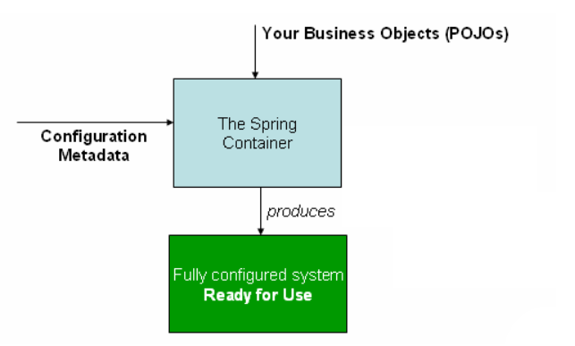
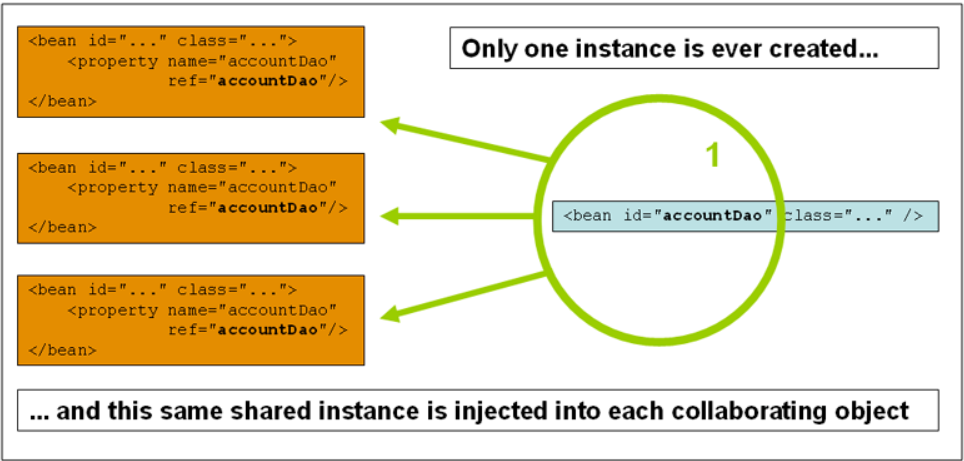
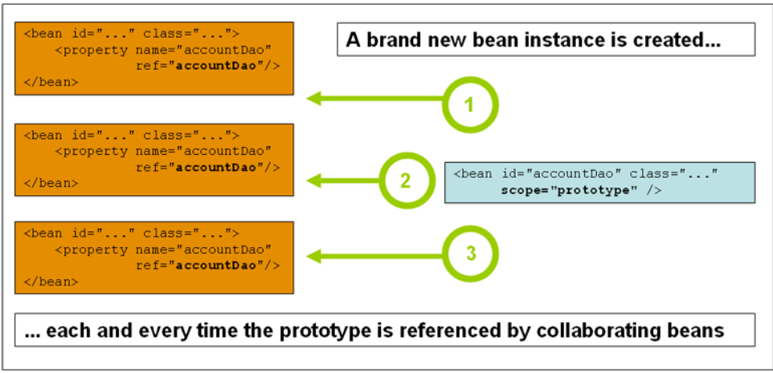
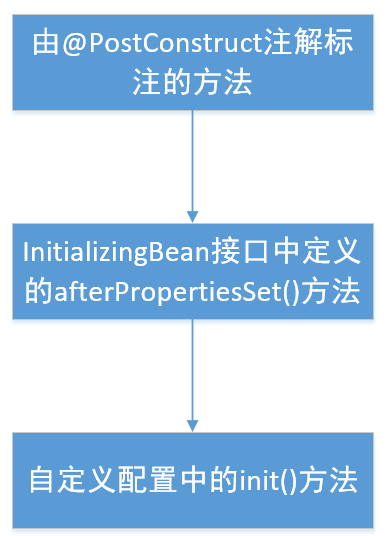
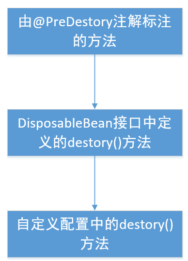

## 1.IOC容器

### 1.1 对IOC容器和Beans的简介

- org.springframework.beans和org.springframework.context构成了IOC实现的基础
- BeanFactory是能够管理各种类型对象的一个接口，ApplicationContext是它的子接口
- 简而言之，BeanFactory提供了配置框架和基本功能，而ApplicationContext则增加了更多的企业特定功能。ApplicationContext是BeanFactory的一个完整的超集

### 1.2 容器概览

- ApplicationContext接口代表了IOC容器，是它对对象进行的实例化、配置和整合
- 配制方法是通过读取一些元数据，这些元数据可以由xml、注解和Java配置文件进行配置。
- 在配置好配置文件（元数据之后），只要创建ApplicaitonContext对象，就完成了容器的初始化，容器就会帮我们创建好对象
  
- 对于元数据，即xml配置文件的定义可以有多个。每个单独的 XML 配置文件代表体系结构中的一个逻辑层或模块。例如，dao.xml中专门存放持久层的bean。service.xml专门用于存放service层的bean
- 虽然ApplicationContext中定义了获取bean的方法和API，但是在理想情况下，并不应该使用这些API，因为Spring的许多整合框架就已经将所有的依赖配置好了，比如说SpringMVC

### 1.3 Bean概览

- 在容器的视角下，bean在容器内部被定义为BeanDefinition对象。

  ```java
  public interface BeanDefinition extends AttributeAccessor, BeanMetadataElement {
      String SCOPE_SINGLETON = "singleton";
      String SCOPE_PROTOTYPE = "prototype";
      int ROLE_APPLICATION = 0;
      int ROLE_SUPPORT = 1;
      int ROLE_INFRASTRUCTURE = 2;
  
      void setParentName(@Nullable String var1);
  
      @Nullable
      String getParentName();
  
      void setBeanClassName(@Nullable String var1);
  
      @Nullable
      String getBeanClassName();
  
      void setScope(@Nullable String var1);
  
      @Nullable
      String getScope();
  
      void setLazyInit(boolean var1);
  
      boolean isLazyInit();
  
      void setDependsOn(@Nullable String... var1);
  
      @Nullable
      String[] getDependsOn();
  
      void setAutowireCandidate(boolean var1);
  
      boolean isAutowireCandidate();
  
      void setPrimary(boolean var1);
  
      boolean isPrimary();
  
      void setFactoryBeanName(@Nullable String var1);
  
      @Nullable
      String getFactoryBeanName();
  
      void setFactoryMethodName(@Nullable String var1);
  
      @Nullable
      String getFactoryMethodName();
  
      ConstructorArgumentValues getConstructorArgumentValues();
  
      default boolean hasConstructorArgumentValues() {
          return !this.getConstructorArgumentValues().isEmpty();
      }
  
      MutablePropertyValues getPropertyValues();
  
      default boolean hasPropertyValues() {
          return !this.getPropertyValues().isEmpty();
      }
  
      void setInitMethodName(@Nullable String var1);
  
      @Nullable
      String getInitMethodName();
  
      void setDestroyMethodName(@Nullable String var1);
  
      @Nullable
      String getDestroyMethodName();
  
      void setRole(int var1);
  
      int getRole();
  
      void setDescription(@Nullable String var1);
  
      @Nullable
      String getDescription();
  
      ResolvableType getResolvableType();
  
      boolean isSingleton();
  
      boolean isPrototype();
  
      boolean isAbstract();
  
      @Nullable
      String getResourceDescription();
  
      @Nullable
      BeanDefinition getOriginatingBeanDefinition();
  }
  ```

  ```java
  public abstract class AbstractBeanDefinition extends BeanMetadataAttributeAccessor implements BeanDefinition, Cloneable {
      public static final String SCOPE_DEFAULT = "";
      public static final int AUTOWIRE_NO = 0;
      public static final int AUTOWIRE_BY_NAME = 1;
      public static final int AUTOWIRE_BY_TYPE = 2;
      public static final int AUTOWIRE_CONSTRUCTOR = 3;
      /** @deprecated */
      @Deprecated
      public static final int AUTOWIRE_AUTODETECT = 4;
      public static final int DEPENDENCY_CHECK_NONE = 0;
      public static final int DEPENDENCY_CHECK_OBJECTS = 1;
      public static final int DEPENDENCY_CHECK_SIMPLE = 2;
      public static final int DEPENDENCY_CHECK_ALL = 3;
      public static final String INFER_METHOD = "(inferred)";
      @Nullable
      private volatile Object beanClass;
      @Nullable
      private String scope;
      private boolean abstractFlag;
      @Nullable
      private Boolean lazyInit;
      private int autowireMode;
      private int dependencyCheck;
      @Nullable
      private String[] dependsOn;
      private boolean autowireCandidate;
      private boolean primary;
      private final Map<String, AutowireCandidateQualifier> qualifiers;
      @Nullable
      private Supplier<?> instanceSupplier;
      private boolean nonPublicAccessAllowed;
      private boolean lenientConstructorResolution;
      @Nullable
      private String factoryBeanName;
      @Nullable
      private String factoryMethodName;
      @Nullable
      private ConstructorArgumentValues constructorArgumentValues;
      @Nullable
      private MutablePropertyValues propertyValues;
      private MethodOverrides methodOverrides;
      @Nullable
      private String initMethodName;
      @Nullable
      private String destroyMethodName;
      private boolean enforceInitMethod;
      private boolean enforceDestroyMethod;
      private boolean synthetic;
      private int role;
      @Nullable
      private String description;
      @Nullable
      private Resource resource;
  }
  ```

  其中包含着以下元数据

  - 全限定类名：通常是定义的 bean 的实际实现类。

  - Bean行为配置元素，用来表示Bean在容器中的行为，如bean的作用范围，生命周期，回调等等。

  - Bean所依赖的其他Bean的引用。这些引用用来同该Bean共同完成任务，这些引用也被称作协作者或者依赖关系

    ```java
     private String[] dependsOn;
    ```

  - 在一个新创建的对象中设置的一些其他配置，例如，池的大小，或者管理连接池的bean中可用的连接数等

- 除了使用配置文件创建Bean之外，ApplicationContext还可以允许注册在容器之外，由用户创建的现有的对象。可以通过getBeanFactory()方法来实现，但是不建议。还是建议使用正常的注册方式。

- 每个 bean 都有一个或多个标识符。这些标识符在承载 bean 的容器中必须是唯一的。一个 bean 通常只有一个标识符。但是，如果它需要多于一个，那么额外的那些可以被认为是别名。

- 虽然XML解析器对Bean的ID并没有强制唯一，但是容器对Bean的ID是强制唯一的。

- 如果不给Bean指定name或者id属性，那么容器就会自动给它生成一个唯一ID，但是当我们在xml定义其他Bean需要引用那个没有name或者id的Bean时，就没办法了。

- bean的命名规范是小写字母开头的驼峰式

- 可以为bean创建别名

  ```xml
  <!-- id是bean的唯一标识符 class是bean的类的全限定类名  -->
  <bean id="studentDao" class="com.echo.dao.StudentDao" name="stdDao">
      <property name="id" value="1"/>
      <!--  这个属性代表了对其他bean的引用      -->
      <property name="student" ref="studentBean"/>
  </bean>
  
  <alias name="stdDao" alias="studentDao2"/>
  ```

- Bean 定义本质上是创建一个或多个对象的配方。当提出请求时，容器查看命名 bean 的配方，并使用该 bean 定义封装的配置元数据来创建(或获取)实际对象。

- 使用XML配置数据创建bean的话，一定要给bean指定class属性。容器会通过反射的方式，创建一个Bean，这种操作方法和new一个对象类型。

- 静态内部类对象的bean配置方式

  ```java
  public class Something {
      public static class OtherThing{
          
      }
  }
  ```

  ```xml
  <bean id="otherThing" class="com.echo.pojo.Something$OtherThing">
  
  </bean>
  ```

- 使用构造函数创建bean

  ```xml
  <!-- id是bean的唯一标识符 class是bean的类的全限定类名  -->
  <bean id="studentBean" class="com.echo.pojo.Student" >
      <!-- collaborators and configuration for this bean go here -->
      <property name="id" value="1"/>
      <property name="name" value="echo" />
      <property name="score" value="90" />
  </bean>
  ```

  ```java
  public class Student {
      private int id;
      private String name;
      private int score;
  
      public Student() {
      }
  
      public Student(int id, String name, int score) {
          this.id = id;
          this.name = name;
          this.score = score;
      }
      //getter and setter
      public static void main(String[] args) {
          //使用路径资源来加载容器初始化时需要的元数据
          //这样就初始化好了容器
          ApplicationContext applicationContext = new ClassPathXmlApplicationContext("pojo.xml");
          StudentDao studentDao = applicationContext.getBean("studentDao", StudentDao.class);
          System.out.println(studentDao);
      }
  }
  ```

  就是传统的方式

- 使用静态工厂方法创建bean

  ```xml
  <bean id="clientService"
            class="com.echo.chapter1.beanoverview.ClientService"
            factory-method="createInstance"/>
  ```

  ```java
  public class ClientService {
      private static ClientService clientService = new ClientService();
      private ClientService() {}
  
      public static ClientService createInstance() {
          return clientService;
      }
  
      @Override
      public String toString() {
          return "Client Service has been created";
      }
  
      public static void main(String[] args) {
          ApplicationContext context = new ClassPathXmlApplicationContext("pojo.xml");
          ClientService clientService = context.getBean("clientService", ClientService.class);
          System.out.println(clientService);
      }
  }
  ```

  这应该这样解释：就是说，定义了一个类，该类只能使用定义在它本身中的工厂方法实例化，而不是使用new运算符初始化，这样就可以使用上述方式来将其注入到容器中。

- 使用实例工厂方法创建bean
  这是生产student和studentDao的工厂

  ```java
  public class ObjectFactory {
      private static Student student = new Student();
      private static StudentDao studentDao = new StudentDao();
  
      public Student getStudent(){
          return student;
      }
  
      public StudentDao getStudentDao(){
          return studentDao;
      }
  }
  ```

  

  ```xml
  <!--  实例工厂创建bean  -->
  <bean id="objectFactory" class="com.echo.chapter1.beanoverview.ObjectFactory" />
  <bean id="student" factory-bean="objectFactory" factory-method="getStudent" />
  <bean id="studentDao" factory-bean="objectFactory" factory-method="getStudentDao" />
  ```

  

  ```java
  public static void main(String[] args) {
      ApplicationContext context = new ClassPathXmlApplicationContext("pojo.xml");
      Student student = context.getBean("student", Student.class);
      System.out.println(student);
      StudentDao studentDao = context.getBean("studentDao", StudentDao.class);
      System.out.println(studentDao);
  }
  ```

  

### 1.4 依赖性

- 控制翻转与依赖注入  https://www.jianshu.com/p/07af9dbbbc4b

- 依赖注入有两种主要的形式：基于构造函数的依赖注入和基于Setter的依赖注入

- 基于构造函数的依赖注入
  对于类型已知，且不存在歧义的构造函数参数，不需要明确指定其类型

  ```java
  public class ThingOne {
      private ThingTwo thingTwo;
      private ThingThree thingThree;
  
      public ThingOne(ThingTwo thingTwo,ThingThree thingThree){
          this.thingTwo = thingTwo;
          this.thingThree = thingThree;
      }
  }
  ```

  ```xml
  <bean id="thingOne" class="com.echo.chapter1.dependencies.ThingOne">
      <constructor-arg ref="thingTwo"/>
      <constructor-arg ref="thingThree"/>
  </bean>
  <bean id="thingTwo" class="com.echo.chapter1.dependencies.ThingTwo">
  </bean>
  <bean id="thingThree" class="com.echo.chapter1.dependencies.ThingThree">
  
  </bean>
  ```

  对于类型未知或基本数据类型的构造函数参数，则需要指定参数类型

  ```java
  public class ExampleBean {
      private int years;
      private String ultimateAnswer;
  
      public ExampleBean(int years,String ultimateAnswer){
          this.years = years;
          this.ultimateAnswer = ultimateAnswer;
      }
  }
  ```

  ```xml
  <bean id="exampleBean" class="com.echo.chapter1.dependencies.ExampleBean">
      <constructor-arg type="int" value="750000"/>
      <constructor-arg type="java.lang.String" value="42" />
  </bean>
  ```

  也可以使用index属性显示指定构造函数参数的索引

  ```xml
  <bean id="exampleBean" class="com.echo.chapter1.dependencies.ExampleBean">
      <constructor-arg index="0" value="75000"/>
      <constructor-arg index="1" value="42" />
  </bean>
  ```

  也可以使用构造函数参数名

  ```xml
  <bean id="exampleBean" class="com.echo.chapter1.dependencies.ExampleBean">
      <constructor-arg name="years" value="7500000"/>
      <constructor-arg name="ultimateAnswer" value="42"/>
  </bean>
  ```

- 基于Setter的依赖注入
  若类中不存在静态工厂方法和有参构造函数，只有setter方法，则只能使用基于Setter的依赖注入。

  如果有一个类存在着只有部分参数的构造函数，那么在通过构造函数方法注入一些依赖项之后，它还支持基于 setter 的 DI。

- 对于强依赖项使用构造函数DI,对于可选依赖项使用基于setter的DI是一个很好的经验法则

- 在 setter方法上使用@Required 注释可以使该属性成为必需的依赖项

- Setter 注入的一个好处是 setter 方法使该类的对象容易在以后重新配置或重新注入

- 依赖解析的过程

  - 创建ApplcationContext,使用描述所有Bean的配置文件元数据进行初始化，元数据可以通过XML、Java代码和注解来指定。
  - 对于每个Bean，其依赖关系通过属性、构造函数参数或静态工厂方法的参数形式表示。在实际创建Bean时，这些依赖项被注入到Bean中
  - Bean中的依赖项，就是一个类中定义的属性，每个属性或者构造函数参数都是要设置的值的实际定义。或者是容器中对于另一个Bean的引用
  - 依据在配置文件中定义的元数据，容器会将bean中所依赖的每个属性，转换为所定义的实际类型。默认情况下Spring 可以将以字符串格式提供的值转换为所有内置类型，如 int、 long、 String、 boolean 等。

- 在创建容器时，将创建单例并设置为预实例化(pre-instantiated)(默认情况)的 bean

- 只有在请求 bean 时才会创建它

- 循环依赖

  - 出现场景：主要使用构造函数注入。例如: a 类需要通过构造函数注入的 b 类实例，而 b 类需要通过构造函数注入的 a 类实例。如果将 bean 配置为类 a 和类 b 相互注入，那么 Spring IoC 容器在运行时检测到这个循环引用，并抛出 BeanCurrentlyInCreationException。
  - 解决方案：
    1.在编写源代码时，使用setter来设置依赖，在配置代码中，使用Setter注入，尽量避免使用构造函数注入
    2.避免构造函数注入，只使用setter注入。

- 通常可以相信 Spring 会做正确的事情。它在容器加载时检测配置问题，例如对不存在的 bean 和循环依赖项的引用。

- Spring 设置属性并尽可能晚地解析依赖关系，只有当 bean 实际创建时，才会检测该bean的依赖关系。这就意味着，Spring容器会正确的加载，不会因为某个bean的依赖项有错误才停止加载，只有在请求bean时，这个bean出现了错误，才会抛出异常。

- ApplicationContext 实现会预先实例化单例 bean

- 如果不存在循环依赖关系，当一个或多个被依赖 bean 被注入到依赖 bean 中时，每个被依赖的bean 在被注入到依赖 bean 之前都会被完全配置。这意味着，如果 bean a 对 bean b 有依赖关系，那么在调用 bean a 上的 setter 方法之前，Spring IoC 容器将完全配置 bean b。

- ```xml
  <bean id="theTargetBean" class="..."/>
  
  <bean id="theClientBean" class="...">
      <property name="targetName">
          <idref bean="theTargetBean"/>
      </property>
  </bean>
  ```

  ```xml
  <bean id="theTargetBean" class="..." />
  
  <bean id="client" class="...">
      <property name="targetName" value="theTargetBean"/>
  </bean>
  ```

  两种配置方式都一样，但是第一种形式比第二种形式更可取，因为使用 idref 标记可以让容器在部署时验证所引用的命名 bean 是否确实存在。在第二个变体中，不对传递给客户端 bean 的 targetName 属性的值执行验证。

- 内部bean：类似于内部类

  ```xml
  <bean id="outer" class="...">
      <!-- instead of using a reference to a target bean, simply define the target bean inline -->
      <property name="target">
          <bean class="com.example.Person"> <!-- this is the inner bean -->
              <property name="name" value="Fiona Apple"/>
              <property name="age" value="25"/>
          </bean>
      </property>
  </bean>
  ```

  内部 bean 定义不需要定义的 ID 或名称。如果指定，则容器不使用此值作为标识符。容器在创建内部bean时还忽略范围标志，因为内部 bean 总是匿名的，并且总是用外部 bean 创建的。不可能独立地访问内部 bean，也不可能将它们注入到合作 bean 中，而是注入到包围的 bean 中。

- list set map的注入

  ```java
  public class MoreComplexObject {
      private List<String> list;
      private Map<String,String> map;
      private Set<String> set;
  
      //getter setter igonre
  
      public static void main(String[] args) {
          ApplicationContext context = new ClassPathXmlApplicationContext("dependencies.xml");
          MoreComplexObject moreComplexObject = context.getBean("moreComplexObject", MoreComplexObject.class);
          System.out.println(moreComplexObject.getList());
          System.out.println(moreComplexObject.getMap());
          System.out.println(moreComplexObject.getSet());
      }
  }
  ```

  ```xml
  <bean id="moreComplexObject" class="com.echo.chapter1.dependencies.MoreComplexObject">
      <property name="list">
          <list>
              <value>a list demo</value>
          </list>
      </property>
      <property name="map">
          <map>
              <entry key="key" value="value" />
          </map>
      </property>
      <property name="set">
          <set>
              <value>set</value>
          </set>
      </property>
  </bean>
  ```

  ```bash
  [a list demo]
  {key=value}
  [set]
  ```

- 集合和属性的合并

  ```java
  public class ComplexObject {
      private Properties properties;
  
      public Properties getProperties() {
          return properties;
      }
  
      public void setProperties(Properties properties) {
          this.properties = properties;
      }
  
      public static void main(String[] args) {
          ApplicationContext context = new ClassPathXmlApplicationContext("dependencies.xml");
          ComplexObject childProperties = context.getBean("childProperties", ComplexObject.class);
          System.out.println(childProperties.getProperties());
      }
  }
  ```

  ```xml
  <bean id="parentProperties" class="com.echo.chapter1.dependencies.ComplexObject">
      <property name="properties">
          <props>
              <prop key="admin">admin@163.com</prop>
              <prop key="support">support@163.com</prop>
          </props>
      </property>
  </bean>
  <bean id="childProperties" parent="parentProperties">
      <property name="properties">
          <props merge="true">    <!-- 合并父属性 -->
              <prop key="support">support@qq.com</prop>
              <prop key="sales">sales@163.com</prop>
          </props>
      </property>
  </bean>
  ```

  ```bash
  {admin=admin@163.com, support=support@qq.com, sales=sales@163.com}
  ```

  子 Properties 集合的值集从父 < props/> 继承所有属性元素，子集合的支持值覆盖父集合中的值。不能合并不同的集合类型(如 Map 和 List)。

- Spring 将属性和类似属性的空参数视为空字符串。

  ```xml
  <bean class="ExampleBean">
      <property name="email" value=""/>
  </bean>
  ```

  等价于

  ```java
  exampleBean.setEmail("");
  ```

- 空值处理

  ```xml
  <bean class="ExampleBean">
      <property name="email">
          <null/>
      </property>
  </bean>
  ```

  等价于下面的 Java 代码:

  ```java
  exampleBean.setEmail(null);
  ```

- depend-on属性：
  depend-on属性表示对单个bean的依赖，可以在初始化元素之前显示强制初始化一个或者多个bean

  ```xml
  <bean id="beanOne" class="ExampleBean" depends-on="manager"/>
  <bean id="manager" class="ManagerBean" />
  ```

  会在beanOne初始化之前强制初始化名为manager的bean。

  ```xml
  <bean id="beanOne" class="ExampleBean" depends-on="manager,accountDao">
      <property name="manager" ref="manager" />
  </bean>
  
  <bean id="manager" class="ManagerBean" />
  <bean id="accountDao" class="x.y.jdbc.JdbcAccountDao" />
  ```

  会在beanOne初始化之前，强制初始化名为manager和accountDao的bean

- bean的延迟加载：ApplicationContext的默认行为是在容器初始化完成之后，就初始化好那些作用域为singleton的bean，但是如果不想这样做，而是想让bean变为按需加载时，则在bean元素上设置lazy-init属性为true，该bean就会变成按需加载。

  ```xml
  <bean id="lazy" class="com.something.ExpensiveToCreateBean" lazy-init="true"/>
  <bean name="not.lazy" class="com.something.AnotherBean"/>
  ```

- 但是，如果一个惰性初始化的 bean 是一个单例 bean 的依赖项，而这个单例 bean 并不是惰性初始化的，那么 ApplicationContext 会在启动时创建惰性初始化的 bean，因为它必须满足单例依赖项。延迟初始化的 bean 被注入到其他地方的单例 bean 中，这个单例 bean 并不是延迟初始化的。
  还可以使用 < beans/> 元素的 default-lazy-init 属性在容器级别控制延迟初始化

  ```xml
  <beans default-lazy-init="true">
      <!-- no beans will be pre-instantiated... -->
  </beans>
  ```

- 可以让Spring通过检查ApplicationContext中的内容来自动装配相互协作的bean之间的关系。

  优点：

  1. 自动装配可以显著减少指定属性或构造函数参数的需要
  2.  自动装配可以随时更新一个bean的状态

- 当使用基于 xml 的配置元数据时(参见依赖注入) ，可以使用 < bean/> 元素的 autowire 属性为 bean 定义指定 autowire 模式
  autowire的四种模式
  `no` 该选项是`spring`框架的默认选项，表示自动装配为关闭状态`OFF`。我们必须在`bean`定义中使用`<property>`标签显式设置依赖项。

  `byName` 此选项启用基于`bean`名称的依赖项注入。在`Bean`中自动装配属性时，属性名称用于在配置文件中搜索匹配的`Bean`定义。如果找到这样的`bean`，则将其注入属性。如果找不到这样的`bean`，则会引发错误。

  `byType` 此选项支持基于`bean`类型的依赖项注入。在`bean`中自动装配属性时，属性的类类型用于在配置文件中搜索匹配的`bean`定义。如果找到这样的`bean`，就在属性中注入它。如果没有找到这样的`bean`，就会引发一个错误。

  `constructor` 通过构造函数自动装配与`byType`相似，仅适用于构造函数参数。在启用了自动装配的`bean`中，它将查找构造函数参数的类类型，然后对所有构造函数参数执行自动装配类型。请注意，如果容器中没有一个完全属于构造函数参数类型的`bean`，则会引发致命错误。

- 自动装配的缺点：

  1. 在配置文件中配置的显示依赖项会重写自动装配时配置的依赖。
  2. 自动装配不如直接的配置显示依赖精确
  3. Spring容器可以生成依赖关系之间的文档，自动装配可能导致文档生成失败。
  4. 容器中的多个 bean 定义可能与 setter 方法或要自动连接的构造函数参数指定的类型相匹配。对于数组、集合或 Map 实例，这不一定是问题。但是，对于期望单个值的依赖项，不能随意解决这种不确定性。如果没有唯一的 bean 定义可用，则引发异常。

- 使某个bean无法自动装配

  ```xml
  <bean id="childProperties" parent="parentProperties" autowire-candidate="false">
  </bean>
  ```

  设置bean的autowire-candidate属性为false，就会将该bean从自动装配的队列中排除出去。

- 可以通过在<beans>顶层标签的default-autowire-candidates属性中，设置模式，来通过使用名称来模式匹配，限制哪些beans是无法被自动注入的。

- 在大多数应用程序场景中，容器中的大多数 bean 都是单例的。当一个单例 bean 需要与另一个单例 bean 协作，或者一个非单例 bean 需要与另一个非单例 bean 协作时，通常通过将一个 bean 定义为另一个 bean 的属性来处理依赖关系。当 bean 的生命周期不同时，问题就出现了。假设单例 bean a 需要使用非单例bean b，也许在 a 上的每个方法调用上都需要。容器只创建单例 bean a 一次，因此只有一次机会设置属性。每次需要 bean b 的新实例时，容器不能为 bean a 提供 bean b 的新实例。
  一种解决方案是：放弃一些控制反转，让bean A实现ApplicationContextAware 接口，每次在bean A需要其依赖的bean B时，通过调用一个方法，让容器创建一个bean B，给A使用。

  ```java
  public class CommandManager implements ApplicationContextAware {
  	//在类中定义一个ApplicationContext的引用，用来保留实现方法中传递过来的applicationContext
      private ApplicationContext applicationContext;
  
      public Object process(Map commandState) {
          // grab a new instance of the appropriate Command
          Command command = createCommand();
          // set the state on the (hopefully brand new) Command instance
          command.setState(commandState);
          return command.execute();
      }
  
      protected Command createCommand() {
          // notice the Spring API dependency!
          //使用applicationContext来获取该bean所依赖的bean对象
          return this.applicationContext.getBean("command", Command.class);
      }
  	//实现接口中的方法
      @Override
      public void setApplicationContext(ApplicationContext applicationContext) throws BeansException {
          this.applicationContext = applicationContext;
      }
  }
  ```

  但是这种方式是不可取的，因为Spring框架耦合到了业务中。更好的解决办法是使用方法注入。

- LookUp查找方法注入

  ```java
  public abstract class CommandManager {
  
      public Object process(Object commandState) {
          // grab a new instance of the appropriate Command interface
          Command command = createCommand();
          // set the state on the (hopefully brand new) Command instance
          command.setState(commandState);
          return command.execute();
      }
  
      // okay... but where is the implementation of this method?
      protected abstract Command createCommand();
  }
  ```

  ```xml
  <!-- a stateful bean deployed as a prototype (non-singleton) -->
  <bean id="myCommand" class="fiona.apple.AsyncCommand" scope="prototype">
      <!-- inject dependencies here as required -->
  </bean>
  
  <!-- commandProcessor uses statefulCommandHelper -->
  <bean id="commandManager" class="fiona.apple.CommandManager">
      <lookup-method name="createCommand" bean="myCommand"/>
  </bean>
  ```

  使用lookup来查找能够提供实例对象注入的方法。或者，也可以通过注解的方式。

  ```java
  public abstract class CommandManager {
  
      public Object process(Object commandState) {
          Command command = createCommand();
          command.setState(commandState);
          return command.execute();
      }
  
      @Lookup("myCommand")	//通过名字查找
      protected abstract Command createCommand();
  }
  ```

  ```java
  public abstract class CommandManager {
  
      public Object process(Object commandState) {
          MyCommand command = createCommand();
          command.setState(commandState);
          return command.execute();
      }
  
      @Lookup	//通过类型查找
      protected abstract MyCommand createCommand();
  }
  ```

  

### 1.5 Bean的作用域

| Scope 范围                                                   | Description 描述                                             |
| :----------------------------------------------------------- | :----------------------------------------------------------- |
| [singleton](https://docs.spring.io/spring-framework/docs/5.2.9.RELEASE/spring-framework-reference/core.html#beans-factory-scopes-singleton) | (Default) Scopes a single bean definition to a single object instance for each Spring IoC container.(默认值)为每个 Spring IoC 容器将一个 bean 定义作用于一个对象实例。 |
| [prototype](https://docs.spring.io/spring-framework/docs/5.2.9.RELEASE/spring-framework-reference/core.html#beans-factory-scopes-prototype) | Scopes a single bean definition to any number of object instances.将单个 bean 定义作用于任意数量的对象实例。 |
| [request](https://docs.spring.io/spring-framework/docs/5.2.9.RELEASE/spring-framework-reference/core.html#beans-factory-scopes-request) | Scopes a single bean definition to the lifecycle of a single HTTP request. That is, each HTTP request has its own instance of a bean created off the back of a single bean definition. Only valid in the context of a web-aware Spring `ApplicationContext`.将单个 bean 定义作用于单个 HTTP 请求的生命周期。也就是说，每个 HTTP 请求都有自己的 bean 实例，这个 bean 是从单个 bean 定义后面创建的。仅在感知 web 的 Spring application 上下文中有效。 |
| [session](https://docs.spring.io/spring-framework/docs/5.2.9.RELEASE/spring-framework-reference/core.html#beans-factory-scopes-session) | Scopes a single bean definition to the lifecycle of an HTTP `Session`. Only valid in the context of a web-aware Spring `ApplicationContext`.将单个 bean 定义作用于 HTTP 会话的生命周期。仅在感知 web 的 Spring application 上下文中有效。 |
| [application](https://docs.spring.io/spring-framework/docs/5.2.9.RELEASE/spring-framework-reference/core.html#beans-factory-scopes-application) | Scopes a single bean definition to the lifecycle of a `ServletContext`. Only valid in the context of a web-aware Spring `ApplicationContext`.将单个 bean 定义作用于 ServletContext 的生命周期。仅在感知 web 的 Spring application 上下文中有效。 |
| [websocket](https://docs.spring.io/spring-framework/docs/5.2.9.RELEASE/spring-framework-reference/web.html#websocket-stomp-websocket-scope) | Scopes a single bean definition to the lifecycle of a `WebSocket`. Only valid in the context of a web-aware Spring `ApplicationContext`.将一个 bean 定义作为 WebSocket 生命周期的范围。仅在感知 web 的 Spring application 上下文中有效。 |

- 单例bean:当您定义一个 bean 定义并将其作用域定为单例时，Spring IoC 容器只创建由该 bean 定义定义的对象的一个实例。这个单独的实例存储在这样的单独 bean 的缓存中，并且对于这个命名 bean 的所有后续请求和引用都返回缓存的对象。下面的图片展示了单例模式的工作原理:
  
  
- Spring的单例bean不同于设计模式中定义的单例模式。设计模式种的单例模式意味着，整个ClassLoader中只存在一个单例实例，而Spring中的单例bean意味着一个Spring的容器中只存在一个单例Bean，两者的范围不同。

- 原型范围：Bean 部署的非单例原型范围导致每次对特定 bean 发出请求时都会创建一个新的 bean 实例。也就是说，bean 被注入到另一个 bean 中，或者您通过容器上的 getBean ()方法调用请求它。通常，您应该为所有有状态 bean 使用原型范围，为无状态 bean 使用单例范围。
  
  
- Spring对于作用范围为prototype的bean只负责创建，并不负责清理，清理工作交给请求者，也即该bean 的使用者负责。

- 当您使用单实例范围的 bean 与原型 bean 的依赖关系时，请注意依赖关系在实例化时被解析。因此，如果您依赖性地将原型范围的 bean 注入到单实例范围的 bean 中，那么就会实例化一个新的原型 bean，然后依赖性地注入到单实例 bean 中。原型实例是曾经提供给单一作用域 bean 的唯一实例。
  但是，假设您希望**单实例范围的 bean 在运行时重复获取原型范围的 bean 的新实例**。不能依赖性地将原型范围的 bean 注入到单例 bean 中，因为注入只发生一次，即当 Spring 容器实例化单例 bean 并解析和注入它的依赖项时。如果在运行时多次需要原型 bean 的新实例，请参见方法注入
  
- request、session、application和 websocket 范围只有在使用感知 web 的 Spring ApplicationContext 实现(比如 XmlWebApplicationContext)时才可用。如果将这些作用域与常规 Spring IoC 容器(如 ClassPathXmlApplicationContext)一起使用，则会抛出一个非法 statexception，它会报告一个未知的 bean 作用域。

- Spring IoC 容器不仅管理对象(bean)的实例化，还管理协作者(或依赖项)之间的连接。如果您想将(例如)一个 HTTP 请求范围的 bean 注入到另一个长寿命范围的 bean 中，您可以选择注入一个 AOP 代理来代替范围的 bean。也就是说，您需要注入一个代理对象，该代理对象公开与作用域对象相同的公共接口，但也可以从相关作用域中检索真正的目标对象(例如 HTTP 请求) ，并将委托方法调用引用到真正的对象上。

- 不同作用域的对象之间的注入规则

  ```xml
  <bean id="userPreferences" class="com.something.UserPreferences" scope="session">
      <aop:scoped-proxy/>
  </bean>
  
  <bean id="userManager" class="com.something.UserManager">
      <property name="userPreferences" ref="userPreferences"/>
  </bean>
  ```

  上例中，userPreferences是一个会话级别的bean，而userManager的作用域为singleton,因此，由于userManager bean创建时，要依赖于userPreferences，但是由于作用域的原因，在容器创建userManager bean时，容器创建了一个对象，该对象公开了与 UserPreferences 类完全相同的公共接口(理想情况下是一个 UserPreferences 实例的对象) ，该对象可以从范围机制(HTTP request、 Session 等)中获取真正的 UserPreferences 对象。容器将这个代理对象注入到 userManager bean 中，而 UserPreferences 引用并不知道这是一个代理。在这个示例中，当 UserManager 实例调用依赖注入的 UserPreferences 对象上的方法时，它实际上是在调用代理上的方法。然后，代理从(在本例中) HTTP Session 获取真实的 UserPreferences 对象，并将方法调用委托给检索到的真实 UserPreferences 对象。

- 默认情况下，当 Spring 容器为用 < aop: scoped-proxy/> 元素标记的 bean 创建代理时，将创建一个基于 cglib 的类代理。

- <aop:scoped-proxy proxy-target-class="false"/> 当设置 proxy-target-class="false" 之后，将会为这种作用域bean创建标准的基于JDK接口的代理。

- 通过实现Scope接口，可以自定义bean的作用范围

  ```java
  public interface Scope {
      Object get(String var1, ObjectFactory<?> var2);
  
      @Nullable
      Object remove(String var1);
  
      void registerDestructionCallback(String var1, Runnable var2);
  
      @Nullable
      Object resolveContextualObject(String var1);
  
      @Nullable
      String getConversationId();
  }
  ```

### 1.6 定义bean的特征

- 为了实现容器与bean生命周期的交互，可以实现Spring提供的InitializingBean和DisposableBean接口，前者提供了afterPropertiesSet()的回调函数，用来在bean初始化时进行操作，后者提供了destroy()回调函数，用来在销毁bean时执行某些操作。
  不过，在现代实践中，JSR-250中定义的@PostConstruct 和@PreDestroy 注释通常被认为是在现代 Spring 应用程序中接收生命周期回调的最佳实践。被@PostConstruct标注的方法，会在bean创建之前执行，@PreDestroy会在销毁之前执行。

- Spring会使用BeanPostProcessor接口的实现来正确进行回调函数的处理

  ```java
  public interface BeanPostProcessor {
      @Nullable
      default Object postProcessBeforeInitialization(Object bean, String beanName) throws BeansException {
          return bean;
      }
  
      @Nullable
      default Object postProcessAfterInitialization(Object bean, String beanName) throws BeansException {
          return bean;
      }
  }
  ```

  如果您需要自定义特性或其他 Spring 默认不提供的生命周期行为，您可以自己实现 BeanPostProcessor

- org.springframework.beans.factory.InitializingBean接口中只有一个方法 

  ```java
  void afterPropertiesSet() throws Exception;
  ```

  允许 bean 在容器已经在 bean 上设置了所有必要的属性之后执行初始化工作

- 建议不要使用 InitializingBean 接口，因为它不必要地将代码与 Spring 挂钩。
  建议使用@PostConstruct 注释或指定 POJO 初始化方法。对于基于 xml 的配置元数据，可以使用 init-method 属性指定具有无效无参数签名的方法的名称。使用 Java 配置，您可以使用@Bean 的 initMethod 属性。

  ```xml
  <bean id="exampleInitBean" class="examples.ExampleBean" init-method="init"/>
  ```

  ```java
  public class ExampleBean {
  
      public void init() {
          // do some initialization work
      }
  }
  ```

  这种方式与下面不建议使用的方式完全相同。

  ```xml
  <bean id="exampleInitBean" class="examples.AnotherExampleBean"/>
  ```

  ```java
  public class AnotherExampleBean implements InitializingBean {
  
      @Override
      public void afterPropertiesSet() {
          // do some initialization work
      }
  }
  ```

  这种方式将业务代码与Spring的代码耦合到了一起。

- org.springframework.beans.factory.DisposableBean 接口允许bean在包含它的容器被销毁时执行destory()回调。

  ```java
  void destroy() throws Exception;
  ```

  同理，建议不要将其耦合到Spring框架中。

- 推荐使用自定义初始化方法的方式初始化bean，假设类的定义如下

  ```java
  public class BlogService {
      private BlogDao blogDao;
  
      public void setBlogDao(BlogDao blogDao) {
          this.blogDao = blogDao;
      }
  
      public void init(){
          System.out.println("Blog Service init");
      }
  }
  ```

  ```java
  public class BlogDao {
      public void init(){
          System.out.println("Hello world Blog Dao");
      }
  }
  ```

  xml定义如下

  ```xml
  <?xml version="1.0" encoding="UTF-8"?>
  <beans xmlns="http://www.springframework.org/schema/beans"
         xmlns:xsi="http://www.w3.org/2001/XMLSchema-instance"
         xsi:schemaLocation="http://www.springframework.org/schema/beans
          https://www.springframework.org/schema/beans/spring-beans.xsd"
          default-init-method="init">
      <bean id="blogDao" class="com.echo.chapter1.custombeannature.BlogDao"/>
  
      <bean id="blogService" class="com.echo.chapter1.custombeannature.BlogService">
          <property name="blogDao" ref="blogDao"/>
      </bean>
  
  </beans>
  ```

  注意，在<beans>标签中设置了default-init-method="init"属性。

  main方法定义如下

  ```java
  public static void main(String[] args) {
          ApplicationContext context = new ClassPathXmlApplicationContext("nature.xml");
          BlogDao blogDao = context.getBean("blogDao", BlogDao.class);
          //BlogService blogService = context.getBean("blogService", BlogService.class);
  }
  ```

  注意，我这里在两个类中都定义了init()方法，然后容器在初始化时就会初始化作用域为singleton的bean，所以，我在进行完容器的初始化之后，这两个init()方法都会被调用。

  ```bash
  Hello world Blog Dao
  Blog Service init
  ```

  如果将其中一个bean设置为延迟加载

  ```xml
  <bean id="blogDao" class="com.echo.chapter1.custombeannature.BlogDao"/>
  
  <bean id="blogService" class="com.echo.chapter1.custombeannature.BlogService" lazy-init="true">
      <property name="blogDao" ref="blogDao"/>
  </bean>
  ```

  那么，它的init()方法在容器创建完成之后，并不会执行。

  ```java
  public static void main(String[] args) {
      ApplicationContext context = new ClassPathXmlApplicationContext("nature.xml");
      BlogDao blogDao = context.getBean("blogDao", BlogDao.class);
      //BlogService blogService = context.getBean("blogService", BlogService.class);
  }
  ```

  ```bash
  Hello world Blog Dao
  ```

  同理，bean的销毁回调方法也一样，设置default-destroy-method即可。

- Spring 容器保证在提供所有依赖项的 bean 之后立即调用已配置的初始化回调

- 在 Spring 2.5中，控制 bean 生命周期行为有三个选项

  - 实现InitializingBean和DisposableBean接口，并实现接口中定义的函数
  - 自定义init()和destory()方法并在<beans>元素中配置
  - 使用@PostConstruct和@PreDestory注解来标注方法

  如果为一个bean配置了多个上述生命周期机制，且每个机制的方法名都不同，那么每个配置的方法将按照后续列出的顺序执行。但是如果只配置了相同的方法名，那么该方法只会运行一次。
  初始化时的执行顺序：
  

  销毁时的执行顺序：
  


